<div align="center">

</img><br>

<h3>Universidad Peruana de Ciencias Aplicadas</h3>
<h4>Facultad de Ingeniería</h4>
<h4>Carrera de Ingeniería de Software</h4>
<h4>Periodo 202610</h4>
<h4>1ASI0729 Desarrollo de Aplicaciones Open Source</h4>
<h4>NRC 11896</h4>
<h4>Docente: Efraín Ricardo Bautista Ubillús</h4>
<h4>Informe del Trabajo Final</h4>
<h4>Startup: ElectroCorp</h4>
<h4>Producto: Smart</h4>

| **Código** | **Apellidos y Nombres**               |
| :--------: | :------------------------------------ |
| U20241e179 | Tavara Correa, Sebastian Oswaldo      |
| U202418755 | Santiago Atanacio, Jairo Mathias      |
| U20241e014 | Cabrejos Chocco, Diego Alexander      |
| U20241e406 | Loa Rojas, Jean Franck                |
| U202318828 | Documet Romero, Timothy               |

### Mayo 2026
</div>
<div style="page-break-after: always;"></div>


## Registro de Versiones del Informe

| Versión |  Fecha   |                                       Autor                                        |                                                  Descripción de modificación                                                   |
| :-----: | :------: | :--------------------------------------------------------------------------------: | :----------------------------------------------------------------------------------------------------------------------------: |
|   AV1   | 03/04/2026 |Tavara Correa, Sebastian Oswaldo; Santiago Atanacio, Jairo Mathias; Cabrejos Chocco, Diego Alexander; Loa Rojas, Jean Franck; Documet Romero, Timothy| Avance del trabajo: Completando el contenido del Documento, entre estos La Landing Page, la Applicacion Web, etc |
|   TP1   |            |       |                                                            |
|   AV2   |            |       |                                                            |
|   TF1   |            |       |                                                            |

<div style="page-break-after: always;"></div>

## Project Report Collaboration Insights
A continuación, se detallan los repositorios utilizados a lo largo del proyecto:

#### Link del repositorio del Reporte:

- https://github.com/upc-pre-202610-1asi0729-11896-ecorp/electrocorp-report

#### Link del repositorio del Website:

- https://github.com/upc-pre-202610-1asi0729-11896-ecorp/electrocorp-website

#### Link del repositorio de la Webapp:

- https://github.com/upc-pre-202610-1asi0729-11896-ecorp/electrocorp-webapp

#### Link del repositorio del Platform:

- https://github.com/upc-pre-202610-1asi0729-11896-ecorp/electrocorp-platform


### **Entrega TB1:**
Durante esta entrega se elaboraron los capítulos 1 al 5 del informe. La redacción fue dividida equitativamente entre los integrantes del equipo, quienes se encargaron de desarrollar sus respectivas secciones de manera paralela. Cada miembro subió sus contribuciones directamente al repositorio de GitHub, asegurando así un seguimiento claro de los avances y la colaboración conjunta.


Durante esta entrega se elaboraron los capítulos 1 al 5 del informe. La redacción fue dividida equitativamente entre los integrantes del equipo, quienes se encargaron de desarrollar sus respectivas secciones de manera paralela. Cada miembro subió sus contribuciones directamente al repositorio de GitHub, asegurando así un seguimiento claro de los avances y la colaboración conjunta.


##### Participación por integrante:

- Tavara Correa, Sebastian Oswaldo: Desarrollo de los capitulos 1, 2, 3 y 4.      <br>
- Santiago Atanacio, Jairo Mathias: Desarrollo de los capitulos 1, 2, 4 y 5. 
- Cabrejos Chocco, Diego Alexander: Desarrollo de los capitulos 2,4, 5 y landing page.  
- Loa Rojas, Jean Franck: Desarrollo de los capitulos 1, 2, 4 y Aplicación web.
- Documet Romero, Timothy: Desarrollo de capitulo 1.    

+ **Evidencias de colaboración y commits - Github:**
    * **Análiticos de colaboración** <br><br>
        + **Pulse Image of Github Insights**
        <div align="center"></div><br><br>


        + **Contributors Image of Github Insights**
        <div align="center"></div><br><br>


    * **Commits**

         A continuación se muestran algunos commits realizados en este entrega de TB1.

        + **Sebastian Tavara**
            <div style="display: flex; align-items: center;">
            
            </div><br>

        + **Jairo Santiago**
            <div style="display: flex; align-items: center;">
            
            </div><br>

        + **Diego Cabrejos**
            <div style="display: flex; align-items: center;">
            
            </div><br>
        + **Jean Loa**
            <div style="display: flex; align-items: center;">
            
            </div><br>
        + **Timothy Documet**
            <div style="display: flex; align-items: center;">
            
            </div><br><br>

- Tavara Correa, Sebastian Oswaldo: Desarrollo de los capitulos 1, 2, 3 y 4.      <br>
- Santiago Atanacio, Jairo Mathias: Desarrollo de los capitulos 1, 2, 4 y 5. 
- Cabrejos Chocco, Diego Alexander: Desarrollo de los capitulos 2,4, 5 y landing page.  
- Loa Rojas, Jean Franck: Desarrollo de los capitulos 1, 2, 4 y Aplicación web.
- Documet Romero, Timothy: Desarrollo de capitulo 1.    

+ **Evidencias de colaboración y commits - Github:**
    * **Análiticos de colaboración** <br><br>
        + **Pulse Image of Github Insights**
        <div align="center"></div><br><br>


        + **Contributors Image of Github Insights**
        <div align="center"></div><br><br>


    * **Commits**

         A continuación se muestran algunos commits realizados en este entrega de TB1.

        + **Sebastian Tavara**
            <div style="display: flex; align-items: center;">
            
            </div><br>

        + **Jairo Santiago**
            <div style="display: flex; align-items: center;">
            
            </div><br>

        + **Diego Cabrejos**
            <div style="display: flex; align-items: center;">
            
            </div><br>
        + **Jean Loa**
            <div style="display: flex; align-items: center;">
            
            </div><br>
        + **Timothy Documet**
            <div style="display: flex; align-items: center;">
            
            </div><br><br>


# Contenido

## Índice

- [Registro de versiones del informe](#registro-de-versiones-del-informe)

- [Project Report Collaboration Insights](#project-report-collaboration-insights)

- [Contenido](#contenido)

- [Student Outcome](#student-outcome-1)

- [Capítulo I: Introducción](#capitulo-i-introduccion)
  - [1.1. StartUp Profile](#11-startup-profile)
    - [1.1.1. Descripción de la StartUp](#111-descripción-de-la-startup)
    - [1.1.2. Perfiles de Integrantes del equipo](#112-perfiles-de-integrantes-del-equipo)
  - [1.2. Solution Profile](#12-solution-profile)
    - [1.2.1. Antecedentes y Problemática](#121-antecedentes-y-problemática)
    - [1.2.2. Lean UX Process](#122-lean-ux-process)
      - [1.2.2.1. Lean UX Problem Statements](#1221-lean-ux-problem-statements)
      - [1.2.2.2. Lean UX Assumptions](#1222-lean-ux-assumptions)
      - [1.2.2.3. Lean UX Hypothesis Statements](#1223-lean-ux-hyphotesis-statements)
      - [1.2.2.4. Lean UX Canvas](#1224-lean-ux-canvas)
  - [1.3. Segmentos objetivo](#13-segmentos-objetivo)
- [Capítulo II: Requirements Elicitation & Analysis]()
  - [2.1. Competidores](#21-competidores)
    - [2.1.1. Análisis competitivo](#211-análisis-competitivo)
    - [2.1.2. Estrategias y tácticas frente a competidores](#212-estrategias-y-tácticas-frente-a-competidores)
  - [2.2. Entrevistas](#22-entrevistas)
    - [2.2.1. Diseño de entrevistas](#221-diseño-de-entrevistas)
    - [2.2.2. Registro de entrevistas](#222-registro-de-entrevistas)
    - [2.2.3. Análisis de entrevistas](#223-análisis-de-entrevistas)
  - [2.3. Needfinding](#23-needfinding)
    - [2.3.1. User Persona](#231-user-persona)
    - [2.3.2. User Task Matrix](#232-user-task-matrix)
    - [2.3.3. User Journey Mapping](#233-user-journey-mapping)
    - [2.3.4. Empathy Mapping](#234-empathy-mapping)
  - [2.4 Big Picture Event Storming](#24-big-picture-event-storming)
  - [2.5 Ubiquitous Language](#25-ubiquitous-language)
- [Capítulo III: Requirements Specification]()
  - [3.1. User Stories](#31-user-stories)
  - [3.2. Impact Mapping](#32-impact-mapping)
  - [3.3. Product Backlog](#33-product-backlog)
- [Capítulo IV: Product Design]()
  - [4.1. Style Guidelines](#41-style-guidelines)
    - [4.1.1. General Style Guidelines](#411-general-style-guidelines)
    - [4.1.2. Web Style Guidelines](#412-web-style-guidelines)
  - [4.2. Information Architecture](#42-information-architecture)
    - [4.2.1. Organization Systems](#421-organization-systems)
    - [4.2.2. Labeling Systems](#422-labeling-systems)
    - [4.2.3. SEO Tags and Meta Tags](#423-seo-tags-and-meta-tags)
    - [4.2.4. Searching Systems](#424-searching-systems)
    - [4.2.5. Navigation Systems](#425-navigation-systems)
  - [4.3. Landing Page UI Design](#43-landing-page-ui-design)
    - [4.3.1. Landing Page Wireframe](#431-landing-page-wireframe)
    - [4.3.2. Landing Page Mock-up](#432-landing-page-mock-up)
  - [4.4. Web Applications UX/UI Design](#44-web-applications-uxui-design)
    - [4.4.1. Web Applications Wireframes](#441-web-applications-wireframes)
    - [4.4.2. Web Applications Wireflow Diagrams](#442-web-applications-wireflow-diagrams)
    - [4.4.3. Web Applications Mock-ups](#443-web-applications-mock-ups)
    - [4.4.4. Web Applications User Flow Diagrams](#444-web-applications-user-flow-diagrams)
  - [4.5. Web Applications Prototyping](#45-web-applications-prototyping)
  - [4.6. Domain-Driven Software Architecture](#46-domain-driven-software-architecture)
    - [4.6.1. Design-Level Event Storming](#461-design-level-event-storming)
    - [4.6.2. Software Architecture Context Diagram](#462-software-architecture-context-diagram)
    - [4.6.3. Software Architecture Container Diagrams](#463-software-architecture-container-diagrams)
    - [4.6.4. Software Architecture Components Diagrams](#464-software-architecture-components-diagrams)
  - [4.7. Software Object-Oriented Design](#47-software-object-oriented-design)
    - [4.7.1. Class Diagrams](#471-class-diagrams)
  - [4.8. Database Design](#48-database-design)
    - [4.8.1. Database Diagram](#481-database-diagram)
- [Capítulo V: Product Implementation, Validation & Deployment]()
  - [5.1. Software Configuration Management](#51-software-configuration-management)
    - [5.1.1. Software Development Environment Configuration](#511-software-development-environment-configuration)
    - [5.1.2. Source Code Management](#512-source-code-management)
    - [5.1.3. Source Code Style Guide & Conventions](#513-source-code-style-guide--conventions)
    - [5.1.4. Software Deployment Configuration](#514-software-deployment-configuration)
  - [5.2. Landing Page, Services & Applications Implementation](#52-landing-page-services--applications-implementation)
    - [5.2.1. Sprint 1](#521-sprint-1)
      - [5.2.1.1. Sprint Planning 1](#5211-sprint-planning-1)
      - [5.2.1.2. Aspect Leaders and Collaborators](#5212-aspect-leaders-and-collaborators)
      - [5.2.1.3. Sprint Backlog 1](#5213-sprint-backlog-1)
      - [5.2.1.4. Development Evidence for Sprint Review](#5214-development-evidence-for-sprint-review)
      - [5.2.1.5. Execution Evidence for Sprint Review](#5215-execution-evidence-for-sprint-review)
      - [5.2.1.6. Services Documentation Evidence for Sprint Review](#5216-services-documentation-evidence-for-sprint-review)
      - [5.2.1.7. Software Deployment Evidence for Sprint Review](#5217-software-deployment-evidence-for-sprint-review)
      - [5.2.1.8. Team Collaboration Insights during Sprint](#5218-team-collaboration-insights-during-sprint)
    - [5.2.2. Sprint 2](#522-sprint-2)
      - [5.2.2.1. Sprint Planning 2](#5221-sprint-planning-2)
      - [5.2.2.2. Aspect Leaders and Collaborators](#5222-aspect-leaders-and-collaborators)
      - [5.2.2.3. Sprint Backlog 2](#5223-sprint-backlog-2)
      - [5.2.2.4. Development Evidence for Sprint Review](#5224-development-evidence-for-sprint-review)
      - [5.2.2.5. Execution Evidence for Sprint Review](#5225-execution-evidence-for-sprint-review)
      - [5.2.2.6. Services Documentation Evidence for Sprint Review](#5226-services-documentation-evidence-for-sprint-review)
      - [5.2.2.7. Software Deployment Evidence for Sprint Review](#5227-software-deployment-evidence-for-sprint-review)
      - [5.2.2.8. Team Collaboration Insights during Sprint](#5228-team-collaboration-insights-during-sprint)
    - [5.2.3. Sprint 3](#523-sprint-3)
      - [5.2.3.1. Sprint Planning 3](#5231-sprint-planning-3)
      - [5.2.3.2. Aspect Leaders and Collaborators](#5232-aspect-leaders-and-collaborators)
      - [5.2.3.3. Sprint Backlog 3](#5233-sprint-backlog-3)
      - [5.2.3.4. Development Evidence for Sprint Review](#5234-development-evidence-for-sprint-review)
      - [5.2.3.5. Execution Evidence for Sprint Review](#5235-execution-evidence-for-sprint-review)
      - [5.2.3.6. Services Documentation Evidence for Sprint Review](#5236-services-documentation-evidence-for-sprint-review)
      - [5.2.3.7. Software Deployment Evidence for Sprint Review](#5237-software-deployment-evidence-for-sprint-review)
      - [5.2.3.8. Team Collaboration Insights during Sprint](#5238-team-collaboration-insights-during-sprint)
    - [5.2.4. Sprint 4](#524-sprint-4)
      - [5.2.4.1. Sprint Planning 4](#5241-sprint-planning-4)
      - [5.2.4.2. Aspect Leaders and Collaborators](#5242-aspect-leaders-and-collaborators)
      - [5.2.4.3. Sprint Backlog 4](#5243-sprint-backlog-4)
      - [5.2.4.4. Development Evidence for Sprint Review](#5244-development-evidence-for-sprint-review)
      - [5.2.4.5. Execution Evidence for Sprint Review](#5245-execution-evidence-for-sprint-review)
      - [5.2.4.6. Services Documentation Evidence for Sprint Review](#5246-services-documentation-evidence-for-sprint-review)
      - [5.2.4.7. Software Deployment Evidence for Sprint Review](#5247-software-deployment-evidence-for-sprint-review)
      - [5.2.4.8. Team Collaboration Insights during Sprint](#5248-team-collaboration-insights-during-sprint)
  - [5.3. Validation Interviews]()
    - [5.3.1. Diseño de Entrevistas](#531-diseño-de-entrevistas)
    - [5.3.2. Registro de Entrevistas](#532-registro-de-entrevistas)
    - [5.3.3. Evaluaciones según heuristicas](#533-evaluaciones-segun-heuristicas)
  - [5.4. Video About-the-Product](#54-video-about-the-product)
- [Conclusiones](#conclusiones)
  - [Conclusiones y recomendaciones](#conclusiones-y-recomendaciones)
- [Bibliografía](#bibliografía)
- [Anexos](#anexos)

<div style="page-break-after: always;"></div>

## Student Outcome

Objetivo general, ABET – EAC - Student Outcome 3: Capacidad de comunicarse efectivamente con un rango de audiencias.
| Criterio Especifico | Acciones realizadas | Conclusiones |
|--|--|--|
| Comunica oralmente con efectividad a diferentes rangos de audiencia. | Sebastian Tavara <br>AV1: Realizo entrevistas clave para poder entender al usuario<br> TP1: <br> AV2: <br> TF1: <br> <br> Diego Cabrejos <br>AV1: Expuso la estructura y los avances del desarrollo de la Landing Page durante las reuniones del equipo<br> TP1: <br> AV2: <br> TF1: <br> <br> Jean Loa <br> AV1: Expuso la estructura general de la aplicación, explicó la función de los módulos principales del sistema y comunicó al equipo cómo se relacionaban las secciones del frontend con la lógica del backend durante el desarrollo inicial del proyecto.<br> TP1: <br> AV2: <br> TF1: <br> <br> Timothy Documet <br>AV1: Realizo entrevistas clave para el proyecto, así como las user stories, el product backlog y el ubiquitous language.<br> TP1: <br> AV2: <br> TF1:<br> <br> Jairo Santiago <br> AV1: Expuso en las reuniones de equipo la estructura de las historias de usuario y los criterios de aceptación para el proyecto ElectroCorp. Explicó detalladamente el diseño y las interacciones de los Diagramas de Contexto y Contenedores (Modelo C4) de la arquitectura del software. Además, comunicó oralmente las normativas de la Guía de Estilos de Código, asegurando que todos los miembros comprendieran las convenciones a seguir durante el desarrollo. <br> TP1: <br> AV2: <br> TF1: <br> <br>| Sebastian Tavara <br> Fue muy interesante poder estar cerca al usuario y poder tener una mejor vision del problema al que nos enfrentabamos. <br><br> Jean Loa <br> La comunicación oral en la etapa inicial permitió transmitir con claridad la estructura funcional del sistema y facilitó que el equipo comprendiera mejor cómo se integraban las principales partes de la aplicación.<br> <br> Jairo Santiago <br> AV1: Durante esta primera etapa, el equipo logró establecer un canal de comunicación oral constante y efectivo. A través de exposiciones en reuniones regulares, los integrantes lograron articular y transmitir ideas complejas sobre la arquitectura del sistema, el flujo de desarrollo y las normas de codificación. Esto permitió alinear la visión del proyecto (ElectroCorp), resolver dudas técnicas en tiempo real y asegurar que todos los miembros compartieran un entendimiento claro de los objetivos iniciales.<br> TP1: <br> AV2: <br> TF1: <br> <br> |
| Comunica por escrito con efectividad a diferentes rangos de audiencia | Sebastian Tavara <br>AV1: Analisis de entrevista, User Persona<br> TP1: <br> AV2: <br> TF1: <br> <br> Diego Cabrejos <br>AV1: Redactó y estructuró la documentación técnica del Sprint 1 (Sprint Planning y Sprint Backlog) en el informe del proyecto. Además, comunicó el progreso del desarrollo a través de código semántico y descriptivo en la Landing Page, documentando los cambios mediante mensajes de commit claros en el repositorio de GitHub.<br> TP1: <br> AV2: <br> TF1: <br> <br> Jean Loa <br> AV1: Redactó contenido técnico relacionado con la estructura funcional de la aplicación, describió la organización inicial del sistema y documentó por escrito la lógica general de los módulos implementados en el proyecto.<br> TP1: <br> AV2: <br> TF1: <br> <br> Timothy Documet <br>AV1:<br> TP1: <br> AV2: <br> TF1:<br> <br> Jairo Santiago <br> AV1: Redactó y estructuró el Product Backlog y las historias de usuario (User Stories y Technical Stories) utilizando el lenguaje Gherkin para asegurar la claridad de los requisitos. Diseñó y documentó la arquitectura del sistema elaborando los Diagramas de Contexto y de Contenedores. También redactó la Guía de Estilos y Convenciones de Código para estandarizar el desarrollo del proyecto en HTML, CSS, JavaScript y Java dentro del informe técnico.<br> TP1: <br> AV2: <br> TF1: <br> <br>| Sebastian Tavara <br> Ayudo muchisimo el crear el User Persona para poder modelar el modelo de cada segmento en una sola persona. <br><br> Jean Loa <br> La comunicación escrita en la etapa inicial ayudó a dejar organizada la estructura del sistema y permitió describir con claridad la función de los módulos principales, facilitando la comprensión del proyecto desde una perspectiva técnica y académica. <br> <br> Jairo Santiago <br> AV1: En este primer avance, el equipo demostró una sólida capacidad para documentar técnicamente el proyecto con gran nivel de detalle y profesionalismo. Mediante la redacción de artefactos clave como el Product Backlog, las historias de usuario bajo el estándar Gherkin, los diagramas de arquitectura C4 y las guías de estilo, se logró plasmar por escrito la complejidad técnica y los requisitos del sistema. Esta documentación clara y estructurada garantiza que cualquier perfil técnico o de negocio pueda comprender el alcance y las bases del desarrollo de ElectroCorp.<br> TP1: <br> AV2: <br> TF1: <br> <br>|


# Capitulo I: Introducción

## 1.1. StartUp Profile

### 1.1.1. Descripción de la StartUp
Es una startup de tecnologia enfocada en democratizar la domótica y la eficiencia energética para los hogares peruanos. 
<br><br>
Actualmente, el convertir una casa tradicional en un "hogar inteligente" es percibido como un lujo costoso, que requiere modificar el cableado eléctrico, contratar técnicos especializados y lidiar con aplicaciones genéricas que no reflejan la realidad del consumo local o que simplemente son complicados de comprender. Además, los altos costos de energía eléctrica son una preocupación constante para las familias y negocios nuevos.
<br><br>
Hemos desarrollado un ecosistema IoT (Internet de las Cosas) plug-and-play que se instala en minutos sobre los interruptores y enchufes existentes, sin necesidad de romper paredes, quebrar techos, ni alterar la red eléctrica. A través de nuestra plataforma web y móvil, los usuarios pueden controlar sus electrodomésticos de forma remota, podran programar horarios de encendido y monitorear el consumo de energia de su hogar en tiempo real.

---

## Misión

Nuestra misión es brindar a las familias peruanas soluciones de domótica accesibles y de fácil instalación que les permitan tomar el control de su consumo eléctrico, optimizando su presupuesto mediante tecnología inteligente.

---

## Visión

Queremos que ElectroCorp sea el referente en el Perú en gestión energética residencial, transformando los hogares tradicionales en espacios eficientes y sostenibles que alivien la economía familiar y contribuyan al cuidado del medio ambiente.

### 1.1.2. Perfiles de integrantes del equipo
| **Nombre Completo del integrante**    |	**Descripcion de la carrera** | **Fotografia** | **Conocimientos y habilidades**
| :------------------------------------ |:------------------------------------ |:------------------------------------ |:------------------------------------ |
| Tavara Correa, Sebastian Oswaldo      |Ingeniería de Software Universidad Peruana de Ciencias Aplicadas |  | Soy Sebastian Oswaldo Tavara Correa estudiante de la carrera de ingeniería de software, actualmente cursando el 5to ciclo, me considero una persona estudiosa y muy colaborativa al trabajar en grupo. Me adapto rápidamente a cualquier entorno. Me interesa desarrollar soluciones tecnológicas que tengan un impacto positivo. Creo que el desarrollo de software no debe limitarse en buscar la mayor funcionalidad, sino que también en generar bienestar en la sociedad.
| Santiago Atanacio, Jairo Mathias      |Ingeniería de Software Universidad Peruana de Ciencias Aplicadas|  | Soy Jairo Mathias Santiago Atanacio, estudiante de 5to ciclo de Ingeniería de Software. Cuento con una base sólida en el desarrollo de algoritmos en C++, la creación de interfaces web interactivas mediante HTML, CSS y JavaScript, y el dominio de bases de datos relacionales (MySQL) y no relacionales (MongoDB). Me apasiona transformar problemas complejos en soluciones de software eficientes, escalables y con una gestión de datos versátil. Mi enfoque combina la rigurosidad técnica con habilidades blandas como la proactividad y la empatía, lo que me permite integrarme fácilmente en equipos colaborativos bajo metodologías ágiles.
| Cabrejos Chocco, Diego Alexander      |Ingeniería de Software Universidad Peruana de Ciencias Aplicadas |  | Soy Diego Alexander Cabrejos Chocco estudiante de la carrera de ingeniería de software, actualmente cursando el 5to ciclo, soy una persona sociable, creativa, que trabaja bien en equipo y busco que todo el equipo participe en las actividades activamente. Me adapto rapidamente a la modalidad de trabajo. Mi meta es poder crear y desarrollar proyectos tecnologicos que tenga un impacto positivo y que sea entretenido. Lo mas interesante de la Software es que cada vez se va expandiendo, y las opciones para poder desarrollar algun proyecto por mas interesante o loco que paresca el tema, no es impedimento para desarrollar lo que desees. (claro que siempre siguiendo el tema legal)
| Loa Rojas, Jean Franck      |Ingeniería de Software Universidad Peruana de Ciencias Aplicadas|  | Soy Jean Franck Loa Rojas, estudiante de 5to ciclo de la carrera de Ingeniería de Software. Actualmente estoy abierto a oportunidades laborales para emplear mis conocimientos en programación y obtener experiencia trabajando de la mano con conocedores y profesionales de mi rubro académico. Estoy emocionado por todo lo que puede venir en el futuro, y las colaboraciones tecnológicas entre países para compartir conocimiento y prosperar una nación unida y pacífica.
| Documet Romero, Timothy     |Ingeniera de software Universidad Peruana de Ciencias Aplicadas|  | Soy Timothy Documet Romero, estudiante de Ingeniería de Software, cuento con una base sólida en el desarrollo de algoritmos en C++, la creación de interfaces web interactivas mediante HTML, CSS y JavaScript, así como en el manejo de bases de datos relacionales (MySQL) y no relacionales (MongoDB). Me apasiona convertir problemas complejos en soluciones de software eficientes, escalables y con una gestión de datos versátil. Mi enfoque combina la rigurosidad técnica con habilidades blandas como la proactividad y la empatía, lo que le permite integrarse con facilidad en equipos colaborativos bajo metodologías ágiles.

## 1.2 *Solution Profile*
### 1.2.1 Antecedentes y problemática
La energía eléctrica, es uno de los recursos más importantes de nuestra sociedad actual, ayudándonos a desarrollar multiplicidad de tareas, ya sea en hogares, instituciones educativas, espacios publicos, sector empresarial, etc.
En la última década, el ecosistema IoT ha experimentado un crecimiento exponencial, impulsado por la miniaturización de componentes, el abaratamiento de los sensores y la mejora en las infraestructuras de conectividad (como el Wi-Fi de alta velocidad y el 5G). Por ejemplo los enchufes inteligentes, que ayudan al gestionamiento de la energía eléctrica empleando sensores. 
Sin embargo, estas soluciones tecnológicas están diseñadas y comercializadas casi exclusivamente para sectores de alto poder adquisitivo. Los enchufes inteligentes y sistemas de gestión energética suelen encontrarse en residencias exclusivas, hoteles de lujo o infraestructuras corporativas. Pero qué sucede con aquellas personas o familias que quieren gestionar su electricidad o controlar su energía en casa, pero que no cuentan con los recursos necesarios para poder costearse estos lujos.

## "5W" & "2H"

| Elemento | Pregunta | Definición para ElectroCorp |
| :--- | :--- | :--- |
| ("Who") Quién | ¿A quién afecta el problema / Quién es el usuario? | Familias peruanas y dueños de negocios nuevos que buscan reducir sus gastos de luz y modernizar sus espacios, pero no cuentan con el presupuesto o el conocimiento técnico para domótica tradicional. |
| ("What") Qué | ¿Cuál es el problema / Qué se ofrece? | La barrera económica y técnica para tener un hogar inteligente. La solución es un ecosistema IoT *plug-and-play* controlado mediante una plataforma web y móvil para gestionar el consumo eléctrico. |
| ("Where") Dónde | ¿Dónde ocurre el problema / Dónde se usará? | En los hogares tradicionales y negocios (enfocado inicialmente en zonas urbanas del Perú), específicamente sobre los interruptores y enchufes eléctricos ya existentes. |
| ("When") Cuándo | ¿Cuándo ocurre / Cuándo se usará? | De forma continua (24/7). Los usuarios interactuarán con el sistema cada vez que necesiten encender/apagar dispositivos, programar horarios o revisar su facturación proyectada. |
| ("Why") Por qué | ¿Por qué es importante resolverlo? | Porque el alto costo de la energía eléctrica es una preocupación constante que afecta la economía familiar, y la domótica actual es inaccesible, invasiva y compleja. |
| ("How") Cómo | ¿Cómo se va a resolver? | Desarrollando dispositivos que se sobreponen a las instalaciones actuales sin romper paredes ni cables, conectados vía Wi-Fi a una aplicación intuitiva que centraliza el control y monitoreo de la energía. |
| ("How much") Cuánto | ¿Cuánto costará / Cuál es el impacto? | Se requiere mantener un costo de producción y venta significativamente menor al de la domótica invasiva tradicional, garantizando que el ahorro en la factura de luz justifique la inversión del usuario a corto plazo. |

## Objetivos
Objetivo General:
Nuestro objetivo general es el diseñar, desarrollar e implementar un ecosistema de Internet de las Cosas (IoT) de arquitectura plug-and-play de facil entendimiento que permita a las familias y nuevo negocios en el Perú gestionar su consumo eléctrico de manera eficiente, optimizando su gasto económico y fomentando la sostenibilidad a través de una plataforma de software: una app y/o sitio web.

Objetivos Específicos
Desarrollo Tecnológico: Implementar una arquitectura de software escalable que integre una plataforma web y móvil, permitiendo el control remoto y el monitoreo en tiempo real de los dispositivos conectados con una latencia menor a 5 segundos.
Impacto Económico: Desarrollar un algoritmo de análisis de datos que proporcione proyecciones de facturación mensual en soles, facilitando la identificación de hábitos de consumo ineficientes para reducir el gasto eléctrico del hogar.

## Restricciones
Restricciones de Alcance (Scope)
Integración de terceros: En su primera versión, el ecosistema IoT operará exclusivamente a través de la plataforma web y móvil propietaria de ElectroCorp. No se contemplará la integración con asistentes de voz de terceros (como Amazon Alexa, Google Assistant o Apple HomeKit) para mantener el enfoque en la robustez de la interfaz nativa.

Restricciones de Tiempo y Costo
Cronograma de Desarrollo: El ciclo de vida del proyecto está estrictamente sujeto al calendario académico regular. Todas las fases de diseño, desarrollo, pruebas y despliegue deben completarse y documentarse para coincidir con los hitos de entrega programados (TB1, TP1, TB2 y TF1).

### 1.2.2 Lean UX Process
#### 1.2.2.1 Lean UX Problem Statements
Los hogares urbanos y pequeños negocios en el Perú enfrentan grandes dificultades para modernizar su infraestructura eléctrica y adoptar tecnologías de domótica. Actualmente, convertir una vivienda tradicional en un "hogar inteligente" es percibido como un lujo costoso que requiere modificaciones invasivas en el cableado, la ruptura de paredes y la contratación de técnicos especializados. Esta situación limita el acceso a la tecnología y mantiene una preocupación constante por los altos costos de energía eléctrica, los cuales afectan directamente la economía de las familias de clase media y la rentabilidad de los nuevos emprendimientos.

El problema central es que los propietarios y administradores carecen de una herramienta digital accesible y adaptada a la realidad de las viviendas con más de 10 años de antigüedad, que les permita monitorear y controlar el consumo de energía de manera sencilla. Las soluciones actuales en el mercado son complejas de configurar o utilizan aplicaciones genéricas que no reflejan el gasto real en moneda local (Soles). La ausencia de un control eficiente contribuye a desperdicios energéticos y sobrecostos significativos en los recibos de luz, representando una carga económica que impacta el presupuesto mensual de los usuarios.

ElectroCorp responde a esta necesidad con un ecosistema IoT plug-and-play diseñado para instalarse en minutos sobre interruptores y enchufes existentes, sin necesidad de alterar la red eléctrica ni realizar obras civiles. A través de nuestra plataforma web y móvil intuitiva, facilitamos el control remoto de dispositivos, la programación de horarios y el monitoreo del consumo en tiempo real. Esto no solo democratiza el acceso a la domótica en el Perú, sino que empodera al usuario para optimizar su gasto energético y transformar su entorno en un espacio eficiente y sostenible.

#### 1.2.2.1 Lean UX Assumptions

 + **User Assumptions:** 

###### ¿Quién es el usuario?

Los usuarios de ElectroCorp se dividen en dos grupos principales. Primero, los usuarios residenciales, conformados por familias de clase media que viven en zonas urbanas con viviendas de infraestructura antigua y buscan reducir su gasto mensual de luz sin realizar obras civiles. Segundo, los usuarios comerciales, que incluyen dueños y administradores de pequeños negocios (talleres, oficinas y restaurantes) que necesitan optimizar sus costos operativos y asegurar que sus equipos eléctricos funcionen de manera eficiente y segura.

###### ¿Dónde encaja nuestro producto, en su trabajo o en su vida?

En el ámbito residencial, ElectroCorp se integra en la vida diaria y en la planificación financiera del hogar, permitiendo a los usuarios gestionar su entorno de manera remota y consciente. En el ámbito comercial, se convierte en una herramienta estratégica de gestión operativa que ayuda a los dueños de negocios a controlar el gasto energético de sus locales y mejorar la seguridad al finalizar la jornada laboral.

###### ¿Qué problema resuelve nuestro producto?

ElectroCorp soluciona la alta barrera de entrada a la domótica en el Perú, eliminando la necesidad de modificar el cableado eléctrico o realizar costosas remodelaciones. Resuelve la falta de visibilidad sobre el consumo energético real, permitiendo a los usuarios identificar qué dispositivos generan un gasto excesivo y tomar medidas preventivas para reducir el monto de sus recibos de luz en moneda local.

###### ¿Cuándo y cómo se utiliza nuestro producto?

La plataforma se utiliza de forma continua mediante el monitoreo en tiempo real desde dispositivos móviles o web. Los usuarios interactúan con ella principalmente al salir de casa o del negocio para verificar que todo esté apagado, al programar horarios automáticos para electrodomésticos de alto consumo (como termas o maquinaria) y al recibir notificaciones de alerta cuando se detectan picos de consumo inusuales.

###### ¿Qué características son importantes?

- Instalación física no invasiva (Plug & Play) sobre interruptores y enchufes existentes.

- Monitoreo del consumo eléctrico traducido directamente a Soles (S/).

- Control remoto y programación de horarios desde una interfaz web y móvil sencilla.

- Sistema de alertas preventivas ante consumos elevados o dispositivos encendidos innecesariamente.

- Interfaz en español diseñada para ser comprendida por usuarios sin conocimientos técnicos avanzados.

###### ¿Cómo debe verse y comportarse nuestro producto?

ElectroCorp debe proyectar una imagen de modernidad, eficiencia y simplicidad. La interfaz debe ser intuitiva y fluida, con indicadores visuales claros (gráficos de consumo) que faciliten la interpretación de los datos financieros. El comportamiento del sistema debe ser altamente confiable y seguro, transmitiendo al usuario la tranquilidad de tener el control total de su infraestructura eléctrica en la palma de su mano.

 + **Business Outcomes:**

1. **Creo que mis clientes necesitan:** Una forma económica y sencilla de automatizar su hogar y controlar su gasto eléctrico sin hacer obras.

2. **Estas necesidades se pueden resolver con:** Un ecosistema IoT plug-and-play que se instala sobre la infraestructura eléctrica existente.

3. **Mis clientes iniciales son (o serán):** Familias de clase media en zonas urbanas con viviendas de más de 10 años e inquilinos de departamentos.

4. **El valor #1 que un cliente quiere de mi servicio es:** Ahorro de dinero en el recibo de luz y comodidad en el control de sus dispositivos.

5. **El cliente también puede obtener estos beneficios adicionales:** Mayor seguridad al evitar cortocircuitos por equipos encendidos y reportes de consumo detallados.

6. **Voy a adquirir la mayoría de mis clientes a través de:** Publicidad segmentada en redes sociales (Facebook/Instagram) y alianzas con ferreterías locales.

7. **Haré dinero a través de:** La venta directa del hardware (kits) y un modelo de suscripción opcional para funciones avanzadas de análisis de energía.

8. **Mi competencia principal en el mercado será:** Marcas globales como Xiaomi y Sonoff, además de enchufes genéricos en retail.

9. **Los venceremos debido a:** Nuestra instalación no invasiva (sin cables) y la visualización de costos directamente en Soles (S/).

10. **Mi mayor riesgo de producto es:** Que el hardware no encaje físicamente en algunos modelos de interruptores antiguos muy específicos.

11. **Resolveremos esto a través de:** Pruebas piloto con usuarios reales y el diseño de adaptadores universales ajustables.

12. **¿Qué otras suposiciones tenemos?:** Suponemos que la conexión Wi-Fi en los hogares peruanos es lo suficientemente estable para el control remoto.


#### 1.2.2.1 Lean UX Hypothesis Statements

###### Hipótesis 1:

We believe that la alta penetración en el mercado de viviendas antiguas y la reducción de barreras de entrada para nuevos clientes will be achieved if las familias de clase media en viviendas urbanas antiguas e inquilinos que no pueden modificar su infraestructura attains automatización inmediata del hogar sin costos de instalación profesional ni daños a la propiedad with hardware IoT plug-and-play adaptable a interruptores y enchufes tradicionales.

**Business Outcome:** Alta penetración en el mercado de viviendas antiguas y reducción de barreras de entrada para nuevos clientes.  
**Users:** Familias de clase media en viviendas urbanas antiguas e inquilinos que no pueden modificar su infraestructura.  
**User Outcome:** Automatización inmediata del hogar sin costos de instalación profesional ni daños a la propiedad.  
**Feature:** Hardware IoT plug-and-play adaptable a interruptores y enchufes tradicionales.

###### Hipótesis 2:

We believe that el incremento en la retención de usuarios activos y la fidelización de marca mediante una experiencia de uso simplificada will be achieved if los usuarios residenciales y dueños de pequeños negocios con diversos niveles de habilidades tecnológicas attains acceso sencillo y seguro al control de dispositivos eléctricos sin barreras de idioma o complejidad técnica with una interfaz de usuario intuitiva con guías de configuración integradas en español.

**Business Outcome:** Incremento en la retención de usuarios activos y fidelización de marca mediante una experiencia de uso simplificada.  
**Users:** Usuarios residenciales y dueños de pequeños negocios con diversos niveles de habilidades tecnológicas.  
**User Outcome:** Acceso sencillo y seguro al control de dispositivos eléctricos sin barreras de idioma o complejidad técnica.  
**Feature:** Interfaz de usuario (UI) intuitiva con guías de configuración integradas en español.

###### Hipótesis 3:

We believe that el crecimiento sostenido de ventas basado en un retorno de inversión positivo para el cliente y recomendaciones boca a boca will be achieved if los jefes de hogar y administradores de pequeños negocios preocupados por los altos costos fijos de energía attains reducción del gasto mensual de energía y optimización del presupuesto familiar o comercial with un panel de monitoreo de consumo en tiempo real con conversión automática de Watts a Soles (S/).

**Business Outcome:** Crecimiento sostenido de ventas basado en el retorno de inversión (ROI) positivo para el cliente y recomendaciones boca a boca.  
**Users:** Jefes de hogar y administradores de pequeños negocios preocupados por los altos costos fijos de energía.  
**User Outcome:** Reducción del gasto mensual de energía y optimización del presupuesto familiar o comercial. 
**Feature:** Panel de monitoreo de consumo en tiempo real con conversión automática de Watts a Soles (S/).

#### 1.2.2.1 Lean UX Canvas


<table>  
<tr>  
<td>  
<h2>Business Problem</h2>  
- La mayoría de las soluciones de domótica requieren modificar la infraestructura eléctrica, lo que encarece su implementación.  <br>
- Los hogares en el Perú no están diseñados para la automatización, generando barreras técnicas.  <br>
- Existe poca accesibilidad a soluciones IoT económicas para familias de ingresos medios y bajos.
</td>  
<td>  
<h2>Solutions</h2>  
-   Módulo IoT "No-Neutro" ultracompacto: Un dispositivo basado en ESP32 y relé que sea lo suficientemente pequeño para caber en las cajas eléctricas estándar de las paredes peruanas sin requerir el cable neutro. <br>
-   Interruptores _Plug & Play_: Placas de interruptores táctiles o físicos que ya traigan el módulo inteligente integrado y se instalen exactamente igual que un interruptor tradicional. <br>
-  Kits de inicio pre-configurados:** Paquetes como "Kit Habitación" o "Kit Sala" donde los dispositivos ya vienen emparejados entre sí, listos para instalar sin configuraciones complejas.
</td>  
<td>  
<h2>Business Outcomes</h2>  
- Incrementar la adopción de hogares inteligentes en sectores urbanos y semiurbanos.  <br>
- Reducir los costos energéticos en hogares y pequeños negocios mediante control eficiente. <br>  
- Posicionar a SmartHome Control como solución peruana innovadora y accesible.
</td>  
</tr>  
<tr>  
<td>  
<h2>Users</h2>  
- Familias de clase media en zonas urbanas que buscan comodidad y ahorro energético. <br>
- Propietarios de pequeños negocios y oficinas que desean optimizar consumo eléctrico.
</td>  
<td></td>  
<td>  
<h2>User Outcomes & Benefits</h2>  
- Automatizar el control de luces y dispositivos sin hacer modificaciones costosas.  <br>
- Gestionar sus electrodomésticos desde el celular o la computadora, en tiempo real.  <br>
- Obtener reportes o alertas sobre el estado de los dispositivos para mayor seguridad y eficiencia.
</td>  
</tr>  
<tr>  
<td>  
<h2>Hypotheses</h2>  
- Dispositivos sin obras facilitarán la adopción masiva en viviendas antiguas. <br>
- Una app intuitiva en español generará mayor confianza y uso regular. <br>
- Visualizar el ahorro económico en soles (S/) mediante el monitoreo en tiempo real motivará la compra.
</td>  
<td>  
<h2>What’s the most important thing we need to learn first?</h2>  
- Validar la confianza del usuario en la seguridad del hardware no invasivo. <br>
- Confirmar si el monitoreo en Soles (S/) es un factor decisivo de compra. <br>
- Verificar la estabilidad de la conexión Wi-Fi en viviendas de infraestructura antigua.
</td>  
<td>  
<h2>What’s the least amount of work we need to do to learn the next most important thing?</h2>  
- Lanzar una Landing Page con video demostrativo y lista de espera.  <br>
- Realizar entrevistas a profundidad con dueños de hogares y pequeñas empresas.  <br>
- Crear un Mock-up interactivo del panel de control de ahorro en Soles.
</td>  
</tr>  
</table>

## 1.3 Segmentos objetivo
El proyecto busca atender a usuarios que requieren soluciones de automatización accesibles y no invasivas, con un enfoque en dos segmentos principales:

- Hogares urbanos con viviendas antiguas (más de 10 años de construcción).  
Este segmento comprende familias de clase media que residen en departamentos y casas en zonas urbanas, donde la infraestructura eléctrica fue instalada hace más de una década y no está diseñada para la domótica. Según el Censo Nacional 2017 del INEI, aproximadamente 79,3 % de la población peruana vive en áreas urbanas (INEI, 2017). Dada la antigüedad de gran parte de estas viviendas, existe una alta necesidad de modernización mediante soluciones que no requieran remodelaciones eléctricas costosas. Nuestro producto responde directamente a esta problemática al ofrecer automatización sin modificaciones en el cableado.
- Pequeños negocios y talleres en zonas urbanas.  
Este segmento incluye comercios, oficinas, talleres y restaurantes que buscan optimizar el uso de sus dispositivos eléctricos, reducir costos operativos y mejorar la seguridad. En el Perú, las micro y pequeñas empresas representan el 99,2 % del tejido empresarial nacional (Ministerio de la Producción, 2023) y más del 91 % de ellas operan en zonas urbanas (ComexPerú, 2022). Estos negocios generalmente se establecen en locales con instalaciones tradicionales, lo que dificulta la implementación de domótica. SmartHome Control ofrece una solución práctica y económica, adaptada a su infraestructura y a sus necesidades de ahorro energético.
# Capitulo II: Requirements Elicitation & Analysis
## 2.1 Competidores
En este apartado, examinamos el ecosistema de soluciones existentes en el mercado peruano que ofrecen servicios de automatización residencial y gestión de dispositivos eléctricos. 
### 2.1.1 Análisis Competitivo
A través de esta comparativa, buscamos determinar el valor diferencial de ElectroCorp frente a las alternativas globales. El análisis se enfoca en detectar necesidades no resueltas por las grandes marcas, especialmente en lo que respecta a la adaptabilidad a la infraestructura eléctrica peruana (instalación sin obra civil) y la interpretación financiera del consumo energético en moneda local.

<table border="1" cellpadding="5" cellspacing="0">
  <tr>
    <th colspan="6"><b>Competitive Analysis Landscape</b></th>
  </tr>
  <tr>
    <td>¿Por qué llevar a cabo este análisis?</td>
    <td colspan="5"> Queremos saber cómo está posicionado cada posible competidor con nuestro producto, así podemos detectar ventajas competitivas y diferenciar nuestra propuesta de valor.</td>
  </tr>
  <tr>
    <td colspan="2">Nombre y logo de competidor</td>
    <td><b>ElectroCorp  </b></td>
    <td><b> Sonoff Peru</b>  </td>
    <td><b>Xiaomi Mi Smart Plug</b>  </td>
    <td><b>Smart Plugs</b>  </td>
  </tr>
  <tr>
    <td rowspan="2"><b>Perfil</b></td>
    <td><b>Overview</b></td>
    <td> Startup peruana de tecnología enfocada en democratizar la domótica mediante un ecosistema IoT plug-and-play que se instala sobre interruptores y enchufes existentes sin modificar el cableado eléctrico. </td>
    <td> Ofrece variedad en enchufes, interruptores, relés WIFI y dispositivos para automatización del hogar. Su funcionamiento es simple, se conecta directamente a la red electrica y se controla mediante la app eWeLink.</td>
    <td>Es un enchufre inteligente que convierte cualquier dispositivo electrico en un aparato “inteligente”. Permitiendo asi: encender/apagar remotamente, programar horarios y controlar el consumo electrico desde la app llamada “Xiaomi Home”.</td>
    <td>Promart entre muchos otros productos comercializa enchufes inteligentes (Smart Plugs) Con la funcion de poder encender/apagar remotamente, temporizador, conexion WIFI y control mediante la app.</td>
  </tr>
  <tr>
    <td><b>Ventaja competitiva ¿Qué valor ofrece a los clientes?</b></td>
    <td> - Instalación no invasiva (sin técnicos ni obras civiles).<br> - Monitoreo de consumo en Soles (S/) en tiempo real<br>- Una plataforma diseñada específicamente para la realidad del consumo eléctrico en Perú. </td>
    <td> - Variedad en productos que se adaptan a distintos aparatos y situaciones (no solo enchufes, también interruptores y relés). <br> -Precio accesible <br> -Soporte local y venta directa en Perú.</td>
    <td> -Marca reconocida a nivel mundial por su calidad y confiabilidad<br>-Integración directa con el ecosistema Xiaomi (atractivo para personas que cuenten con dispositivos Xiaomi).</td>
    <td> -Disponibilidad, hay tiendas fisicas a nivel nacional<br>-Facilidad de compra y confianza al ser una cadena de empresas conocida en Peru.<br>-Precios competitivos en relacion a productos similares</td>
  </tr>
  <tr>
    <td rowspan="2"><b>Perfil de Marketing</b></td>
    <td><b>Mercado objetivo</b></td>
    <td>- Familias de clase media en zonas urbanas con viviendas de más de 10 años de antigüedad.<br>- Micro/pequeñas empresas (talleres, restaurantes) que buscan reducir costos operativos.</td>
    <td>-Personas interesadas en automatizar su vivienda a bajo precio y sin necesidad de conocimientos tecnicos.<br>- Personas jovenes y familias que buscan comodidad (encender/apagar)<br>- Emprendedores pequeños (restaurantes, oficinas, talleres).</td>
    <td>-Consumidores que ya tengan productos xiami, ya sea celulares, camaras, aspiradoras)<br>-Jovenes y familias que tengan alto uso de tecnologia y preferencia por marcas reconocidas<br>- Personas que valoran la calidad y seguridad certificada.</td>
    <td>-Familias que son clientes recurrentes de Promart ya se para compras del hogar.<br>- Personas que no tienen conocimiento en tecnologia y buscan algo facil de instalar.</td>
  </tr>
  <tr>
    <td><b>Estrategias de marketing</b></td>
    <td>- Marketing de contenidos sobre ahorro energético.<br>- Enfoque en la facilidad de autoinstalación ("Hazlo tú mismo").<br>- Presencia activa en canales digitales dirigidos a emprendedores y jefes de hogar.</td>
    <td>-Venta directa online en su tienda web.<br>- Marketing digital por medio de redes sociales (Facebook, Instagram).<br>- Estrategia de precios accesibles al consumidor.</td>
    <td>-Integracion de un dispositivo mas al ecosistema de Xiaomi<br>
- Branding Fuerte, Xiaomi al ser una marca con reconocimiento global, hace transmitir confianza al cliente.</td>
    <td>
-Presencia de tiendas Promart a nivel nacional, lo que da confianza al cliente.<br>
- Promociones y descuentos por temporadas.<br>
- Estrategia de Conveniencia: facil de conseguir, comprar y devolver en casos de problemas.</td>
  </tr>
  <tr>
    <td rowspan="3"><b>Perfil de Producto</b></td>
    <td><b>Productos y Servicios</b></td>
    <td>- Adaptadores IoT para interruptores y enchufes, aplicación móvil en español y plataforma web para programación de horarios y gestión de eficiencia energética. </td>
    <td>-Ofrece enchufes inteligentes, interruptores WIFI, relés, sensores, etc. También ofrece soporte técnico local, tutorías y asesoría de uso básico.</td>
    <td>Su producto principal es el enchufe inteligente compacto, se integra con la app “Xiaomi Home” y con el ecosistema Xiaomi</td>
    <td>-Encufhes inteligentes importados (marcas genéricas).</td>
  </tr>
  <tr>
    <td><b>Precios y Costos</b></td>
    <td> Rango de precios accesible para la clase media (aprox. S/ 70 - S/ 120), posicionándose como una inversión de rápido retorno mediante el ahorro de luz.</td>
    <td> Enchufes desde S/ 60 – S/ 100</td>
    <td>Desde S/ 90 a S/ 130.</td>
    <td>Desde S/ 60  a S/ 100</td>
  </tr>
  <tr>
    <td><b>Canales de distribución (Web y/o móvil)</b></td>
    <td>- Plataforma web oficial.<br>- Aplicación móvil propia y posibles alianzas estratégicas con ferreterías locales.</td>
    <td>-Web Principal (sonoffperu.com)<br>
- Distribución en redes sociales y Marketplace peruano</td>
    <td>
-Tiendas Online Oficiales (ShopMi.pe, Linio, MercadoLibre)<br>
-Tiendas fisicas (malls).</td>
    <td>
-Tiendas fisicas Promart. <br>
-Tienda online Promart.pe<br>
- App movil de Promart.</td>
  </tr>
  <tr>
    <td rowspan="5"><b>Análisis SWOT</b></td>
    <td colspan="5">Realice esto para su startup y sus competidores. Sus fortalezas deberían apoyar sus oportunidades y contribuir a lo que ustedes definen como su posible ventaja competitiva.</td>
  </tr>
  <tr>
    <td><b>Fortalezas</b></td>
    <td>- Instalación simple sin obra civil.<br>- Conocimiento profundo del mercado local (tarifas en Soles).<br> - Solución adaptada a infraestructura antigua.</td>
    <td>- Variedad de productos. <br>
    - Precios accesibles<br>
- Soporte tecnico y garantia local<br>
- Compatibilidad con ecosistemas como Google y Alexa</td>
    <td>
- Marca reconocida globalmente.<br>
- Ecosistema bien consolidado<br>
- Fuerte presencia en retail y e-commerce peruanos.</td>
    <td>
- Muchas tiendas fisicas en Peru.<br>
- Disponibilidad inmediata y confianza en la compra.</td>
  </tr>
  <tr>
    <td><b>Debilidades</b></td>
    <td>- Marca nueva con presupuesto limitado para publicidad masiva frente a gigantes globales.</td>
    <td>- Depende de importacion (no produce localmente)</td>
    <td>
- Precios más altos que competidores locales.<br>
- Dependencia del ecosistema Xiaomi.</td>
    <td>
- Productos genericos con poca diferenciacion.<br>
- Sin ecosistema propio.<br>
- Dependencia de proveedores externos.</td>
  </tr>
  <tr>
    <td><b>Oportunidades</b></td>
    <td>- Incremento constante de las tarifas eléctricas en el mercado peruano.<br> - Gran volumen de viviendas urbanas que necesitan modernización.</td>
    <td>
- Mercado local con poca competencia especializada.<br>
- Posibilidad de diferenciarse ofreciendo instalación y soporte.</td>
    <td>
- Posibilidad de cross-selling para maximizar ganancias.<br>
- Tendencia global hacia la domótica segura y certificada.</td>
  <td>
- Captar al consumidor no especializado que busca soluciones rápidas.<br>
- Posibilidad de aliarse con marcas reconocidas para diferenciar su oferta.</td>
  </tr>
  <tr>
    <td><b>Amenazas</b></td>
    <td>- Ingreso de nuevos dispositivos genéricos de bajo costo.<br> - Inestabilidad en los precios de componentes electrónicos y módulos Wi-Fi importados.</td>
    <td>
- Competencia de marcas globales con mayor presupuesto de marketing<br>
- Cambios en regulaciones eléctricas o certificaciones necesarias.</td>
    <td>
- Productos genéricos más baratos que cumplen funciones similares<br>
- Cambios en restricciones de importación o alzas en costos logísticos.</td>
    <td>
- Competidores Online que ofrecen más variedad.<br>
- Clientes que buscan marcas con ecosistemas establecidos.</td>
  </tr>
</table>

### **2.1.2 Estrategias y tácticas frente a competidores**
A partir del análisis competitivo realizado, se han definido las siguientes estrategias y tácticas para posicionar a ElectroCorp en el mercado peruano y afrontar las fortalezas de la competencia.

##### **1. Aprovechar la Fortaleza: Instalación No Invasiva y Enfoque en Hogares Peruanos**
**Estrategia**

Posicionarse como la única alternativa de automatización que no requiere modificaciones en el cableado eléctrico ni contratar técnicos especializados, diferenciándose de competidores como Sonoff que exigen instalaciones complejas.

**Tácticas**

- **Guías de Autoinstalación:** Producción de tutoriales en video enfocados en la instalación del sistema sobre interruptores y enchufes estándar de viviendas peruanas.
- **Kits para Departamentos Alquilados:** Desarrollo de paquetes de dispositivos diseñados específicamente para usuarios que no tienen permiso para romper paredes o techos.
- **Demostraciones en Tiendas Locales:** Realización de exhibiciones en ferreterías para mostrar que el hardware se instala en minutos sobre la red eléctrica existente.

**Valor Añadido**

- Eliminación de costos adicionales por contratación de electricistas o técnicos externos.
- Facilidad para retirar los dispositivos y llevarlos a una nueva vivienda sin dejar daños en la infraestructura.

##### **2.  Aprovechar la Oportunidad: Incremento de Tarifas Eléctricas y Necesidad de Ahorro**
**Estrategia**

Centrar la propuesta de valor en el control del presupuesto familiar mediante el monitoreo del consumo de energía en tiempo real y en moneda local (Soles).

**Tácticas**

- **Panel de Control en Soles:** Implementación de una interfaz en la aplicación que traduzca el consumo de Watts a Soles basándose en el pliego tarifario local.
- **Sistema de Alertas de Presupuesto:** Configuración de notificaciones móviles que avisen al usuario cuando el consumo se acerque a un límite de gasto mensual establecido.
- **Reportes de Consumo Real:** Generación de resúmenes semanales que identifiquen qué electrodomésticos generan el mayor gasto energético en el hogar.

**Valor Añadido**

- Gestión eficiente de la economía del hogar mediante información financiera clara y directa.
- Capacidad de tomar acciones preventivas para reducir el monto del recibo de luz antes de que termine el mes.

##### **3.  Afrontar la Amenaza: Presencia de Marcas Globales y Soluciones Genéricas**
**Estrategia**

Mitigar la desconfianza hacia los productos importados mediante la oferta de soporte técnico local y una plataforma adaptada a la realidad del consumo peruano.

**Tácticas**

- **Soporte Técnico por WhatsApp:** Establecimiento de un canal de atención directa en español para resolver dudas sobre la configuración inicial de la plataforma.
- **Garantía de Reemplazo Inmediato:** Implementación de un servicio de cambio de hardware rápido en Lima ante cualquier falla de fábrica, evitando esperas de importación.
- **Actualizaciones Basadas en el Usuario:** Desarrollo de nuevas funcionalidades en la plataforma web y móvil a partir de las sugerencias de los clientes locales.

**Valor Añadido**

- Respaldo y seguridad de una marca con presencia física y técnica en el país.
- Reducción de la incertidumbre al configurar dispositivos inteligentes gracias al acompañamiento personalizado.
## 2.2 Entrevistas
### 2.2.1. Diseño de entrevistas

##### Preguntas Generales

- ¿Cuál es su nombre?
- ¿Cuántos años tiene usted?
- ¿En qué ciudad y distrito reside?
- ¿A qué se dedica y cuál es su formación académica?

##### Preguntas Específicas

###### Segmento 1: Hogares urbanos con viviendas antiguas (mayor a 10 años de construcción)

1. ¿Cómo es el estado de las instalaciones eléctricas en su hogar actualmente?
2. ¿Qué tan seguido revisa su recibo de luz y qué siente al ver el monto final?
3. ¿Ha intentado implementar soluciones de "hogar inteligente"?
4. ¿Cuál es su mayor temor al pensar en contratar a un técnico para remodelar su casa?
5. ¿Qué electrodoméstico le gustaría poder apagar desde su celular si olvida hacerlo al salir?
6. ¿Cuánto tiempo estaría dispuesto a invertir en instalar una solución por su cuenta si no requiere herramientas?
7. ¿Le interesaría ver su consumo de energía traducido a Soles en tiempo real?
8. ¿Qué características buscaría en una aplicación para que sea fácil de usar para toda su familia?

###### Segmento 2: Pequeños negocios y talleres en zonas urbanas

1. ¿Qué equipos eléctricos son críticos para la operación diaria de su negocio o taller?
2. ¿Cómo asegura que todos los equipos queden apagados al cerrar el local?
3. ¿Qué impacto económico tiene el recibo de luz en la rentabilidad de su negocio o taller (bajo, moderado, crítico)?
4. ¿Ha tenido problemas por dejar equipos encendidos accidentalmente después del horario de cierre?
5. ¿Qué canales digitales utiliza para gestionar o promover su negocio actualmente?
6. ¿Qué funciones le darían más tranquilidad: programar horarios de encendido o recibir alertas de sobrecosto?
7. ¿Estaría dispuesto a invertir en una solución tecnológica que no requiera detener sus actividades para su instalación?
8. ¿Cuánto valoraría contar con un reporte que identifique los puntos críticos de desperdicio de energía en su local?


### 2.2.2. Registro de entrevistas 
URL del video: [https://upcedupe-my.sharepoint.com/:v:/g/personal/u202318828_upc_edu_pe/IQDU3UeTO_ZpS4S1jz04v8u-Ac14TANhydUiktFWcX_VEck?nav=eyJyZWZlcnJhbEluZm8iOnsicmVmZXJyYWxBcHAiOiJPbmVEcml2ZUZvckJ1c2luZXNzIiwicmVmZXJyYWxBcHBQbGF0Zm9ybSI6IldlYiIsInJlZmVycmFsTW9kZSI6InZpZXciLCJyZWZlcnJhbFZpZXciOiJNeUZpbGVzTGlua0NvcHkifX0&e=BmEX0t](https://upcedupe-my.sharepoint.com/:v:/g/personal/u20241e179_upc_edu_pe/IQDqFhKvmWPjTaD9o5B1WZKpAbqMxXwnXlRLJkqneWyPcoo?e=EHoJjH&nav=eyJyZWZlcnJhbEluZm8iOnsicmVmZXJyYWxBcHAiOiJTdHJlYW1XZWJBcHAiLCJyZWZlcnJhbFZpZXciOiJTaGFyZURpYWxvZy1MaW5rIiwicmVmZXJyYWxBcHBQbGF0Zm9ybSI6IldlYiIsInJlZmVycmFsTW9kZSI6InZpZXcifX0%3D)

Segmento 1: Hogares urbanos con viviendas antiguas

| N | Datos |Descripción |Imagen referencial
|--|--|--|--|
|1  | Nombre: Sonia<br>Apellido: Rojas <br>Edad: 48<br>Distrito: Ate | Sonia Rojas, es una mujer de 48 años que reside en Lima, distrito de Vitarte. Cuenta con educación secundaria completa y se desempeña en un negocio dependiente, lo que sugiere ingresos relativamente estables pero limitados.<br><br>Se percibe como una persona:<br>- Práctica y conservadora, prioriza lo funcional sobre la innovación<br>- Confiada en el estado actual de su hogar, ya que considera que sus instalaciones eléctricas cumplen con los estándares.<br>- Poco exploradora en tecnología, no ha implementado soluciones de hogar inteligente.<br><br>Contexto del hogar y uso de la energía<br>- Considera que sus instalaciones eléctricas están en buen estado y cumplen con lo requerido por la empresa proveedora <br>- Tiene un hábito de revisión mensual del recibo de luz<br>Es de denotar que no existe una preocupación activa por el consumo energético, sin embargo, si hay una oportunidad de mejora.<br><br>Necesidades y Motivaciones<br>- Interés en control remoto de dispositivos (TV, lavadora)<br>- Interés en visualizar consumo en soles en tiempo real.<br>- Necesidad de facilidad de uso para toda la familia. |
|2  | Nombre: Victor<br>Apellido: Loa <br>Edad: 59<br>Distrito: Ate | Víctor Loa, es un hombre de 59 años que reside en Lima, distrito de Ate Vitarte. Cuenta con educación secundaria completa y se desempeña como trabajador independiente.<br><br>Se percibe como una persona<br>- Tranquila y conservadora, no muestra preocupación por su consumo actual.<br>- Confiada en su entorno, considera que sus instalaciones funcionan correctamente.<br>- Precavida, especialmente frente a desconocidos (técnicos).<br>Se denota que no busca implementar tecnología, sin embargo puede adoptarla si percibe utilidad clara.<br><br>Contexto del hogar y uso de energía<br>- Considera que sus instalaciones eléctricas están en buen estado.<br>- Revisa su recibo de luz mensualmente <br>- Percibe que el consumo es estable y no varía mucho<br><br>Necesidades y Motivaciones<br>- Control remoto de dispositivos(principalmente TV).<br>- Visualización del consumo en dinero.<br>Se puede ver que su motivación principal es la comodidad, orientación y simplicidad.|
|3  | Nombre: Margarita<br>Apellido: Espinoza <br>Edad: 49<br>Distrito: Cieneguilla |Margarita representa a una ama de casa:<br>- Tener conectados los artefactos y servicios de cableado "normales"<br>- Controlar la energía empleada en ciertos artefactos<br>- Conocer técnicos especializados en mejorar experiencias de usuario|
|4  | Nombre: Victor<br>Apellido: Documet <br>Edad: 52<br>Distrito: surco |Víctor Documet, es un hombre adulto (edad no especificada, pero inferida como adulto medio) que reside en un edificio con varios años de antigüedad.<br><br>Se percibe como una persona:<br>- Preocupado por los costos, espacialmente el consumo eléctrico.<br>- Realista y crítica, reconoce limitaciones en su vivienda (requiere mantenimiento).<br>- Interesada en la tecnología, pero con dificultades prácticas. <br><br>Contexto del hogar y uso de la energía<br>- Considera que sus instalaciones eléctricas son buenas en general, aunque requieren mantenimiento. <br>- Revisa su recibo de luz mensualmente.<br>- Percibe que el consumo aumenta constantemente.<br>Se percibe una preocupación activa y creciente por el gasto energético.<br><br>Necesidades y Motivaciones<br>- Control remoto de dispositivos (Microondas, Olla arrocera).<br>- Visualización del consumo.<br>- Conocer como mejorar la interfaz de usuario|


Segmento 2: Pequeños negocios y talleres en zonas urbanas.


| N | Datos |Descripción |Imagen referencial
|--|--|--|--|
|1  | Nombre: Orlando<br>Apellido: Trinidad <br>Edad: 48<br>Distrito: La Victoria |El entrevistado Orlando Trinidad Parra, es un hombre de 48 años que reside en La Victoria. Se desempeña como microempresario del rubro textil, específicamente en la confección, operando un taller con varias máquinas industriales. Su negocio se encuentra dentro del segmento de pequeñas y medianas empresas (PYME), lo que implica recursos limitados y alta sensibilidad a los costos operativos.<br><br>Se percibe como una persona:<br>- Responsable y organizada ya que tiene trabajadores que limpian y apagan la maquina que trabajan.<br>- Abierta al cambio tecnológico, pero con criterio económico.<br><br>El taller usa diferentes equipos eléctricos tales como:<br>- Maquinas remalladoras.<br>- Maquinas rectas.<br>- Cortadora.<br>Se puede denotar que el consumo energético es alto y critico, impactando directamente la rentabilidad del negocio<br><br>Problemas detectados:<br>- Errores humanos frecuentes, especialmente en personal nuevo.<br>- Equipos que quedan encendidos o conectados innecesariamente.<br>- Desconocimiento del costo exacto por máquina, solo percibe el gasto total.<br><br>El entrevistado muestra interes en soluciones tecnologicas que le permitan:<br>- Medir el costo real por máquina (no solo consumo)<br>- Automatizar encendido/apagado<br>- Obtener reportes de desperdicio energético|
|2  | Nombre: Catherine<br>Apellido: Tejada <br>Edad: 39<br>Distrito: Villa el Salvador |La entrevistada, Katherine, es una mujer de 39 años que reside en Villa El Salvador. Es dueña de dos tiendas de vestidos de quinceañera, donde no solo comercializa, sino que también diseña y confecciona los productos.<br><br>Se percibe como una persona: <br>- Proactiva y emprendedora, al manejar dos tiendas y participar directamente en el diseño y confección.<br>- Organizada y preventiva, utiliza un sistema central (palanca general) para apagar todos los equipos.<br>- Digitalmente activa, aprovecha redes sociales para promoción.<br><br>Equipos electrónicos identificados:<br>- Remalladoras<br>- Maquina recta<br>- Maquina urbanera.<br>Equipos complementarios:<br>- Cámaras de seguridad.<br>- Ventiladores<br>- Reflectores y focos<br>Es de denotar que el negocio combina producción y exhibición de productos por lo que incrementa la variedad de consumo energético.<br><br>Problemas detectados:<br>- Ha tenido incidentes leves relacionados con el apagado (aunque sin consecuencias graves).<br>- Existe dependencia de un sistema manual (palanca general).<br>- No cuenta con monitoreo detallado del consumo energético.<br><br>Necesidades y motivaciones:<br>- Programación de encendido/apagado<br>- Alertas de actividad (saber cuándo se encienden equipos).<br>- Monitoreo de costos y consumo energético.|
|3  | Nombre: Lourdes<br>Apellido: Saldarriaga <br>Edad: 46<br>Distrito: La Victoria |Lourdes Saldarriaga, es una mujer de 46 años que reside en La Victoria. Es propietaria de una pequeña tintorería, lo que la ubica dentro del segmento de microempresas o negocios pequeños con operaciones intensivas en uso de equipos eléctricos.<br><br>Se percibe como una persona:<br>- Practica y operativa, enfocada en el funcionamiento diario del negocio más que en análisis detallados<br>- Consciente de riesgos, especialmente después de haber experimentado incidentes (recalentamiento de equipos).<br>- Precavida en inversión, muestra interés condicionado al costo.<br><br>El taller usa diferentes equipos eléctricos tales como:<br>- Lavadoras industriales<br>- Posibles secadoras<br>El negocio tiene dependencia directa de maquinaria eléctrica continua, lo que hace critico el control energético<br><br>Problemas detectados:<br>-Errores humanos: un trabajador olvidó apagar un equipo.<br>- Consecuencia directa: recalentamiento de maquinaria, lo que implica riesgo operativo y económico.<br>- Dependencia del personal para tareas críticas.<br><br>Necesidades detectadas:<br>- Programación automática de encendido y apagado (su prioridad principal)<br>- Monitoreo del consumo energético por máquina y horario<br>- Identificación de picos de consumo| 


### 2.2.3. Análisis de entrevistas 

#### Segmento 1: Hogares urbanos con viviendas antiguas

Características objetivas del segmento

- Rango de edad: 48 - 59 años.
- Ubicacion: 100% Lima
- Nivel educativo: 100% secundaria completa
- Ocupación: 
-- 75% independientes
-- 25% dependiente
- El segmento esta compuesto por adultos de mediana a mayor edad, con nivel educativo y estabilidad laboral modera.
<br>

Infraestructura del hogar
- 100% viviendas con mas de 10 años 
- 100% consideran que sus instalaciones eléctricas están en buen estado.
-- 25% menciona necesidad de mantenimiento
- Existe una percepción de seguridad y conformidad con la infraestructura actual.

Percepción del consumo
- 25% percepción negativa (preocupados)
- 75% percepción neutral/positiva

Características subjetivas del segmento
- 100% prácticos y orientados a lo funcional.
- 100% conservadores en adopción tecnológica.
- 75% confiados en su situación actual.
- 25 % preocupados activamente por el consumo.

Necesidades y motivaciones
- Control remoto de dispositivos (100%)
- Visualización del consumo en dinero (25%)

Insights clave
- Conformidad
-- 75% esta conforme
-- 25% esta preocupado.
- Interés sin accion.
-- 100% no usa la tecnología pero muestra interés en funciones.
- Simplicidad ante todo
-- el 100% pide facilidad de uso
-- el 75% desconfía de técnicos	
- Valor percibido en dinero
-- El 100% quiere ver el consumo eléctrico en soles.
#### Segmento 2: Pequeños negocios y talleres en zonas urbanas.
Características objetivas del segmento
- Rango edad: 39 -48 anios
- Ubicacion: zonas urbanas (La Vcitoria y Villa el Salvador)
- Tipo de negocio:
-- 33% confecction textil.
-- 33% lavanderia/tintereria
-- 33% moda (vestidos de Quinceaniera)

Infraestructura y equipos electricos

- 100% dependen de maquinaria electrica critica
- Tipos de equipos mas comunes:
-- 66% Maquinas de confeccion.
-- 33% Lavadoras.
-- 100% Equipos complementarios (planchas, secadoras, iluminacion, ventilacion).
- El consumo energetico es estructural, el negocio no puede operar sin electricidad.

Impacto economico del uso de la energia

- 100 % considera el costo electrico como "alto" o "critico"
-- Orlando: "bastante critico"
-- Katherine: "critico"
-- Lourdes: aunque no lo dice explicito, su preocupación por incidentes y control lo respalda.

Características subjetivas del segmento

- 100% utiliza metodos manuales de control energetico
-- Apagador por personal (66%)
-- Uso de llave/palanca general (33%)
- Consecuencia:
-- 67% ha tenido problemas por descuidos
-- Olvidos por personal (66%)
-- Incidentes menores o riesgos (recalentamiento, consumo innecesario)

Necesidades y motivaciones comunes:

- Programacion automatica (67%)
- Alertas (uso/consumo) (67%)
- Reportes de consumo (100%)
- Visualización del gasto energético en dinero (33%)

Insights clave

- Control vs Desorden
el 100% necesita control energetico, pero actualmente depende de procesos manuales vulnerables.
- Costo como driver principal
el 100% toma decisiones basado en impacto económico, no en métricas técnicas.
- Tecnologia pero simple
el 100% acepta tecnología siempre que sea fácil de implementar, económica y no invasiva.
- Segmento en transición
-- El 67% es tradicional (operativo)
-- El 33% es moderno
  
## 2.3. Needfinding
### 2.3.1. User Personas 

Segmento 1: Hogares urbanos con viviendas antiguas


Segmento 2: Pequeños negocios y talleres en zonas urbanas.


### 2.3.2. User Task Matrix 

Segmento 1: Hogares urbanos con viviendas antiguas

| Tareas del usuario | Frecuencia | Importancia |
|--|--|--|
| Encender manualmente los dispositivos del hogar | Diario | Alta |
| Apagar manualmente los dispositivos antes de salir o dormir | Diario | Alta |
| Revisar el recibo de luz | Mensual | Alta |
| Supervisar el uso de electrodomésticos en casa | Semanal | Media |
| Ajustar el uso de aparatos según necesidad (uso básico) | Diario | Media |
| Consultar sobre el consumo eléctrico | Mensual/semanal | Media |
| Entender el monto de recibo de luz | Semanal | Alta |

Segmento 2:  Pequeños negocios y talleres en zonas urbanas.

| Tareas (Tasks) | Frecuencia | Importancia |
|--|--|--|
| Encender equipos al iniciar la jornada | Diario | Alta |
| Operar maquinaria durante la producción | Diario | Alta |
| Supervisar el uso correcto de equipos por el personal | Diario | Alta |
| Apagar equipos al finalizar la jornada | Diario | Alta |
| Verificar que todos los equipos estén apagados | Interdiario | Alta |
| Coordinar con el personal sobre el uso de máquinas | Diario | Media |
| Pagar el recibo de electricidad | Mensual | Alta |
| Revisar el gasto eléctrico del negocio | Mensual | Alta |
| Intentar identificar causas de alto consumo eléctrico | Mensual (baja) | Alta |
| Detectar errores o descuidos (equipos encendidos, fallas) | Mensual (baja) | Alta |

### 2.3.3. User Journey Mapping 

Segmento 1: Hogares urbanos con viviendas antiguas


Segmento 2: Pequeños negocios y talleres en zonas urbanas.


### 2.3.4. Empathy Mapping

Segmento 1: Hogares urbanos con viviendas antiguas


Segmento 2: Pequeños negocios y talleres en zonas urbanas.


## 2.4. Big Picture Event Storming
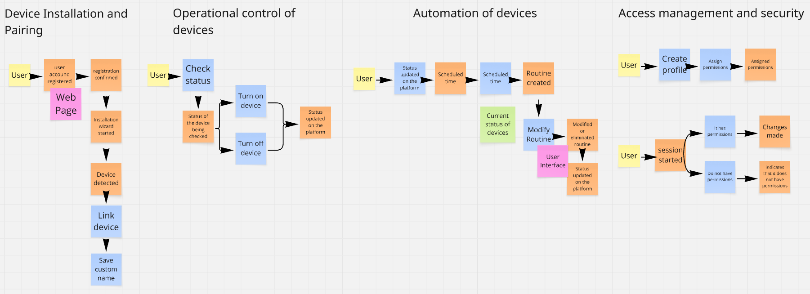

## 2.5. Ubiquitous Language

El "Ubiquitous Language" será una herramienta esencial en nuestro trabajo, ya que nos permitirá establecer un lenguaje
común y compartido entre todos los miembros del equipo, facilitando la comunicación y la comprensión de los conceptos
clave en nuestro proyecto.

**Home User** :  A person who uses the platform to control and monitor the electricity consumption of their home through the mobile app or website.

**Business Owner**: A user who manages electrical devices in a commercial establishment and uses the platform to optimize energy usage, schedules, and access permissions.

**IoT Device**: A smart device connected to the system, such as a smart plug, switch, or meter, that can be monitored and controlled remotely.

**Pairing**: The process through which an IoT device is successfully linked to the user’s account within the platform.

**Guided Installation**: A step-by-step setup process that helps users configure the system easily without requiring technical assistance.

**Custom Device Name**: A personalized label assigned by the user to easily identify each device within the platform.

**Device Status**: The current condition of a device, such as turned on or turned off, displayed in real time.

**Remote Control**: A feature that allows users to turn devices on, turn them off, or manage them through the mobile app or website.

**Automation Routine**: A sequence of scheduled actions executed automatically at specific times, such as turning off devices at night.

**Scheduled Time**: A configured time that determines when a device or routine should start or stop.

**Energy Consumption**: The amount of electricity used by one or more devices during a specific period.

**Consumption History**: A record of energy usage data accumulated daily, weekly, or monthly.

**Consumption Alert**: A notification sent to the user when electricity usage exceeds a defined threshold.

**Saving Recommendation**: A suggestion generated by the system to reduce electricity usage and optimize costs.

**Access Profile**: A secondary or limited account created by the administrator to allow partial control of selected devices.

**Permissions**: Rules that define what actions each user is allowed to perform within the platform.

**Traceability**: A record of actions performed in the system, including who made the change, when it happened, and which device was affected.

**Billing Forecast**: An estimated monthly electricity cost in Peruvian soles, calculated using historical consumption and the current tariff.

# Capitulo III: Requirements Specification


## 3.2. User Stories.
En esta sección, profundizaremos en la definición y elaboración de las User Stories relacionadas con nuestro proyecto ElectroCorp.

**EPICS**

|**Epic ID**|**Título**|**Descripción**|**Criterio de aceptación**|**Relación (EPIC ID)**|
| - | - | - | - | - |
|**EP-01**|**Instalación y configuración inicial**|Como usuario de un hogar o pequeño negocio, quiero instalar y configurar mis dispositivos inteligentes simulados fácilmente para comenzar a usar la solución de forma rápida.|<p>**Escenario 1: Registro de usuario**</p><p>Dado que el usuario accede a la plataforma,</p><p>Cuando completa sus datos de registro,</p><p>Entonces el sistema crea su cuenta y le permite iniciar sesión.</p><br><p>**Escenario 2: Vinculación de dispositivo**</p><p>Dado que el usuario ha iniciado sesión,</p><p>Cuando ingresa el código del dispositivo,</p><p>Entonces el sistema vincula el equipo a su cuenta.</p>||
|**EP-02**|**Control y automatización de dispositivos**|Como usuario, quiero controlar y automatizar mis dispositivos eléctricos desde la plataforma para mejorar la comodidad y optimizar energía.|<p>**Escenario 1: Control Remoto**</p><p>Dado que el usuario está en su panel principal,</p><p>Cuando presiona el botón de encendido/apagado,</p><p>Entonces el estado del dispositivo cambia en la base de datos.</p><br><p>**Escenario 2: Programación**</p><p>Dado que el usuario selecciona un dispositivo,</p><p>Cuando define una hora de encendido automático,</p><p>Entonces el sistema guarda la rutina y la ejecuta.</p>||
|**EP-03**|**Monitoreo y ahorro de energía**|Como usuario, quiero visualizar y comparar el consumo de mis dispositivos en tiempo real e histórico para identificar oportunidades de ahorro.|<p>**Escenario 1: Ver consumo actual**</p><p>Dado que el usuario accede al dashboard,</p><p>Cuando selecciona la pestaña de métricas,</p><p>Entonces el sistema muestra los Watts consumidos.</p><br><p>**Escenario 2: Reporte Histórico**</p><p>Dado que el usuario solicita el reporte,</p><p>Cuando selecciona el mes de interés,</p><p>Entonces se genera un gráfico comparativo.</p>||
|**EP-04**|**Seguridad, accesos y gestión de usuarios**|Como usuario administrador, quiero controlar los accesos y permisos de quienes usan la plataforma para mantener la seguridad y trazabilidad.|<p>**Escenario 1: Creación de perfiles**</p><p>Dado que el administrador accede a la sección de accesos,</p><p>Cuando invita a un nuevo correo,</p><p>Entonces se crea un perfil con permisos restringidos.</p><br><p>**Escenario 2: Trazabilidad**</p><p>Dado que un empleado realiza una acción,</p><p>Cuando el administrador revisa el historial,</p><p>Entonces ve quién realizó el cambio.</p>||
|**EP-05**|**Información y Navegación de Landing Page**|Como usuario visitante, deseo acceder a información, cambiar el idioma y navegar dinámicamente por la landing page mediante búsquedas inteligentes.|<p>**Escenario 1: Navegación por Búsqueda**</p><p>Dado que el visitante busca un tema específico,</p><p>Cuando usa la barra de búsqueda,</p><p>Entonces la vista se desplaza a la sección correspondiente.</p><br><p>**Escenario 2: Traducción**</p><p>Dado que el visitante prefiere otro idioma,</p><p>Cuando interactúa con el botón de idioma,</p><p>Entonces el texto cambia inmediatamente entre ES/EN.</p>||
|**EP-06**|**Gestión de Suscripciones (Stripe)**|Como usuario, quiero gestionar mi plan de suscripción premium mediante pagos seguros para acceder a funciones avanzadas.|<p>**Escenario 1: Pago exitoso**</p><p>Dado que el usuario elige el Plan Enterprise,</p><p>Cuando ingresa los datos de su tarjeta,</p><p>Entonces su cuenta se actualiza con dispositivos ilimitados.</p><br><p>**Escenario 2: Cancelación**</p><p>Dado que el usuario es Premium,</p><p>Cuando hace clic en anular suscripción,</p><p>Entonces su plan vuelve a ser Free el próximo mes.</p>||
|**EP-07**|**Notificaciones y Soporte (Mailchimp)**|Como usuario, quiero recibir alertas por correo electrónico y acceder a soporte técnico para resolver problemas o ver picos de consumo.|<p>**Escenario 1: Alerta de alto consumo**</p><p>Dado que un dispositivo supera el umbral configurado,</p><p>Cuando el sistema detecta la anomalía,</p><p>Entonces se envía un correo de alerta mediante Mailchimp.</p><br><p>**Escenario 2: Soporte**</p><p>Dado que el usuario tiene dudas,</p><p>Cuando ingresa a ayuda,</p><p>Entonces visualiza las FAQ y contacto.</p>||

<br><br>

**USER STORIES**

|**Epic/User Story ID**|**Título**|**Descripción**|**Criterio de aceptación**|**Relación (EPIC ID)**|
| - | - | - | - | - |
|**US-01**|Visualizar información de la startup y testimonios|<p>Como usuario visitante, quiero acceder a la descripción de la empresa y leer opiniones de usuarios para confirmar la calidad del servicio.</p>|<p>**Escenario 1:** Información consolidada</p><p>Dado que navego en la página,</p><p>Cuando hago scroll por el contenido,</p><p>Entonces leo sobre la democratización de la domótica y los testimonios de clientes reales.</p>|**EP-05**|
|**US-02**|Motor de búsqueda inteligente|<p>Como usuario visitante, quiero usar una barra de búsqueda para encontrar secciones de la página rápidamente.</p>|<p>**Escenario 1:** Búsqueda exitosa</p><p>Dado que busco información de costos,</p><p>Cuando escribo "precios" y doy clic a la lupa,</p><p>Entonces la página hace un scroll suave hacia "Our Plans".</p>|**EP-05**|
|**US-03**|Cambio de idioma (ES/EN)|<p>Como usuario visitante, quiero poder cambiar el idioma de la página web para leerla en mi idioma nativo.</p>|<p>**Escenario 1:** Traducción dinámica</p><p>Dado que la página está en inglés,</p><p>Cuando doy clic al ícono del mundo (ES),</p><p>Entonces todos los textos cambian instantáneamente al español.</p>|**EP-05**|
|**US-04**|Suscripción al boletín de noticias|<p>Como usuario visitante, quiero suscribirme al boletín en un formulario para recibir consejos de ahorro y ofertas.</p>|<p>**Escenario 1:** Envío de formulario</p><p>Dado que ingreso mi email en la sección de contacto,</p><p>Cuando presiono "Submit",</p><p>Entonces aparece un mensaje de agradecimiento temporal y la caja se limpia.</p>|**EP-05**|
|**US-05**|Interfaz interactiva (Menú y Audio)|<p>Como usuario visitante, quiero interactuar con un menú fluido y pausar/reproducir la música de fondo a mi gusto.</p>|<p>**Escenario 1:** Navegación y control</p><p>Dado que estoy en la web,</p><p>Cuando uso el Navbar dinámico o presiono el botón flotante de audio,</p><p>Entonces la página me redirige a la sección deseada o pausa la música (ElectroCorp.mp3).</p>|**EP-05**|
|**US-06**|Comparar planes de servicio|<p>Como usuario visitante, quiero ver las diferencias entre el plan Free y Enterprise para elegir el adecuado.</p>|<p>**Escenario 1:** Tarjetas de precio</p><p>Dado que bajo a la sección "Pricing",</p><p>Cuando visualizo las tarjetas,</p><p>Entonces noto que el plan Enterprise está resaltado como premium.</p>|**EP-05**|
|**US-07**|Registro inicial del usuario|<p>Como usuario del hogar, quiero crear una cuenta en la plataforma para vincular mis dispositivos.</p>|<p>**Escenario 1:** Registro Exitoso</p><p>Dado que el usuario no tiene cuenta,</p><p>Cuando ingresa su email y contraseña,</p><p>Entonces el sistema crea la cuenta.</p>|**EP-01**|
|**US-08**|Emparejar dispositivo|<p>Como usuario, quiero vincular un enchufe inteligente desde la app.</p>|<p>**Escenario 1:** Vinculación exitosa</p><p>Dado que el usuario está en "Agregar",</p><p>Cuando ingresa el código del equipo,</p><p>Entonces el equipo aparece en su lista.</p>|**EP-01**|
|**US-09**|Asistente de instalación|<p>Como usuario nuevo, quiero seguir una guía paso a paso para instalar el sistema.</p>|<p>**Escenario 1:** Tutorial de inicio</p><p>Dado que es el primer inicio de sesión,</p><p>Cuando el usuario entra a la app,</p><p>Entonces se muestra un tutorial de pasos básicos.</p>|**EP-01**|
|**US-10**|Nombrar dispositivos|<p>Como usuario, quiero asignar nombres personalizados a mis dispositivos.</p>|<p>**Escenario 1:** Edición de nombre</p><p>Dado que el equipo fue vinculado,</p><p>Cuando el usuario edita el nombre a "Lámpara",</p><p>Entonces el nuevo nombre se guarda en la base de datos.</p>|**EP-01**|
|**US-11**|Ver estado en tiempo real|<p>Como usuario, quiero ver si un dispositivo está encendido o apagado.</p>|<p>**Escenario 1:** Feedback visual</p><p>Dado que el usuario observa el dashboard,</p><p>Cuando un equipo cambia de estado físico,</p><p>Entonces el icono se actualiza en la app.</p>|**EP-02**|
|**US-12**|Encender y apagar remotamente|<p>Como usuario, quiero controlar mis dispositivos desde el celular.</p>|<p>**Escenario 1:** Acción remota</p><p>Dado que el equipo está apagado,</p><p>Cuando el usuario hace clic en encender,</p><p>Entonces el dispositivo cambia a ON.</p>|**EP-02**|
|**US-13**|Programar horarios de encendido|<p>Como usuario, quiero programar horarios automáticos.</p>|<p>**Escenario 1:** Creación de horario</p><p>Dado que el usuario selecciona un enchufe,</p><p>Cuando configura la hora de encendido,</p><p>Entonces el sistema respeta el horario diariamente.</p>|**EP-02**|
|**US-14**|Crear rutinas automáticas|<p>Como usuario, quiero definir rutinas de automatización general.</p>|<p>**Escenario 1:** Rutina nocturna</p><p>Dado que el usuario crea una rutina "Dormir",</p><p>Cuando llega la hora programada,</p><p>Entonces todos los dispositivos seleccionados se apagan a la vez.</p>|**EP-02**|
|**US-15**|Ver consumo en tiempo real|<p>Como usuario, quiero monitorear el consumo energético en vivo.</p>|<p>**Escenario 1:** Monitor de Watts</p><p>Dado que el enchufe está activo,</p><p>Cuando el usuario abre la gráfica,</p><p>Entonces visualiza los Watts consumidos actualizados.</p>|**EP-03**|
|**US-16**|Consultar historial de consumo|<p>Como usuario, quiero revisar el historial de consumo por día o semana.</p>|<p>**Escenario 1:** Filtro de historial</p><p>Dado que el usuario está en reportes,</p><p>Cuando selecciona "Últimos 7 días",</p><p>Entonces se muestra un gráfico diario.</p>|**EP-03**|
|**US-17**|Recibir alertas por alto consumo|<p>Como usuario, quiero recibir alertas por consumos inusuales de energía.</p>|<p>**Escenario 1:** Alerta en app</p><p>Dado que el límite es 500W,</p><p>Cuando se supera la cifra de manera sostenida,</p><p>Entonces aparece una notificación push.</p>|**EP-03**|
|**US-18**|Ver recomendaciones de ahorro|<p>Como usuario, quiero recibir sugerencias para ahorrar energía.</p>|<p>**Escenario 1:** Tips inteligentes</p><p>Dado que el consumo es ineficiente en cierto horario,</p><p>Cuando revisa el panel de sugerencias,</p><p>Entonces el sistema recomienda crear nuevas rutinas.</p>|**EP-03**|
|**US-19**|Administrar múltiples dispositivos|<p>Como usuario, quiero visualizar todos mis dispositivos en una sola pantalla.</p>|<p>**Escenario 1:** Vista general</p><p>Dado que el usuario tiene 5 equipos,</p><p>Cuando ingresa al inicio,</p><p>Entonces visualiza las 5 tarjetas operables.</p>|**EP-04**|
|**US-20**|Crear perfiles de acceso|<p>Como administrador, quiero dar acceso a familiares con permisos limitados.</p>|<p>**Escenario 1:** Rol de invitado</p><p>Dado que el administrador invita a un familiar,</p><p>Cuando este inicia sesión en su dispositivo,</p><p>Entonces solo puede apagar/encender equipos.</p>|**EP-04**|
|**US-21**|Bloquear acceso no autorizado|<p>Como usuario, quiero proteger mi cuenta de extraños.</p>|<p>**Escenario 1:** Timeout por inactividad</p><p>Dado que la app web queda abierta sin interactuar,</p><p>Cuando pasan 30 minutos sin uso,</p><p>Entonces la sesión expira.</p>|**EP-04**|
|**US-22**|Registrar actividad de control|<p>Como administrador, quiero ver quién controló un equipo.</p>|<p>**Escenario 1:** Log de auditoría</p><p>Dado que se ejecutó una acción,</p><p>Cuando se revisa el log de eventos,</p><p>Entonces se detalla el nombre del usuario y la hora.</p>|**EP-04**|
|**US-23**|Controlar equipos del negocio|<p>Como dueño de negocio, quiero controlar equipos del local desde mi móvil.</p>|<p>**Escenario 1:** Control comercial</p><p>Dado que el dueño está en su domicilio,</p><p>Cuando apaga el grupo de luz del local,</p><p>Entonces se refleja instantáneamente en el negocio.</p>|**EP-02**|
|**US-24**|Programar equipos por horario comercial|<p>Como dueño, quiero automatizar el local según el horario de atención.</p>|<p>**Escenario 1:** Automatización de horario</p><p>Dado que el horario es de 9am a 6pm,</p><p>Cuando se activa la rutina comercial,</p><p>Entonces los equipos siguen automáticamente el horario.</p>|**EP-02**|
|**US-25**|Revisar consumo por área o equipo|<p>Como dueño, quiero identificar qué áreas consumen más.</p>|<p>**Escenario 1:** Desglose por zona</p><p>Dado que hay varios equipos registrados,</p><p>Cuando revisa el reporte corporativo,</p><p>Entonces visualiza un gráfico detallado por zonas.</p>|**EP-03**|
|**US-26**|Compartir acceso con personal|<p>Como dueño, quiero permitir que empleados controlen ciertos equipos.</p>|<p>**Escenario 1:** Control limitado</p><p>Dado que un empleado de almacén entra a la app,</p><p>Cuando visualiza el dashboard principal,</p><p>Entonces solo ve el control de su área correspondiente.</p>|**EP-04**|
|**US-27**|Pagar suscripción con tarjeta|<p>Como usuario, quiero ingresar mi tarjeta de forma segura para adquirir el plan Premium.</p>|<p>**Escenario 1:** Pasarela Stripe</p><p>Dado que el usuario elige el plan Enterprise,</p><p>Cuando ingresa sus datos válidos,</p><p>Entonces Stripe procesa exitosamente el cobro mensual.</p>|**EP-06**|
|**US-28**|Cancelar suscripción Premium|<p>Como usuario, quiero anular mi suscripción para detener cobros.</p>|<p>**Escenario 1:** Detención de cobros</p><p>Dado que el usuario accede a configuración de facturación,</p><p>Cuando confirma la cancelación del servicio,</p><p>Entonces el plan se degrada a final de mes.</p>|**EP-06**|
|**US-29**|Recibir alertas por correo|<p>Como usuario, quiero que el sistema me notifique a mi correo si algo inusual pasa con mi consumo.</p>|<p>**Escenario 1:** Despacho vía Mailchimp</p><p>Dado que hay un evento crítico registrado,</p><p>Cuando el backend lo procesa,</p><p>Entonces recibo un email de alerta inmediata.</p>|**EP-07**|
|**US-30**|Recibir reporte mensual|<p>Como usuario, quiero recibir un resumen mensual en mi email para saber cuánto ahorré.</p>|<p>**Escenario 1:** Envío automatizado</p><p>Dado que es el último día del mes,</p><p>Cuando el cronjob se activa,</p><p>Entonces me envía un correo con mis estadísticas.</p>|**EP-07**|
|**US-31**|Recuperar contraseña|<p>Como usuario, quiero poder restablecer mi contraseña si la olvido.</p>|<p>**Escenario 1:** Email de recuperación</p><p>Dado que el usuario hace clic en "Olvidé mi contraseña",</p><p>Cuando ingresa su email,</p><p>Entonces recibe un enlace seguro por tiempo limitado.</p>|**EP-04**|
|**US-32**|Editar perfil de usuario|<p>Como usuario, quiero cambiar mis datos personales de perfil.</p>|<p>**Escenario 1:** Guardado de cambios</p><p>Dado que el usuario edita su nombre o teléfono,</p><p>Cuando da clic en guardar,</p><p>Entonces la información se actualiza en la base de datos MySQL.</p>|**EP-04**|
|**US-33**|Eliminar cuenta|<p>Como usuario, quiero borrar definitivamente mi cuenta y datos.</p>|<p>**Escenario 1:** Purga de información</p><p>Dado que el usuario confirma la eliminación total,</p><p>Cuando el sistema procesa la solicitud,</p><p>Entonces sus datos se borran irreversiblemente.</p>|**EP-04**|
|**US-34**|Configurar preferencias|<p>Como usuario, quiero elegir qué tipo de alertas me llegan.</p>|<p>**Escenario 1:** Switch de preferencias</p><p>Dado que el usuario apaga el interruptor de correos mensuales,</p><p>Cuando se guarda la preferencia,</p><p>Entonces su email es removido de la lista de envíos de resúmenes.</p>|**EP-07**|
|**US-35**|Simular conexión de equipo|<p>Como desarrollador, quiero simular un dispositivo nuevo para pruebas de la plataforma.</p>|<p>**Escenario 1:** Inyección de dispositivo virtual</p><p>Dado que se dispara el evento simulador mediante API,</p><p>Cuando ocurre la validación,</p><p>Entonces el equipo aparece en la cuenta del usuario.</p>|**EP-01**|
|**US-36**|Filtrar historial por fechas|<p>Como usuario, quiero establecer un rango de fechas para ver consumos pasados.</p>|<p>**Escenario 1:** Filtro de calendario</p><p>Dado que el usuario abre la herramienta de fechas,</p><p>Cuando selecciona desde y hasta,</p><p>Entonces la gráfica se redibuja excluyendo el resto de días.</p>|**EP-03**|
|**US-37**|Exportar historial a Excel|<p>Como usuario corporativo, quiero descargar mis datos de consumo.</p>|<p>**Escenario 1:** Generación de CSV</p><p>Dado que se visualiza la tabla en pantalla,</p><p>Cuando se hace clic en Exportar,</p><p>Entonces el navegador descarga un archivo CSV estructurado.</p>|**EP-03**|
|**US-38**|Agrupar dispositivos|<p>Como usuario, quiero agrupar mis enchufes por habitaciones.</p>|<p>**Escenario 1:** Operación masiva por grupo</p><p>Dado que el usuario ha creado el grupo "Iluminación Sala",</p><p>Cuando apaga el grupo,</p><p>Entonces todos los enchufes asignados a la sala se apagan simultáneamente.</p>|**EP-02**|
|**US-39**|Activar Modo Oscuro|<p>Como usuario, quiero activar un tema oscuro en mi dashboard para evitar la fatiga visual nocturna.</p>|<p>**Escenario 1:** Toggle Dark Mode</p><p>Dado que el usuario entra a configuraciones de UI,</p><p>Cuando activa el switch de Modo Oscuro,</p><p>Entonces los colores de la aplicación SPA cambian a la paleta Dark.</p>|**EP-05**|
|**US-40**|Gestionar múltiples locales|<p>Como dueño de negocio, quiero gestionar distintas sucursales desde una sola cuenta centralizada.</p>|<p>**Escenario 1:** Selector de Sucursal</p><p>Dado que el usuario posee el plan Enterprise,</p><p>Cuando despliega el menú de ubicaciones superior,</p><p>Entonces puede saltar del "Local A" al "Local B" cambiando el dashboard.</p>|**EP-04**|

<br><br>

**TECHNICAL STORIES**

|**Technical story ID**|**Título**|**Descripción**|**Criterios de Aceptación**|**Epica**|
| - | - | - | - | - |
|**TS-01**|Frontend Consumidor REST API|<p>**Como** desarrollador frontend</p><p>**Quiero** consumir endpoints REST mediante fetch/API calls</p><p>**Para** renderizar contenido dinámico y responsive desde el backend (US-01, US-06).</p>|<p>**Escenario 1: Consumo API Responsive**</p><p>Dado el endpoint de configuración visual,</p><p>Cuando la aplicación obtiene los datos del backend,</p><p>Entonces el diseño cambia dinámicamente según el tamaño de pantalla.</p>|**EP-05**|
|**TS-02**|API REST de Traducciones i18n|<p>**Como** desarrollador frontend</p><p>**Quiero** consumir un endpoint REST de traducciones</p><p>**Para** cambiar idiomas dinámicamente desde el servidor (US-03).</p>|<p>**Escenario 1: Traducción dinámica**</p><p>Dado el endpoint /api/v1/translations,</p><p>Cuando se llama toggleLanguage(),</p><p>Entonces la API devuelve los textos traducidos correctamente.</p>|**EP-05**|
|**TS-03**|API REST de Búsqueda Inteligente|<p>**Como** desarrollador frontend</p><p>**Quiero** consumir un endpoint REST con palabras clave</p><p>**Para** realizar búsquedas dinámicas y navegación automática (US-02).</p>|<p>**Escenario 1: Búsqueda desde API**</p><p>Dado el request al endpoint de búsqueda,</p><p>Cuando el término existe en la base de datos,</p><p>Entonces el backend devuelve la sección correspondiente.</p>|**EP-05**|
|**TS-04**|API REST Newsletter|<p>**Como** desarrollador frontend</p><p>**Quiero** enviar formularios mediante peticiones HTTP POST</p><p>**Para** registrar suscripciones sin recargar la web (US-04).</p>|<p>**Escenario 1: Registro Newsletter**</p><p>Dado el formulario completado,</p><p>Cuando se envía la petición POST al backend,</p><p>Entonces la API registra el correo y devuelve una respuesta exitosa.</p>|**EP-05**|
|**TS-05**|REST API de Configuración Multimedia|<p>**Como** desarrollador frontend</p><p>**Quiero** consumir endpoints REST de configuración multimedia</p><p>**Para** sincronizar el estado del menú y audio de la aplicación (US-05).</p>|<p>**Escenario 1: Configuración dinámica**</p><p>Dado el request al endpoint multimedia,</p><p>Cuando el usuario interactúa con la interfaz,</p><p>Entonces el sistema actualiza el estado del audio y navegación.</p>|**EP-05**|
|**TS-06**|Setup Spring Boot API|<p>**Como** backend developer</p><p>**Quiero** iniciar el servidor web Java</p><p>**Para** alojar los endpoints REST del sistema core.</p>|<p>**Escenario 1: Deploy inicial**</p><p>Dado el pom.xml con dependencias web,</p><p>Cuando compila el proyecto,</p><p>Entonces el contenedor Tomcat levanta en el puerto 8080.</p>|**EP-01**|
|**TS-07**|Conexión JPA - MySQL|<p>**Como** Database Admin</p><p>**Quiero** crear entidades Java anotadas con @Entity</p><p>Para persistir la información consumida por la REST API (US-07).</p>|<p>**Escenario 1: Data Source**</p><p>Dado el application.properties configurado,</p><p>Cuando inicia el contexto de Spring,</p><p>Entonces Hibernate realiza la migración DDL en el esquema MySQL.</p>|**EP-01**|
|**TS-08**|Integración Stripe REST API|<p>**Como** backend developer</p><p>**Quiero** incorporar las librerías oficiales de Stripe</p><p>**Para** validar pagos mediante endpoints REST seguros (US-27).</p>|<p>**Escenario 1: Charge API**</p><p>Dado un payload de pago válido,</p><p>Cuando invoca el endpoint createCharge(),</p><p>Entonces Stripe retorna el id de transacción HTTP 200.</p>|EP-06|
|**TS-09**|Integración Mailchimp REST|<p>**Como** backend developer</p><p>**Quiero** programar servicios REST de integración</p><p>**Para** disparar emails automatizados desde la API (US-29).</p>|<p>**Escenario 1: Post Payload**</p><p>Dado que se dispara una alerta,</p><p>Cuando se construye el JSON del email,</p><p>Entonces hace un POST a la API de Mailchimp y se registra el envío.</p>|**EP-07**|
|**TS-10**|REST API de Telemetría|<p>**Como** backend developer</p><p>**Quiero** usar anotaciones @Scheduled en Spring Boot</p><p>**Para** exponer datos simulados de consumo mediante endpoints REST (US-35).</p>|<p>Escenario 1: Tarea en background</p><p>Dado el servidor en ejecución,</p><p>Cuando pasa el tiempo definido en el cron,</p><p>Entonces se insertan registros consumidos posteriormente por la API.</p>|**EP-03**|
|**TS-11**|Endpoints CRUD Dispositivos|<p>**Como** backend developer</p><p>**Quiero** programar controladores @RestController</p><p>**Para** manejar el listado y actualización de enchufes (US-19).</p>|<p>**Escenario 1: GetMapping**</p><p>Dado el request a /api/v1/devices,</p><p>Cuando se procesa la solicitud,</p><p>Entonces devuelve un ResponseEntity con el JSON del listado.</p>|**EP-02**|
|**TS-12**|Frontend SPA Consumidor REST|<p>**Como** frontend developer</p><p>**Quiero** iniciar el framework SPA (Angular/React)</p><p>**Para** consumir endpoints REST del dashboard de monitoreo.</p>|<p>**Escenario 1: Router Guard**</p><p>Dado el acceso a /dashboard,</p><p>Cuando el token no existe,</p><p>Entonces el sistema redirige al /login.</p>|**EP-04**|
|**TS-13**|Generación y Filtro de JWT|<p>**Como** fullstack developer</p><p>**Quiero** configurar Spring Security con un filtro JWT</p><p>**Para** autenticar cada petición HTTP de la REST API (US-07).</p>|**<p>Escenario 1: Token Auth**</p><p>Dado el Bearer token en el Header,</p><p>Cuando pasa por el filtro de seguridad,</p><p>Entonces desencripta la firma y autoriza el request.</p>|EP-04|
|**TS-14**|Dashboard REST con Chart.js|<p>**Como** frontend developer</p><p>**Quiero** consumir datos desde la REST API usando Chart.js</p><p>**Para** visualizar gráficamente el consumo eléctrico (US-15).</p>|<p>Escenario 1: Render del Canvas</p><p>Dado el array numérico obtenido desde la API,</p><p>Cuando se pasan como datasets,</p><p>Entonces Chart.js dibuja visualmente la progresión.</p>|**EP-03**|
|**TS-15**|Cifrado BCrypt para REST API|<p>**Como** backend developer</p><p>**Quiero** usar BCryptPasswordEncoder</p><p>**Para** proteger las credenciales consumidas por la REST API (US-07).</p>|<p>**Escenario 1: Hash**</p><p>Dado el formulario de registro,</p><p>Cuando llega la clave 123456,</p><p>Entonces se guarda como un hash seguro tipo $2a$10$....</p>|**EP-04**|
|**TS-16**|REST API Configuración UI|<p>**Como** frontend developer</p><p>**Quiero** consumir configuraciones visuales desde endpoints REST</p><p>**Para** alternar dinámicamente el modo oscuro en la aplicación (US-39).</p>|<p>**Escenario 1: Clase global**</p><p>Dado que el usuario presiona el switch,</p><p>Cuando la configuración cambia en el backend,</p><p>Entonces se añade la clase .dark-theme al document root.</p>|**EP-05**|


<br><br>


## 3.2. Impact Mapping


## 3.3. Product Backlog

| # Orden | User Story ID | Título | Descripción | Story Points |
|--|--|--|--|--|
| 1 | US-01 | Visualizar info y testimonios | Como visitante, quiero acceder a la descripción de ElectroCorp. | 3 |
| 2 | US-02 | Motor de búsqueda inteligente | Como visitante, quiero buscar por palabras clave y hacer scroll automático. | 5 |
| 3 | US-03 | Cambio de idioma (ES/EN) | Como visitante, quiero cambiar el texto entero de la página mediante el DOM. | 5 |
| 4 | US-04 | Suscripción al boletín | Como visitante, quiero llenar un input de email sin recargar la web. | 3 |
| 5 | US-05 | Interfaz interactiva | Como visitante, quiero navegar fluído y pausar la música con un botón. | 3 |
| 6 | US-06 | Comparar planes de servicio | Como visitante, quiero leer las diferencias del plan Free y Enterprise. | 2 |
| 7 | US-07 | Registro inicial del usuario | Como usuario, quiero crear una cuenta en la plataforma base de datos. | 5 |
| 8 | US-08 | Emparejar dispositivo plug-and-play | Como usuario, quiero vincular mi enchufe inteligente simulado. | 8 |
| 9 | US-09 | Asistente de instalación guiada | Como usuario, quiero un tutorial rápido para empezar. | 5 |
| 10 | US-10 | Nombrar dispositivos | Como usuario, quiero asignarle un alias a mi equipo. | 2 |
| 11 | US-11 | Ver estado en tiempo real | Como usuario, quiero verificar si mi foco virtual está ON u OFF. | 3 |
| 12 | US-12 | Encender y apagar remotamente | Como usuario, quiero enviar señales de apagado por internet. | 5 |
| 13 | US-13 | Programar horarios de encendido | Como usuario, quiero definir a qué hora se enciende mi luz. | 5 |
| 14 | US-14 | Crear rutinas automáticas | Como usuario, quiero configurar grupos de acciones masivas. | 5 |
| 15 | US-15 | Ver consumo en tiempo real | Como usuario, quiero ver una gráfica con el consumo de Watts vivo. | 5 |
| 16 | US-16 | Consultar historial de consumo | Como usuario, quiero ver cómo varió mi consumo durante los 7 días. | 5 |
| 17 | US-17 | Recibir alertas por alto consumo | Como usuario, quiero notificaciones si mis aparatos gastan demasiado. | 3 |
| 18 | US-18 | Ver recomendaciones de ahorro | Como usuario, quiero leer pequeños tips basados en mis propios datos. | 5 |
| 19 | US-19 | Administrar múltiples dispositivos | Como usuario, quiero ver la lista completa de lo que he enlazado. | 3 |
| 20 | US-20 | Crear perfiles de acceso | Como administrador, quiero que otros en casa puedan apagar las luces. | 5 |
| 21 | US-21 | Bloquear acceso no autorizado | Como usuario, quiero que la plataforma se cierre si me olvido abierta. | 3 |
| 22 | US-22 | Registrar actividad de control | Como administrador, quiero revisar un registro de qué se prendió. | 3 |
| 23 | US-23 | Controlar equipos del negocio | Como dueño, quiero gestionar mi pequeño local desde la casa. | 3 |
| 24 | US-24 | Programar equipos por horario comercial | Como dueño, quiero que el local se active de 9 a 6 automatizado. | 5 |
| 25 | US-25 | Revisar consumo por área o equipo | Como dueño, quiero saber si un sector de la oficina consume más luz. | 5 |
| 26 | US-26 | Compartir acceso con personal | Como dueño, quiero aislar los permisos de los empleados a sus sectores. | 5 |
| 27 | US-27 | Pagar suscripción con tarjeta | Como usuario, quiero contratar el Enterprise plan con Stripe. | 8 |
| 28 | US-28 | Cancelar suscripción Premium | Como usuario, quiero regresar al plan Free sin que me sigan cobrando. | 3 |
| 29 | US-29 | Recibir alertas por correo | Como usuario, quiero que un pico de consumo me llegue vía Mailchimp. | 5 |
| 30 | US-30 | Recibir reporte mensual | Como usuario, quiero que en fin de mes se manden mis estadísticas al mail. | 5 |
| 31 | US-31 | Recuperar contraseña | Como usuario, quiero que se envíe un token de reset a mi correo. | 5 |
| 32 | US-32 | Editar perfil de usuario | Como usuario, quiero rectificar mi número de contacto o nombre de perfil. | 2 |
| 33 | US-33 | Eliminar cuenta | Como usuario, quiero un botón rojo para purgar absolutamente todos mis datos. | 3 |
| 34 | US-34 | Configurar preferencias | Como usuario, quiero poder rechazar los boletines desde mi perfil. | 2 |
| 35 | US-35 | Simular conexión de equipo | Como desarrollador, quiero inyectar equipos falsos para probar el sistema. | 5 |
| 36 | US-36 | Filtrar historial por fechas | Como usuario, quiero un calendario de inicio y fin para mis reportes. | 3 |
| 37 | US-37 | Exportar historial a Excel | Como usuario corporativo, quiero bajar una tabla de mis métricas en CSV. | 3 |
| 38 | US-38 | Agrupar dispositivos | Como usuario, quiero juntar varios enchufes bajo la etiqueta "Sala". | 5 |
| 39 | US-39 | Activar Modo Oscuro | Como usuario, quiero activar tema oscuro para descansar mis ojos de noche. | 3 |
| 40 | US-40 | Gestionar múltiples locales | Como dueño Enterprise, quiero saltar entre varias de mis tiendas. | 8 |


# Capitulo IV: Product Design

## 4.1. Style Guidelines

En esta sección se detallan las bases visuales y comunicativas de ElectroCorp, orientadas a mantener una presentación consistente y profesional en todas las interfaces del ecosistema IoT.

### 4.1.1. General Style Guidelines

**Branding:** 
La identidad de ElectroCorp busca democratizar la domótica en el Perú. El uso de la mascota (el enchufe con capa de superhéroe) transmite que el usuario tiene el "poder" y el control sobre su consumo eléctrico de forma amigable y heroica.
<br><br>
FOTO DEL LOGO


<br><br>
**Typography:**
La tipografía es el pilar de la comunicación digital en ElectroCorp. Hemos seleccionado una jerarquía basada en fuentes _sans-serif_ para asegurar que los datos de consumo (watts y costos) sean legibles en cualquier condición de iluminación de la interfaz.

-   **Fuente Principal:** Se utiliza Roboto, tipografías de sistema diseñadas para interfaces de alta densidad de información.
    
-   **Jerarquía de Títulos:** Se aplica un peso de 600 (SemiBold) para transmitir solidez y autoridad en la gestión energética. El tamaño del título principal en el _Hero_ es de 3.5rem, asegurando un impacto visual inmediato.
    
-   **Cuerpo de Texto:** Se define en 1.1rem con un interlineado de 1.6, optimizando la lectura de párrafos largos en la descripción de la startup y testimonios.
    
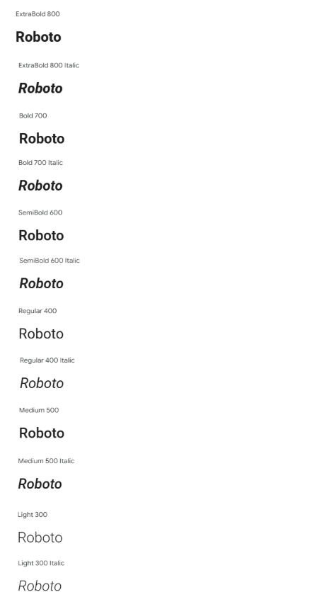

#### **Colors**

La paleta de colores de **ElectroCorp** ha sido diseñada bajo una estética de "Modo Oscuro" (Dark Mode), que evoca tecnología avanzada y eficiencia operativa.


#### **Spacing**

El sistema de espaciado sigue una progresión lógica para mantener el orden y la limpieza visual, facilitando que el usuario no se sienta abrumado por los datos.

-   **Secciones Principales:** Poseen un relleno (_padding_) de 80px en la parte superior e inferior con un margen lateral del 10*, creando un "respiro" visual necesario para separar los objetivos de los planes de servicio.
    
-   **Grillas (Grid Gap):** Se establece un espacio de 30px entre elementos del inventario y dispositivos, permitiendo una diferenciación clara entre cada unidad IoT.
    
-   **Separadores (hr):** Se utilizan líneas de 3px de alto y 60px de ancho en color azul eléctrico para indicar el fin de un concepto y el inicio de otro de forma minimalista.

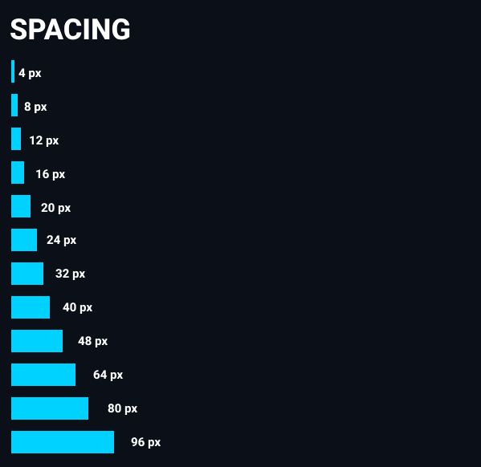


#### **Dimensions (Tone of Voice)**

El lenguaje de **ElectroCorp** ha sido calibrado para generar confianza en una audiencia que suele temer a los costos elevados de energía.

-   **Enfoque:** **Formal pero Entusiasta**. Somos serios con la precisión de la medición (watts), pero entusiastas al invitar al usuario a la "Revolución Eléctrica".
    
-   **Lenguaje:** **Respetuoso y Profesional**. Evitamos términos excesivamente técnicos para que la microempresaria Elena o el gamer Ricardo comprendan el beneficio directo (ahorro de dinero) sin esfuerzo.
    
-   **Estilo de Comunicación:**
    
    -   **Sereno:** Transmitimos tranquilidad mediante la seguridad de que el usuario tiene el control total desde su app.
        
    -   **Heroico:** Usamos la narrativa de nuestra mascota (el enchufe con capa) para posicionar la tecnología como una aliada contra el desperdicio.


### **4.1.2. Web Style Guidelines**

En esta sección se establecen los estándares visuales, técnicos y de interacción aplicados a las interfaces web de ElectroCorp. El objetivo es garantizar una experiencia de usuario (UX) fluida, coherente y accesible que permita a familias y negocios peruanos gestionar su consumo energético con total confianza desde cualquier dispositivo.

#### **1. Diseño Responsivo y Adaptabilidad**

Priorizamos un enfoque Mobile-First para asegurar que el control de los dispositivos IoT sea efectivo en movimiento.

-   **Adaptación Fluida:** El sitio utiliza un sistema de retícula flexible basado en _CSS Flexbox_ y _Media Queries_ que adapta el contenido automáticamente. En dispositivos de escritorio (desktop), se mantiene una estructura de 12 columnas con contenedores máximos de 1200px; mientras que en dispositivos móviles (smartphones), el contenido se reorganiza en una sola columna con márgenes laterales de 20px para facilitar la interacción táctil.
    
-   **Puntos de Ruptura (Breakpoints):** Se define un punto crítico en los 768px, donde la navegación cambia de una barra horizontal a un menú vertical optimizado, y las tarjetas de servicios (planes) pasan de una disposición en grilla (_grid_) a una lista vertical.
    

#### **2. Sistema de Layout y Patrones de Lectura**

-   **Patrón en F:** En la landing page, aplicamos un patrón de escaneo visual en "F". Ubicamos el logotipo de ElectroCorp en la esquina superior izquierda (punto de entrada visual) y los llamados a la acción (CTA) en la parte superior derecha y centro del Hero para maximizar la conversión de usuarios interesados en los planes.
    
-   **Jerarquía Visual:** Utilizamos el contraste entre el fondo Deep Navy (`#0a0f18`) y el Electric Blue (`#00d2ff`) para dirigir la atención hacia los indicadores de ahorro y botones de compra.
    

#### **3. Elementos Visuales (Imágenes e Iconografía)**

-   **Tratamiento de Imágenes:** Las imágenes ilustrativas (como el enchufe superhéroe) y fotografías de hardware deben estar optimizadas en formato WebP para garantizar una carga rápida (peso < 200kb). Se aplica una opacidad del 15% en las imágenes de fondo del Hero para no competir con la legibilidad del texto.
    
-   **Iconografía Funcional:** Implementamos la librería Font Awesome. Los íconos deben ser lineales y minimalistas, manteniendo un tamaño uniforme de 1.8rem en el footer y 20px en los botones de búsqueda y audio para asegurar consistencia visual.
    

#### **4. Componentes de Interacción (Botones y Estados)**

Los botones son los elementos críticos para la toma de decisiones. Se definen tres categorías:

-   **Botón Primario (Action):** Fondo Azul Eléctrico con texto negro. Utilizado para acciones principales como "Suscribirme" o "Empezar Gratis".
    
-   **Botón Secundario (Nav):** Enlaces con efecto _hover_ que activan un resplandor azul (`text-shadow`) y cambian a color blanco para confirmar la selección del usuario.
    
-   **Estados Visuales:** Cada elemento interactivo cuenta con estados claramente definidos (`default`, `hover`, `active`). Se aplica una transición suave de 0.3s para evitar cambios bruscos y mejorar la percepción de fluidez.
    

#### **5. Formularios y Entradas de Datos**

-   **Claridad y Validación:** El formulario de suscripción y la barra de búsqueda central cuentan con bordes redondeados (30px) y _placeholders_ descriptivos.
    
-   **Feedback Inmediato:** Mediante JavaScript, se informa al usuario en tiempo real sobre el éxito de su suscripción o la falta de resultados en la búsqueda mediante alertas visuales y mensajes dinámicos, evitando la frustración ante errores de escritura.
    

#### **6. Accesibilidad y Estándares de Calidad**

-   **Contraste y Legibilidad:** Nos aseguramos de que el texto claro (`#e0e6ed`) sobre el fondo oscuro cumpla con las pautas de accesibilidad WCAG, garantizando que usuarios con fatiga visual o en entornos de baja luz puedan leer los datos de consumo sin dificultad.
    
-   **Navegación Asistida:** El sitio incluye un sistema de búsqueda inteligente que interpreta palabras clave del usuario (ej. "precios", "soporte") y lo desplaza automáticamente (`smooth scroll`) hacia la sección relevante, facilitando el uso a personas que prefieren no usar el menú tradicional.


## 4.2. Information Architecture

En ElectroCorp, la arquitectura de la información se ha diseñado para facilitar la transición hacia un hogar inteligente de forma intuitiva y sin fricciones. El objetivo es que usuarios como Elena o Ricardo puedan gestionar su consumo eléctrico y controlar sus dispositivos IoT sin necesidad de conocimientos técnicos avanzados. Organizamos el contenido mediante una jerarquía visual clara en el Landing Page y sistemas de navegación que priorizan la eficiencia energética y el ahorro económico inmediato.

### 4.2.1. Organization Systems

En ElectroCorp, aplicaremos diversos sistemas de organización para garantizar que la gestión del stock y el monitoreo de energía sean accesibles:

-   **Organización Visual del Contenido (Jerárquica):** Utilizaremos este sistema para guiar al usuario desde el impacto inicial en el Hero hacia la toma de decisiones en la sección de Planes. La información fluye desde la propuesta de valor ("Domina el consumo de tu hogar") hacia los detalles técnicos (Sistemas I.O.T.) y la prueba social (Testimonios).
    
-   **Organización Secuencial (Step-by-step):** Este sistema se emplea rigurosamente en el proceso de instalación _plug-and-play_ de los enchufes y en el flujo de suscripción al boletín informativo. Cada paso está diseñado para evitar la sobrecarga cognitiva del usuario.
    
-   **Esquemas de Categorización de Contenido:**
    
    -   **Por Tópicos:** La información se agrupa en módulos lógicos como "Nuestros Planes", "Nuestros Objetivos" y "Sistemas I.O.T.".
        
    -   **Según Audiencia (Grupos de usuarios):** Segmentamos el contenido para dos perfiles principales: el usuario residencial (Plan Free para departamentos) y el corporativo/microempresario (Plan Enterprise para oficinas o negocios grandes).
        
    -   **Cronológico:** Se utiliza en la visualización de datos de consumo en tiempo real, permitiendo comparar el gasto energético actual frente a periodos pasados para identificar patrones de ahorro.

### 4.2.2. Labeling Systems

El sistema de etiquetado de ElectroCorp utiliza términos directos y familiares para reducir la confusión en usuarios no técnicos.

-   **Inicio:** Sección principal que presenta la misión de democratizar la domótica.
    
-   **Descripción:** Detalle del ecosistema IoT y la facilidad de instalación sin obras eléctricas.
    
-   **Objetivos:** Resumen de las metas de sostenibilidad y eficiencia económica.
    
-   **Planes:** Sección de tarifas donde se diferencian las opciones "Free" y "Enterprise".
    
-   **Enchufes Smart:** Galería técnica de los dispositivos de hardware disponibles.
    
-   **Soporte:** Canal de contacto y suscripción para asistencia técnica.
    
-   **Suscribirme al Boletín:** Llamado a la acción (CTA) claro para la captura de nuevos _leads_.

### 4.2.3. SEO Tags and Meta Tags 

Para optimizar la visibilidad en buscadores y asegurar una correcta indexación de la plataforma de gestión energética, se aplican los siguientes metadatos:
**Landing Page:**


- **Título:**
```html
<title>ElectroCorp | Gestión Energética Inteligente</title>
```
    
- **Descripción:**
```html
<meta name="description" content="Domótica accesible para hogares peruanos. Controla tus electrodomésticos y ahorra en tu recibo de luz con nuestros enchufes inteligentes plug-and-play."/>"/>
```
    
- **Palabras clave (Keywords):**
```html
<meta name="keywords" content="ahorro energía, domótica Perú, enchufes inteligentes, IoT hogar, eficiencia eléctrica, ElectroCorp"/>"/>
```
- **Autor (author):**
```
<meta name="author" content="ElectroCorp Team" />
```
- **Copyright:**
```
<meta name="copyright" content="© ElectroCorp.app, 2026" />
```

**Web Application (Portal de Usuario):**

- **Título:**
```html
<title>ElectroCorp Dashboard - Monitoreo en Tiempo Real</title>
```
- **Descripción:**
```html
<meta name="description" content="Panel de control para la gestión de dispositivos inteligentes y visualización de consumo eléctrico en tiempo real."/>"/>
```
- **Palabras clave (Keywords):**
```html
<meta name="keywords" content="consumo watts, control remoto enchufes, dashboard energético, smart home dashboard"/>"/>
```
- **Autor (author):**
```
<meta name="author" content="ElectroCorp Team" />
```
- **Copyright:**
```
<meta name="copyright" content="© ElectroCorp.app, 2026" />
```

### 4.2.4. Searching Systems

El sistema de búsqueda de ElectroCorp está optimizado para la navegación rápida dentro del sitio de una sola página (SPA):

-   **Búsqueda por Palabras Clave:** Un campo de búsqueda en el Hero permite al usuario ingresar términos como "planes", "hardware" o "misión".
    
-   **Buscador Inteligente :** El sistema utiliza un diccionario de términos ('gratis', 'precios', 'dispositivos') que activa un desplazamiento suave (_smooth scroll_) hacia la sección exacta donde se encuentra la información buscada.
    
-   **Feedback de Búsqueda:** En caso de no encontrar una coincidencia, el sistema proporciona alertas con sugerencias para guiar al usuario hacia términos válidos.

### 4.2.5. Navigation Systems

Diseñamos la navegación para que sea persistente y minimice los clics del usuario:

-   **Barra de Navegación Persistente (Sticky Header):** El menú superior permanece visible durante todo el recorrido, permitiendo saltar entre secciones como "Testimonios" o "Planes" en cualquier momento.
    
-   **Enlaces de Ancla (Anchor Links):** Facilitan el movimiento fluido a través del landing page mediante desplazamientos programados por ID.
    
-   **Botones de Acción Rápida (CTA):** Botones prominentes como "Empezar Gratis" dirigen directamente a los puntos de conversión.
    
-   **Control de Audio Global:** Un botón flotante permite gestionar la experiencia sonora de la plataforma, brindando un control total sobre el entorno multimedia sin interrumpir la navegación.
    
-   **Navegación Móvil:** Para pantallas pequeñas, implementamos un diseño responsivo que reorganiza los elementos del menú en una lista vertical accesible para una interacción táctil eficiente.

## 4.3. Landing Page UI Design
### 4.3.1. Landing Page Wireframe
El wireframe define la estructura básica de la landing page en bloques principales:
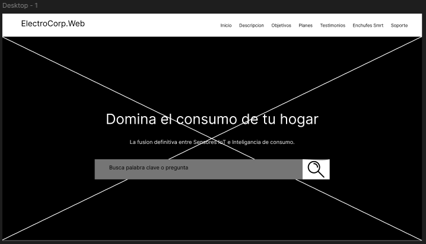
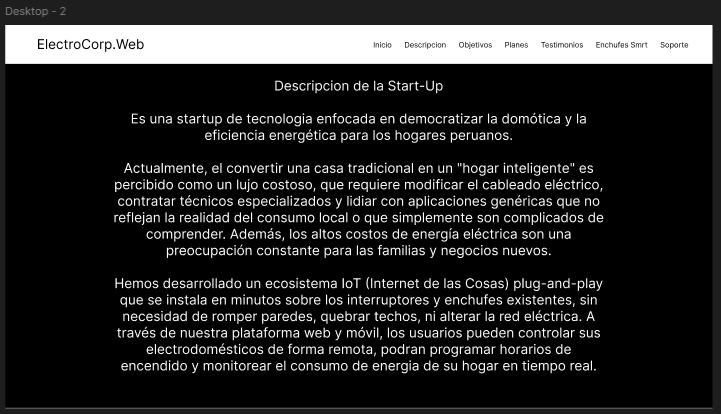
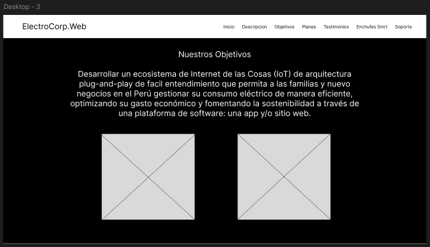
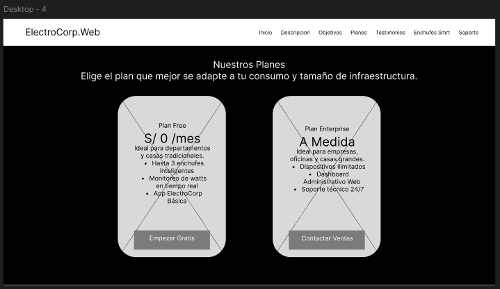
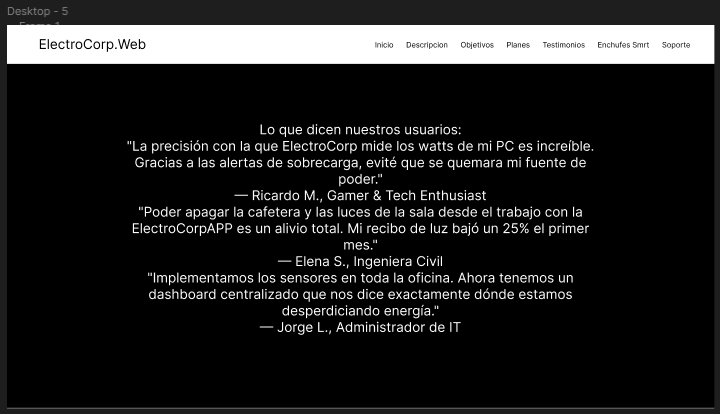
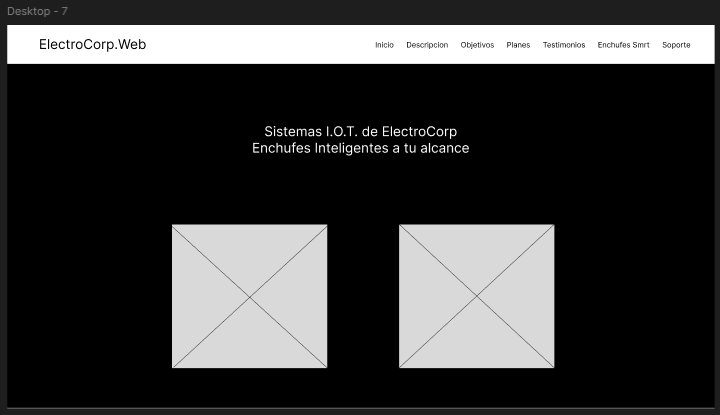
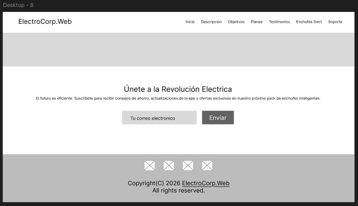

### 4.3.2. Landing Page Mock-up

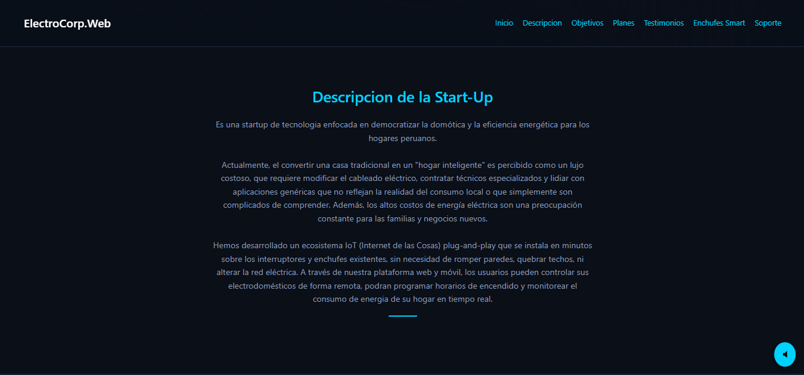
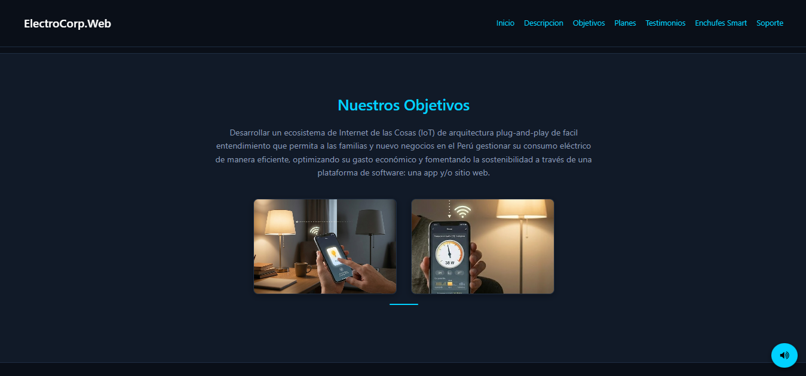
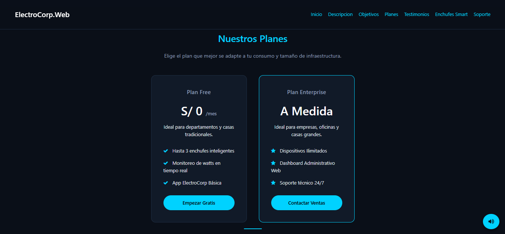
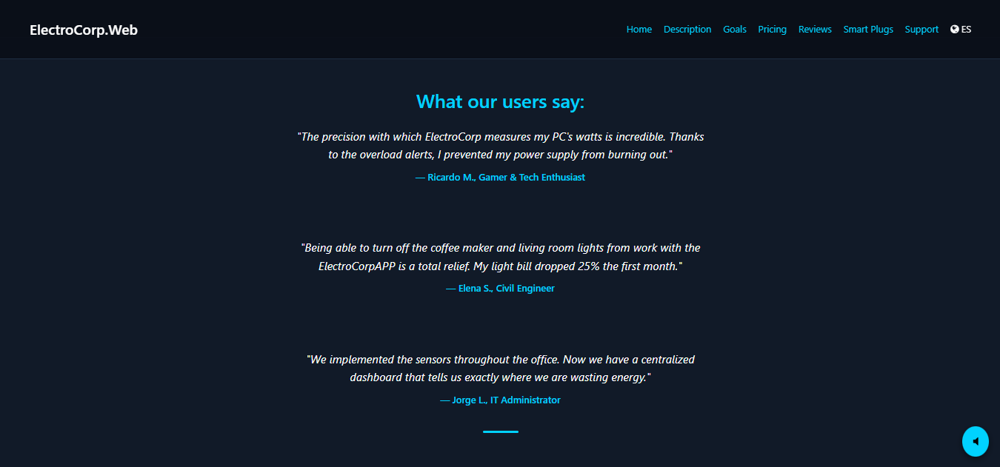
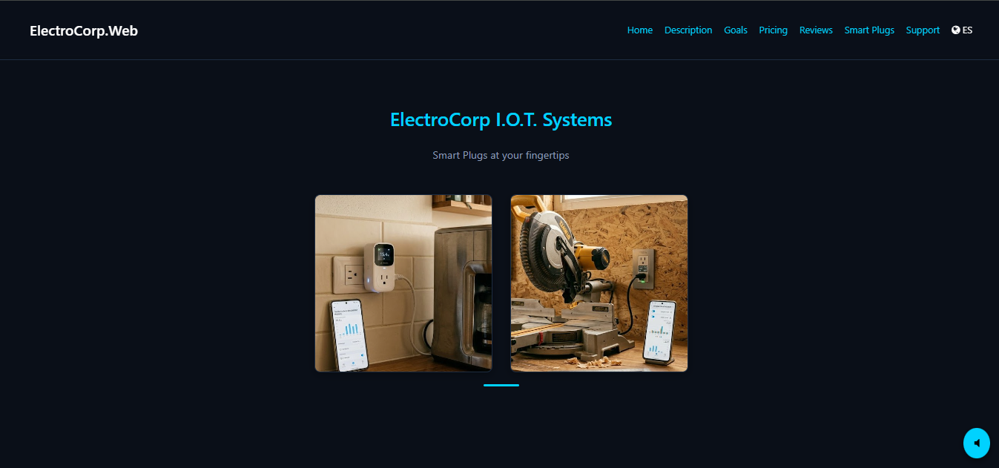


## 4.4. Web Applications UX/UI Design
### 4.4.1. Web Applications Wireframes

Los siguientes wireframes representan la estructura de baja fidelidad de las principales vistas de la aplicación web de **ElectroCorp**. Estos diseños permiten visualizar la distribución general de los componentes, la jerarquía de información y el flujo de navegación antes de aplicar estilos visuales finales.

---

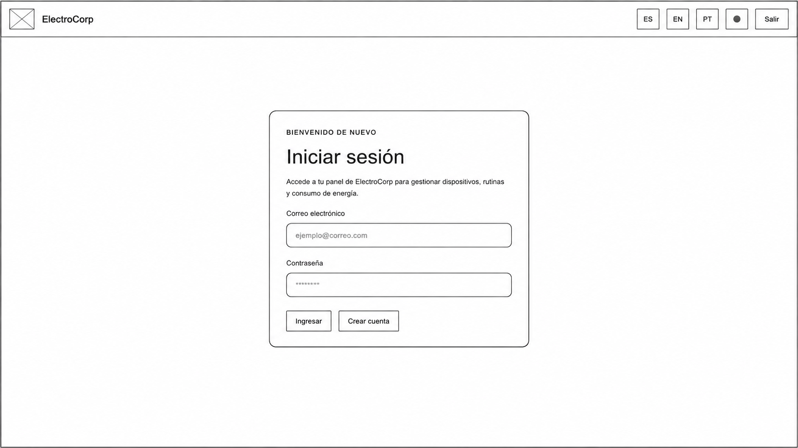

**Login:**  
Este wireframe muestra la pantalla de inicio de sesión de la aplicación web. Incluye los campos principales para ingresar correo electrónico y contraseña, así como las acciones para iniciar sesión o dirigirse al registro de una nueva cuenta. Esta vista funciona como punto de acceso inicial al sistema.

---

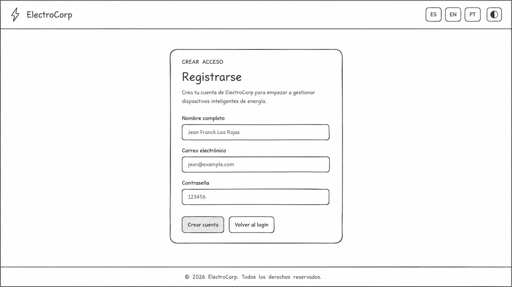

**Register:**  
Este wireframe representa la pantalla de registro de usuarios. Presenta los campos necesarios para crear una cuenta, como nombre completo, correo electrónico y contraseña. Además, incluye una opción para volver al login en caso el usuario ya tenga una cuenta registrada.

---


**Home:**  
Este wireframe corresponde al dashboard principal de ElectroCorp. En esta vista se organiza la información general del usuario, como dispositivos conectados, consumo actual, alertas pendientes y estado de suscripción. También se incluyen accesos rápidos hacia las funcionalidades principales de la aplicación.

---

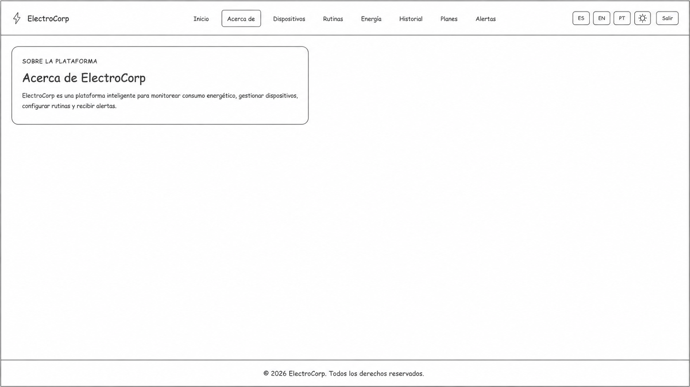

**About:**  
Este wireframe muestra la sección informativa de la plataforma. Su objetivo es presentar una descripción breve de ElectroCorp, explicando su propósito como solución para monitoreo energético, gestión de dispositivos, configuración de rutinas y recepción de alertas.

---

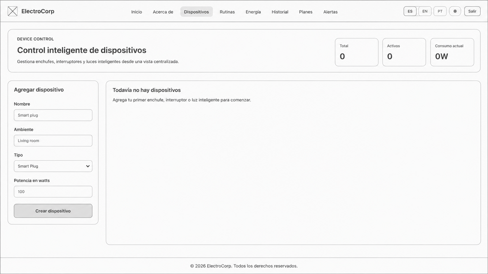

**Devices:**  
Este wireframe representa la vista de control de dispositivos inteligentes. Incluye un formulario para agregar nuevos dispositivos y un área destinada a listar los equipos registrados. Esta sección permite organizar la administración de enchufes, luces e interruptores inteligentes desde una sola interfaz.

---

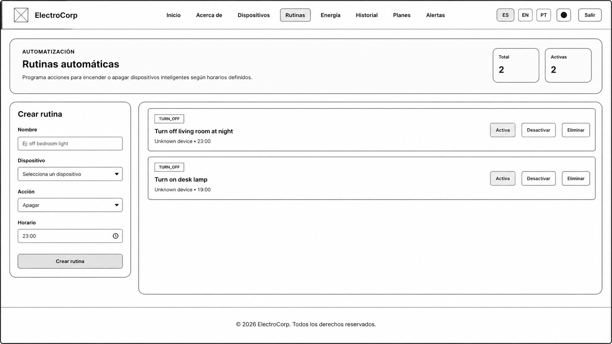

**Routines:**  
Este wireframe corresponde al módulo de rutinas automáticas. Presenta un formulario para crear automatizaciones y una lista de rutinas registradas. Su finalidad es permitir que el usuario programe acciones como encender o apagar dispositivos en horarios definidos.

---

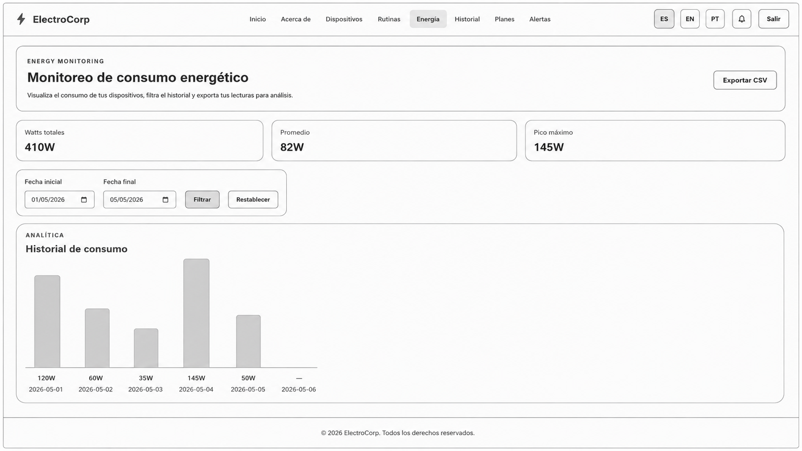

**Energy:**  
Este wireframe muestra la vista de monitoreo de consumo energético. Incluye indicadores clave como watts totales, promedio y pico máximo, además de filtros por fecha y un gráfico para visualizar el comportamiento del consumo. Esta sección facilita el análisis inicial de los datos energéticos.

---


**History:**  
Este wireframe representa el historial de consumo energético. La vista contiene una tabla con registros organizados por dispositivo, consumo en watts, fecha y estado. También incluye una opción para exportar los datos en formato CSV, lo que permite generar reportes o análisis externos.

---


**Plans:**  
Este wireframe presenta la pantalla de planes de servicio. Se muestran diferentes opciones de suscripción con sus precios y características principales. Esta vista permite comparar planes y seleccionar una alternativa adecuada para las necesidades del usuario.

---

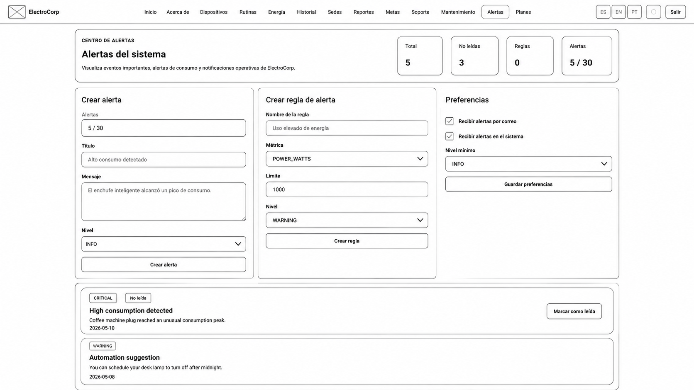

**Alerts:**  
Este wireframe corresponde al centro de alertas de ElectroCorp. Incluye un resumen de alertas no leídas, un formulario para crear nuevas notificaciones y una lista de alertas relacionadas con consumo elevado, sugerencias de automatización y reportes mensuales.

---
### 4.4.2. Web Applications Wireflow Diagrams

El siguiente wireflow representa el flujo de navegación principal de la aplicación web de **ElectroCorp**. Este diagrama permite visualizar cómo el usuario se desplaza entre las pantallas principales del sistema, partiendo desde el proceso de autenticación hasta el acceso a los módulos funcionales de la plataforma.

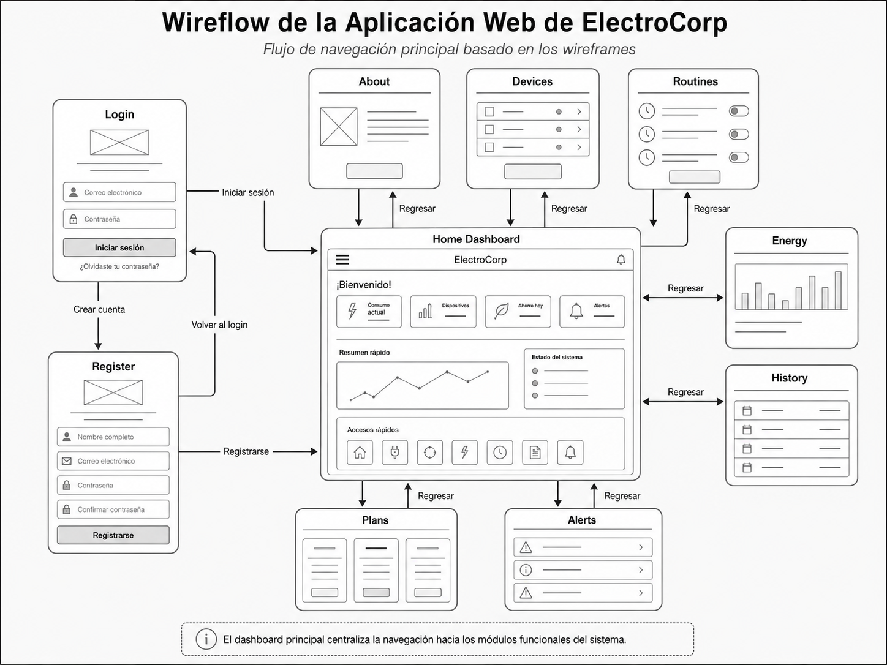

**Web Application Wireflow:**  
El flujo inicia en la pantalla de **Login**, desde donde el usuario puede iniciar sesión o acceder al formulario de **Register** para crear una nueva cuenta. Una vez autenticado, el usuario ingresa al **Home Dashboard**, que funciona como el punto central de navegación de la aplicación.

Desde el dashboard principal, el usuario puede acceder a las secciones de **About**, **Devices**, **Routines**, **Energy**, **History**, **Plans** y **Alerts**. Cada una de estas vistas representa un módulo funcional del sistema y mantiene una navegación de retorno hacia el dashboard o mediante el menú superior. Esta estructura permite que la experiencia de usuario sea clara, centralizada y coherente con los objetivos de la plataforma.

### 4.4.3. Web Applications Mock-ups

Los siguientes mock-ups representan la versión de mayor fidelidad de las interfaces web de **ElectroCorp**. A diferencia de los wireframes, estos diseños incorporan colores, tipografía, estilos visuales y una distribución más cercana a la implementación final desarrollada en la aplicación.

---


**Login:**  
Este mock-up muestra la pantalla final de inicio de sesión. Presenta una interfaz moderna con soporte para cambio de idioma y modo visual. La vista permite que el usuario acceda a la plataforma mediante correo electrónico y contraseña, manteniendo una experiencia clara y directa.

---

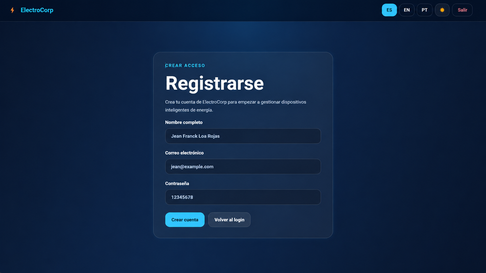

**Register:**  
Este mock-up representa la pantalla de registro final. La interfaz permite crear una cuenta nueva ingresando nombre completo, correo electrónico y contraseña. Además, mantiene una navegación sencilla hacia el login para usuarios que ya poseen una cuenta.

---

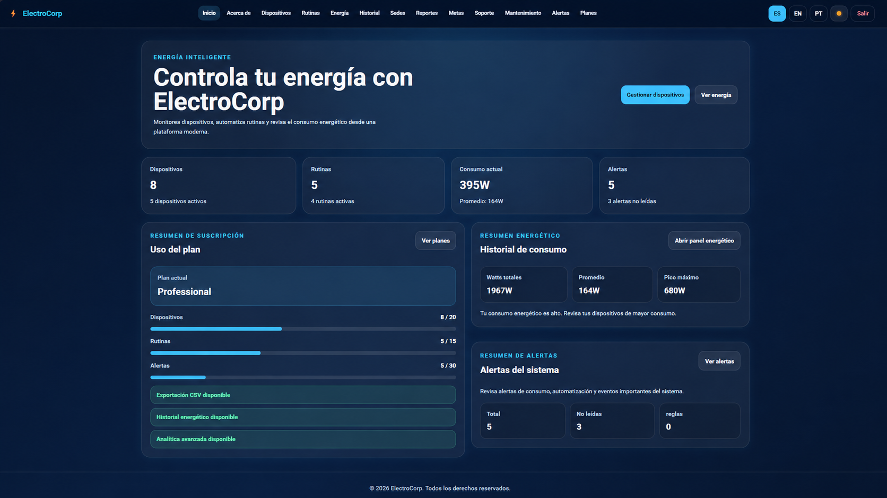

**Home:**  
Este mock-up presenta el dashboard principal de la aplicación. Se muestran tarjetas resumen sobre dispositivos conectados, consumo actual, alertas pendientes y suscripción. También incluye accesos rápidos hacia módulos importantes como control de dispositivos, consumo energético, historial, alertas y planes.

---

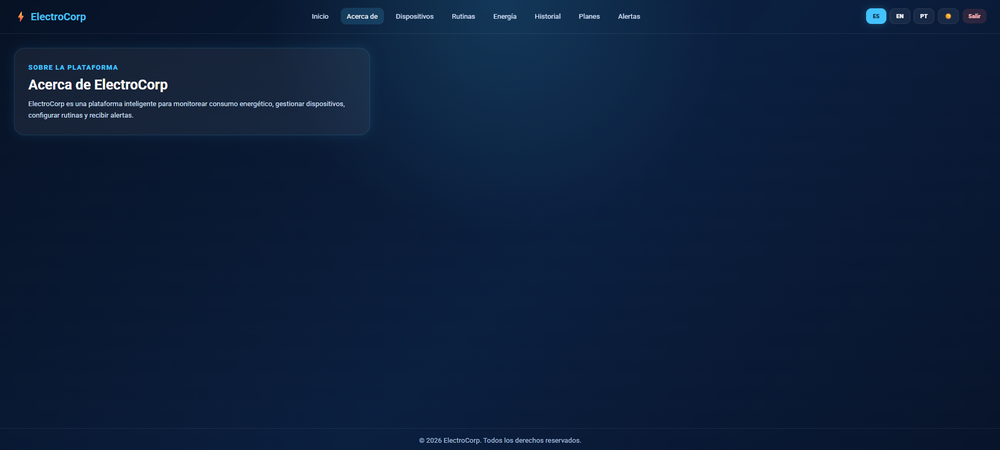

**About:**  
Este mock-up corresponde a la sección informativa de ElectroCorp. La vista resume el propósito de la plataforma, explicando que permite monitorear consumo energético, gestionar dispositivos inteligentes, configurar rutinas automáticas y recibir alertas.

---

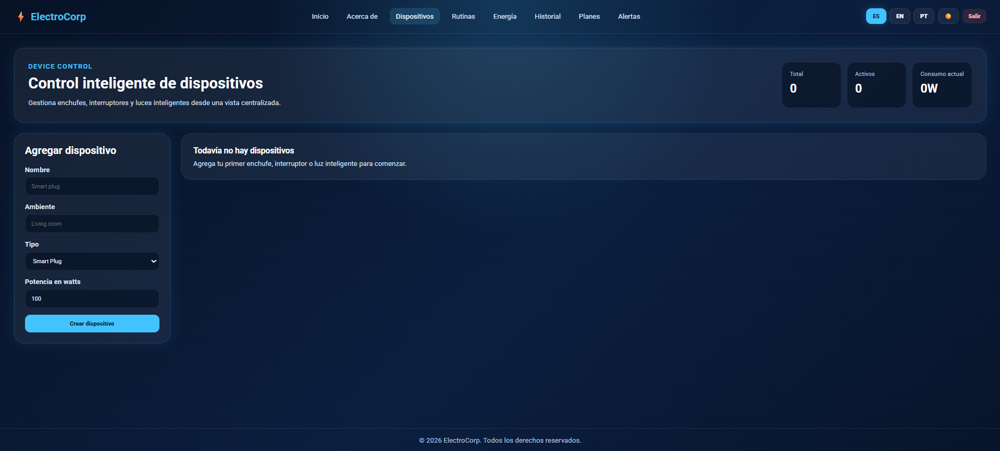

**Devices:**  
Este mock-up muestra el módulo de gestión de dispositivos inteligentes. Permite agregar nuevos equipos mediante un formulario y visualizar el estado general de los dispositivos registrados. Además, presenta métricas como total de dispositivos, dispositivos activos y consumo actual.

---

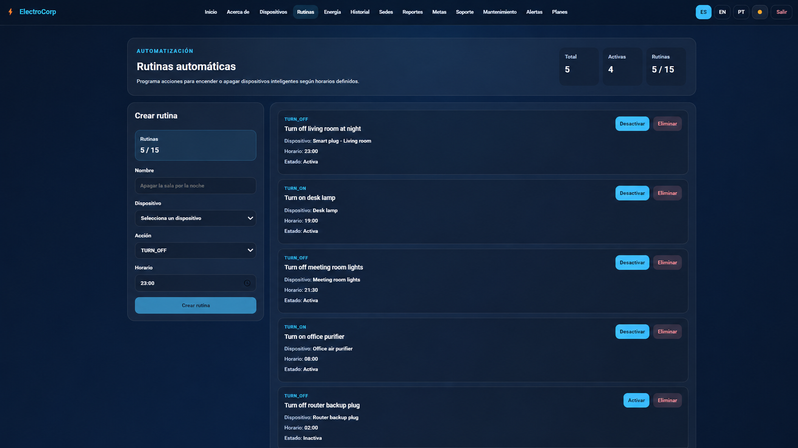

**Routines:**  
Este mock-up representa la vista de rutinas automáticas. El usuario puede crear nuevas rutinas, seleccionar dispositivos, definir una acción y establecer un horario. También se muestra una lista de rutinas existentes con opciones para activarlas, desactivarlas o eliminarlas.

---


**Energy:**  
Este mock-up corresponde al módulo de monitoreo energético. Presenta indicadores como watts totales, promedio y pico máximo. También incluye filtros por fecha y un gráfico de barras que permite analizar visualmente el historial de consumo energético.

---


**History:**  
Este mock-up muestra la vista de historial de consumo. La pantalla presenta una tabla con lecturas energéticas registradas, indicando dispositivo, consumo, fecha y estado. También incluye una opción para exportar la información en formato CSV.

---

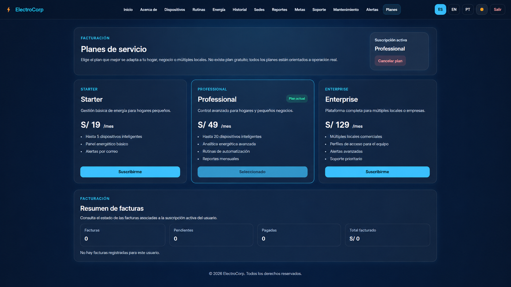

**Plans:**  
Este mock-up representa la vista de planes de servicio. Se presentan tres opciones de suscripción con sus respectivos precios y características. Esta sección permite comparar los planes disponibles y seleccionar una opción acorde al uso del sistema.

---

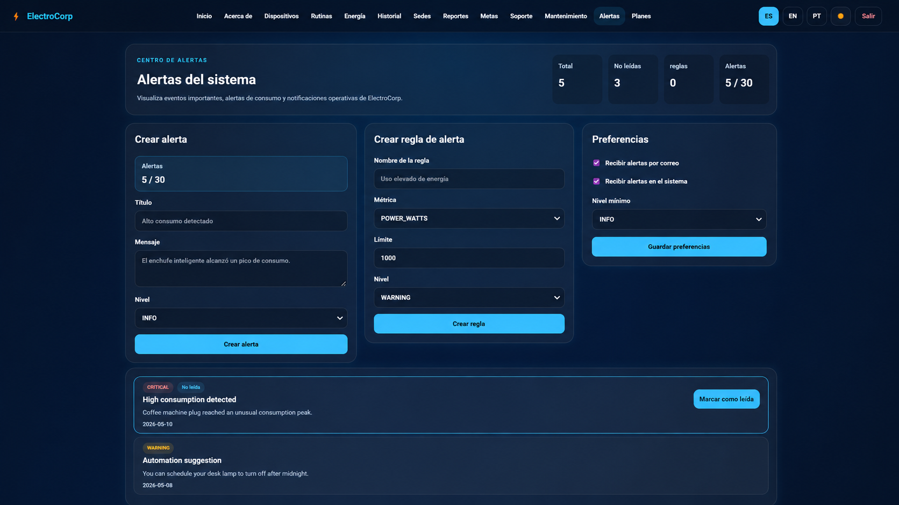

**Alerts:**  
Este mock-up muestra el centro de alertas de la aplicación. Incluye un contador de alertas sin leer, un formulario para crear nuevas alertas y una lista de notificaciones clasificadas por nivel. Esta sección permite al usuario supervisar eventos importantes relacionados con consumo energético y automatización.

---


### 4.4.4. Web Applications User Flow Diagrams

El siguiente diagrama de flujo de usuario representa el recorrido principal que realiza una persona al interactuar con la aplicación web de **ElectroCorp**. Este flujo inicia cuando el usuario accede a la plataforma y debe decidir si ya cuenta con una cuenta registrada. En caso no la tenga, puede dirigirse al proceso de registro para crear una nueva cuenta; si ya posee credenciales, continúa hacia la pantalla de inicio de sesión.

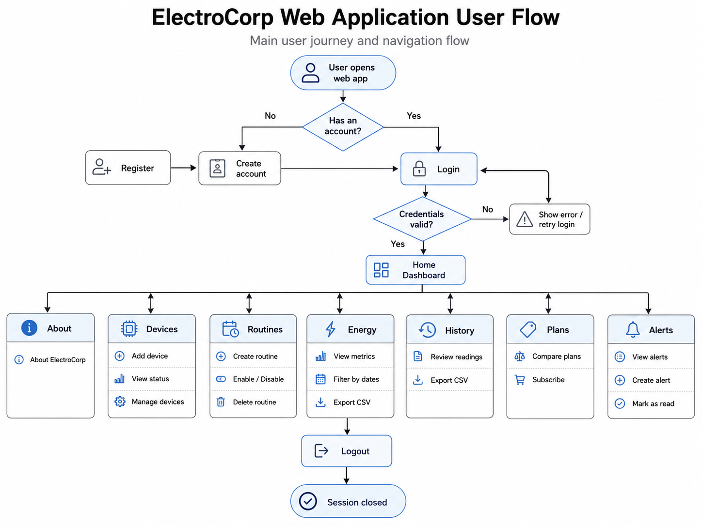

**Web Application User Flow:**  
El flujo principal comienza con el acceso del usuario a la aplicación web. Luego, el sistema evalúa si el usuario cuenta con una cuenta existente. Si no tiene una cuenta, se dirige al módulo de **Register**, donde puede crearla y posteriormente iniciar sesión. Si ya posee una cuenta, accede directamente al módulo de **Login**.

Después del inicio de sesión, se valida si las credenciales ingresadas son correctas. Si los datos no son válidos, el sistema muestra un mensaje de error y permite que el usuario vuelva a intentar el acceso. Si las credenciales son correctas, el usuario ingresa al **Home Dashboard**, que funciona como el punto central de navegación de la plataforma.

Desde el dashboard, el usuario puede acceder a los principales módulos funcionales de ElectroCorp: **About**, **Devices**, **Routines**, **Energy**, **History**, **Plans** y **Alerts**. Cada módulo permite realizar acciones específicas, como gestionar dispositivos, crear rutinas automáticas, visualizar métricas de consumo, revisar historial energético, comparar planes de servicio y atender alertas del sistema.

Finalmente, el flujo contempla la acción de **Logout**, mediante la cual el usuario puede cerrar sesión de forma segura. De esta manera, el diagrama permite comprender tanto el recorrido principal como los escenarios alternativos de autenticación, navegación y salida de la aplicación.

---

## 4.5. Web Applications Prototyping

En esta sección se presenta el prototipo funcional de la aplicación web de **ElectroCorp**, incluyendo la integración entre la webapp y el servicio temporal `electrocorp-platform`. El video muestra el flujo general de uso de la plataforma, desde el acceso del usuario hasta la navegación por los principales módulos del sistema.

El prototipo permite validar visualmente la experiencia de usuario, la navegación entre vistas, el consumo de datos desde la Fake API desplegada en Render y la separación entre frontend y plataforma de datos. Asimismo, evidencia el avance funcional de módulos como autenticación, dashboard principal, gestión de dispositivos, rutinas, monitoreo energético, historial, planes y alertas.

**Video de presentación del prototipo:**  
[Ver video del prototipo de ElectroCorp](https://1drv.ms/v/c/0e85bddd31a5a6b2/IQCP8SBS3IW5S5o6jAGWF7XLAfQNWdWKiPXAHFVbyPx7g6s?e=eU1usI)


## 4.6. Domain-Driven Software Architecture
### 4.6.1. Design-Level Event Storming

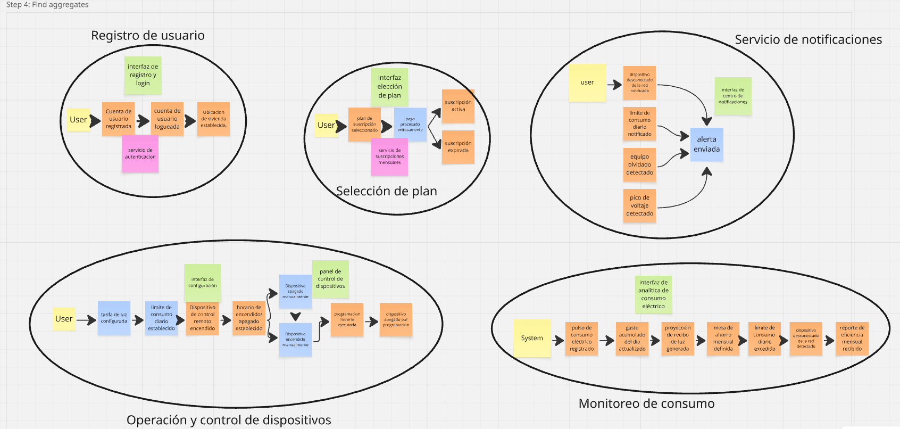

### 4.6.2. Software Architecture Context Diagram

En esta sección se presenta el Diagrama de Contexto correspondiente al Nivel 1 del modelo C4 para la arquitectura de ElectroCorp. Este diagrama permite visualizar el ecosistema general de la solución, identificando al usuario principal, el sistema ElectroCorp y los servicios externos que complementan sus funcionalidades.

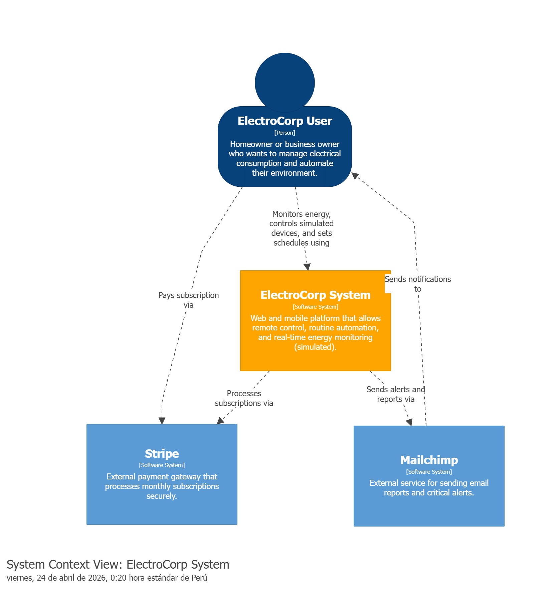

El entorno del sistema ElectroCorp se compone de los siguientes elementos principales:

**- ElectroCorp User (Actor Principal):** Representa a los propietarios de viviendas o dueños de negocios que interactúan con la plataforma. El usuario utiliza ElectroCorp para gestionar dispositivos inteligentes, configurar rutinas automáticas, monitorear el consumo energético, revisar reportes, definir metas energéticas, recibir alertas, gestionar su suscripción y solicitar soporte o mantenimiento técnico.

**- ElectroCorp System (Sistema Principal):** Es la plataforma central del proyecto. Integra las funcionalidades principales relacionadas con autenticación, planes y facturación, control de dispositivos, monitoreo energético, gestión de sedes, reportes, metas, notificaciones, soporte y mantenimiento. Para el alcance del proyecto, el sistema simula el comportamiento y la información de dispositivos inteligentes mediante una API y una base de datos, sin depender de hardware físico real.

**- Stripe (Sistema Externo de Soporte):** Servicio externo utilizado como pasarela de pagos. ElectroCorp se comunica con Stripe para procesar pagos de suscripciones y operaciones relacionadas con la facturación de los usuarios.

**- Mailchimp (Sistema Externo de Soporte):** Servicio externo utilizado para el envío de correos electrónicos. ElectroCorp delega en Mailchimp el despacho de notificaciones, alertas críticas y reportes relacionados con el consumo energético del usuario.

En conjunto, este diagrama evidencia que ElectroCorp actúa como el sistema principal que centraliza la experiencia del usuario, mientras se apoya en servicios externos para resolver procesos especializados como pagos y notificaciones.

### 4.6.3. Software Architecture Container Diagrams

A continuación, se presenta el Diagrama de Contenedores correspondiente al Nivel 2 del modelo C4. Este diagrama detalla los principales contenedores técnicos que conforman ElectroCorp y muestra el flujo general desde la interacción del usuario hasta el procesamiento de la información en el backend y la persistencia de datos.

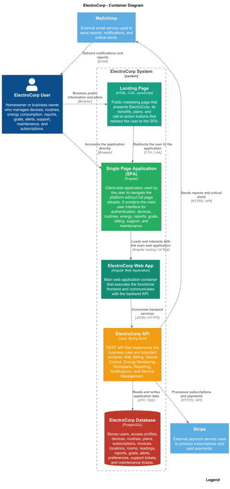

La arquitectura de ElectroCorp se basa en una separación clara entre presentación, aplicación cliente, lógica de negocio, persistencia y servicios externos. Los contenedores principales son los siguientes:

**1. Contenedores de Aplicación Frontend**

**- Landing Page:** Representa la página pública de presentación de ElectroCorp. Su finalidad es mostrar información general del producto, beneficios, planes y llamadas a la acción. Desde esta página, el usuario puede dirigirse hacia la aplicación principal.

**- ElectroCorp Single Page Application (SPA):** Representa la aplicación cliente desarrollada con Angular. Se denomina SPA porque permite navegar entre distintas vistas sin recargar completamente la página. Desde esta aplicación, el usuario interactúa con funcionalidades como dispositivos, rutinas, energía, historial, sedes, reportes, metas, alertas, planes, soporte y mantenimiento.

**- ElectroCorp Web App:** Representa el contenedor funcional web que conecta la aplicación frontend con los servicios de backend. En el flujo definido para la arquitectura, el usuario puede ingresar directamente a la SPA o llegar desde la Landing Page; posteriormente, la SPA se comunica con la Web App y esta consume los servicios de la API.

**2. Contenedor de Lógica Central Backend**

**- ElectroCorp API:** Es el núcleo de la solución backend, desarrollado en Java con Spring Boot. Implementa la lógica de negocio organizada bajo principios de Domain-Driven Design. La API expone servicios REST para los bounded contexts de IAM, Billing, Device Control, Energy Monitoring, Notifications, Workplace, Reporting y Service Management.

**3. Contenedor de Persistencia**

**- ElectroCorp Database:** Es la base de datos relacional encargada de almacenar la información principal del sistema. Contiene datos de usuarios, perfiles de acceso, dispositivos, rutinas, planes, suscripciones, pagos, facturas, sedes, ambientes, asignaciones, lecturas energéticas, reportes, metas, alertas, reglas de alerta, preferencias de notificación, tickets de soporte y tickets de mantenimiento.

**4. Servicios Externos**

**- Stripe:** Servicio externo utilizado para procesar pagos y suscripciones de forma segura.

**- Mailchimp:** Servicio externo utilizado para enviar notificaciones, reportes y alertas críticas por correo electrónico.

El flujo principal de la arquitectura queda representado de la siguiente forma: el usuario puede acceder directamente a la SPA o pasar primero por la Landing Page; la Landing Page redirige hacia la SPA; la SPA interactúa con la Web App; la Web App consume la API; y la API se comunica con la base de datos y con servicios externos como Stripe y Mailchimp.

### 4.6.4. Software Architecture Components Diagrams

Los siguientes diagramas de componentes representan la arquitectura interna de ElectroCorp a nivel frontend. Estos diagramas permiten observar cómo la aplicación se organiza modularmente por bounded contexts, separando responsabilidades de presentación, aplicación, dominio e infraestructura.

Para una mejor comprensión, los diagramas se han dividido en tres tipos:

- **Tipo 1:** Diagrama general de componentes de toda la aplicación frontend.
- **Tipo 2:** Diagramas de componentes por bounded context.
- **Tipo 3:** Diagramas de componentes enfocados en la capa de presentación de cada bounded context.

#### 4.6.4.1. Frontend Components Diagram - Type 1: General Application View

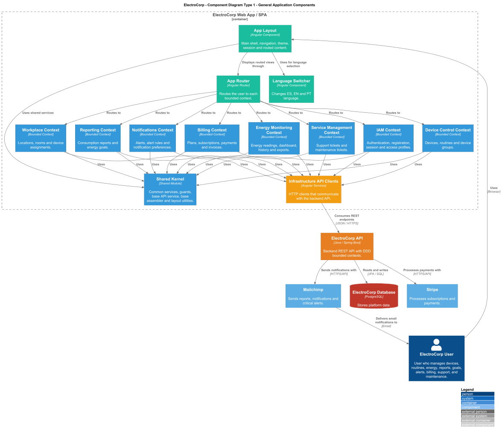

El diagrama general de componentes del frontend muestra la estructura global de la aplicación web de ElectroCorp. En esta vista se observa cómo el usuario interactúa con el `App Layout`, el sistema de rutas y el `Language Switcher`, además de cómo la aplicación organiza sus funcionalidades en bounded contexts.

Los módulos principales considerados son `Shared`, `IAM`, `Billing`, `Device Control`, `Energy Monitoring`, `Notifications`, `Workplace`, `Reporting` y `Service Management`. Cada uno de estos módulos representa una sección funcional de la aplicación y se comunica con servicios de infraestructura encargados de consumir la API backend.

Este diagrama evidencia que la aplicación frontend mantiene una arquitectura modular, donde cada bounded context encapsula sus responsabilidades y utiliza elementos compartidos como servicios de sesión, preferencias de interfaz, base API service, base assembler y componentes comunes.

#### 4.6.4.2. Frontend Components Diagram - Type 2: Bounded Context Design

Los diagramas de componentes de Tipo 2 detallan el diseño interno de cada bounded context. En estos diagramas se muestra la relación entre las capas de presentación, aplicación, dominio e infraestructura.

##### Shared Components Diagram

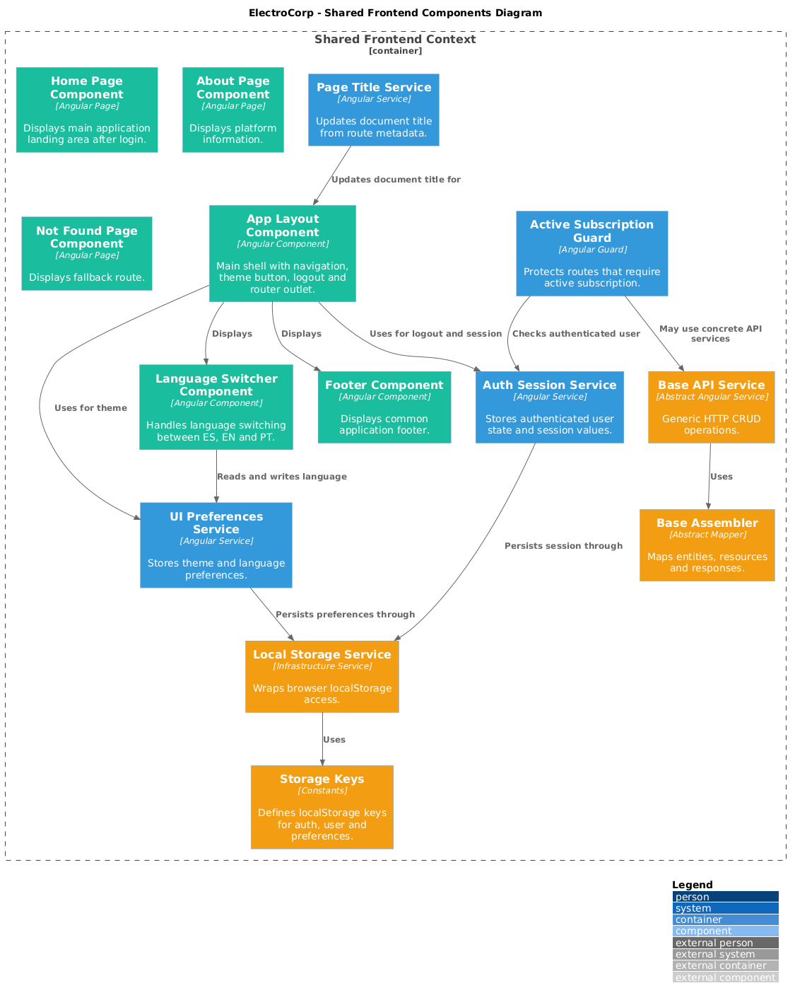

El módulo `Shared` funciona como un kernel compartido dentro del frontend. Contiene componentes comunes como `App Layout`, `Footer` y `Language Switcher`, además de servicios transversales como `Auth Session Service`, `UI Preferences Service`, guards, servicios base de API y ensambladores base. Su propósito es evitar duplicidad y proporcionar funcionalidades reutilizables a los demás bounded contexts.

##### IAM Components Diagram

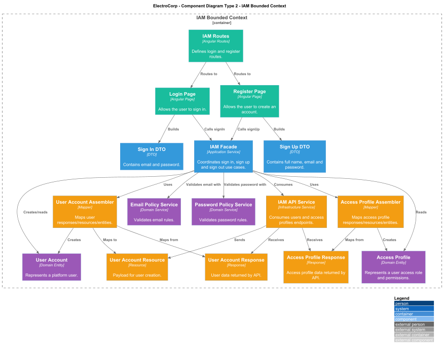

El bounded context `IAM` se encarga de la autenticación, registro, gestión de sesión y perfiles de acceso. Su capa de presentación contiene las páginas de login y registro, mientras que su capa de aplicación utiliza un facade para coordinar los casos de uso. La infraestructura se comunica con la API mediante servicios especializados y transforma los datos usando assemblers.

##### Billing Components Diagram

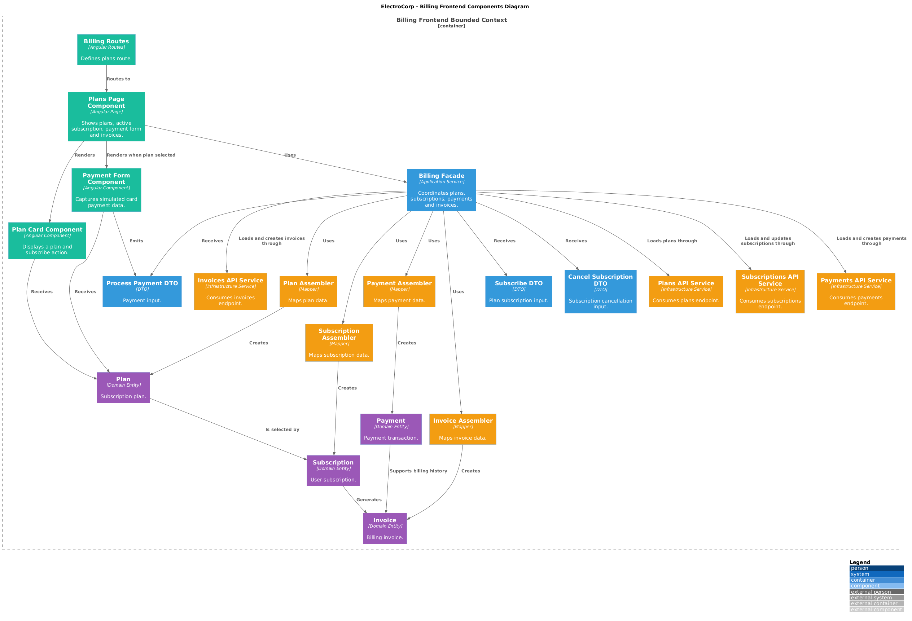

El bounded context `Billing` gestiona planes, suscripciones, pagos e invoices. Este módulo permite visualizar planes disponibles, suscribirse, cancelar una suscripción, procesar pagos simulados y revisar el resumen de facturación. Además, incorpora entidades como `Plan`, `Subscription`, `Payment` e `Invoice`, junto con servicios de dominio para políticas de suscripción y permisos según el plan contratado.

##### Device Control Components Diagram

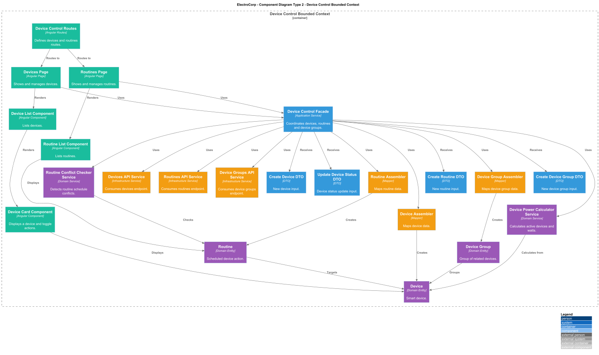

El bounded context `Device Control` administra dispositivos, rutinas y grupos de dispositivos. Su facade coordina la carga, creación, actualización y eliminación de dispositivos y rutinas. También se apoya en servicios de dominio para calcular consumo activo y detectar conflictos entre rutinas programadas.

##### Energy Monitoring Components Diagram

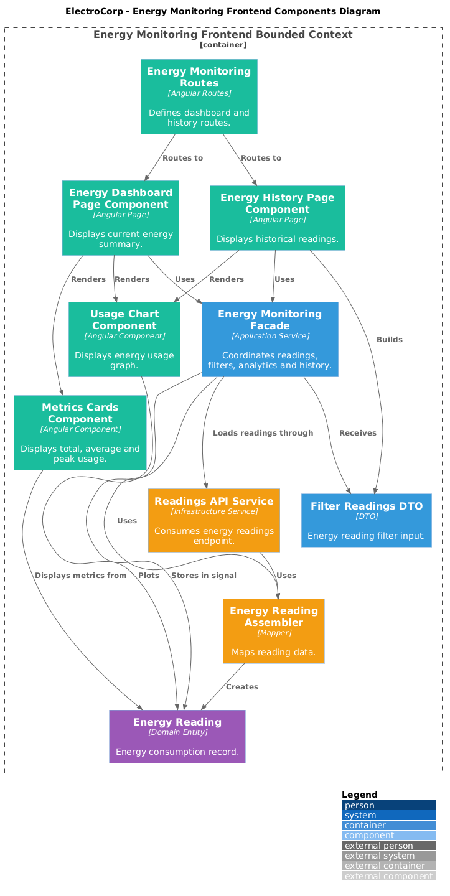

El bounded context `Energy Monitoring` se encarga de mostrar lecturas energéticas, métricas, historial y gráficos de consumo. Este módulo permite observar el comportamiento energético de los dispositivos y, en función del plan del usuario, habilitar funcionalidades como historial energético, analítica avanzada y exportación de datos.

##### Notifications Components Diagram

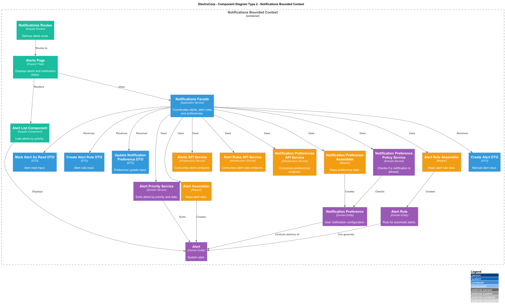

El bounded context `Notifications` administra alertas, reglas de alerta y preferencias de notificación. Permite listar alertas, marcar alertas como leídas, configurar reglas y aplicar criterios de prioridad. Este módulo se relaciona con el monitoreo energético, ya que ciertas lecturas pueden activar alertas según las reglas configuradas.

##### Workplace Components Diagram

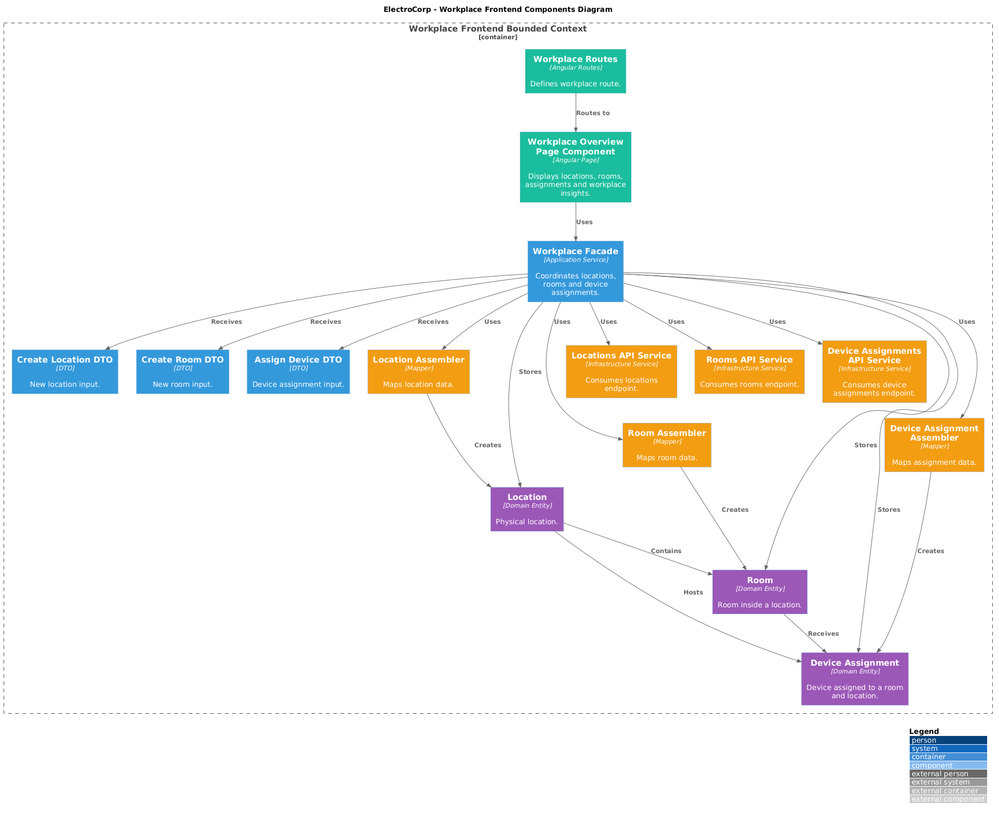

El bounded context `Workplace` gestiona sedes, ambientes y asignaciones de dispositivos. Permite organizar los dispositivos dentro de ubicaciones físicas como hogares, oficinas, tiendas o almacenes. Su diseño facilita visualizar la distribución de ambientes, cobertura de asignaciones y sedes con mayor actividad.

##### Reporting Components Diagram

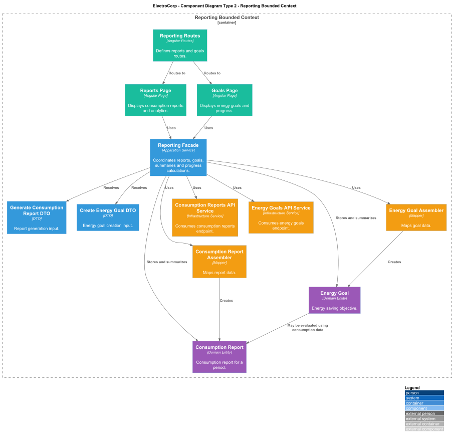

El bounded context `Reporting` gestiona reportes de consumo y metas energéticas. Este módulo muestra indicadores como consumo total, picos máximos, reportes críticos, progreso promedio de metas y metas completadas. También permite organizar la información para analizar la evolución del consumo energético.

##### Service Management Components Diagram

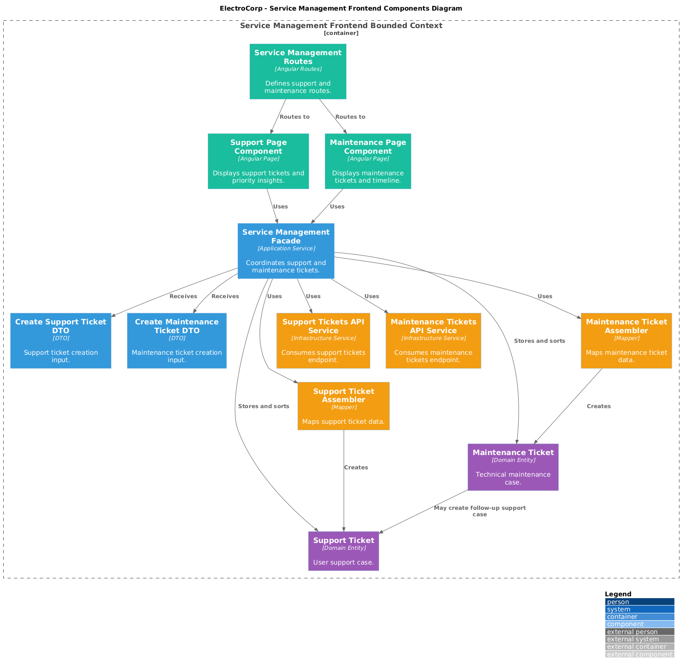

El bounded context `Service Management` administra tickets de soporte y tickets de mantenimiento. Permite visualizar solicitudes de ayuda, casos críticos, tasa de resolución, mantenimientos pendientes y mantenimientos completados. Su objetivo es dar soporte operativo al usuario y controlar incidencias relacionadas con el sistema o los dispositivos.

#### 4.6.4.3. Frontend Components Diagram - Type 3: Presentation Layer Design

Los diagramas de componentes de Tipo 3 se enfocan específicamente en la capa de presentación de cada bounded context. Estos diagramas permiten visualizar cómo se organizan las páginas, componentes visuales, pipes de traducción y facades consumidos desde la interfaz.

##### Shared Presentation Components Diagram

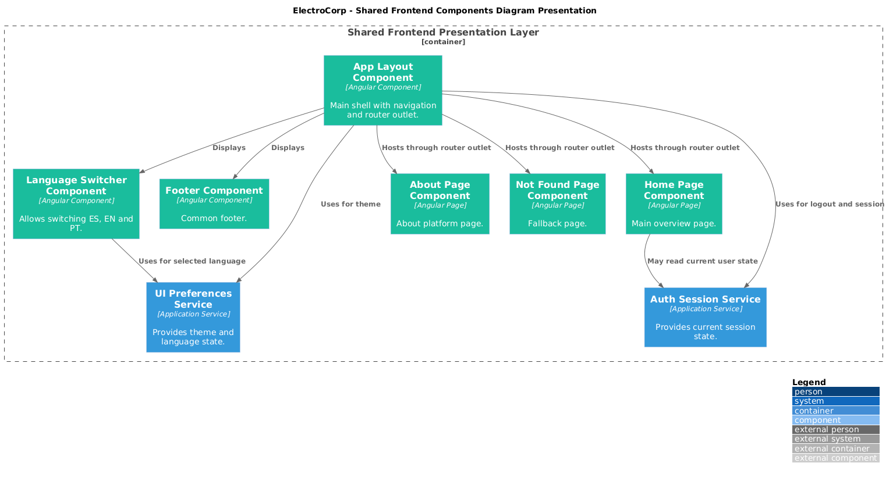

La capa de presentación de `Shared` incluye el layout principal, el componente de cambio de idioma, el footer y páginas generales como Home, About y Not Found. Esta capa proporciona la estructura visual común de toda la aplicación y permite que los demás módulos se rendericen mediante el sistema de rutas.

##### IAM Presentation Components Diagram

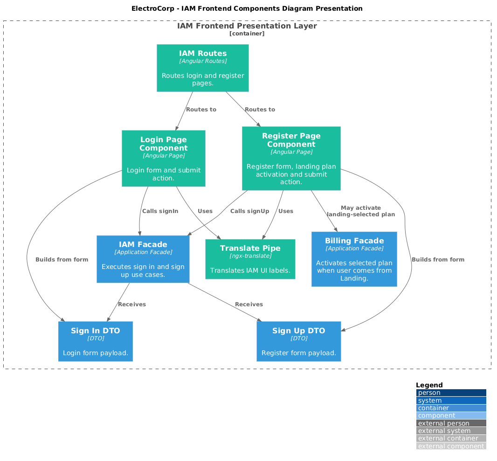

La capa de presentación de `IAM` contiene las páginas de login y registro. Estas páginas construyen los DTOs correspondientes y llaman al `IAM Facade` para ejecutar los casos de uso de autenticación y creación de cuenta. También utiliza traducciones para soportar los idiomas disponibles en la aplicación.

##### Billing Presentation Components Diagram

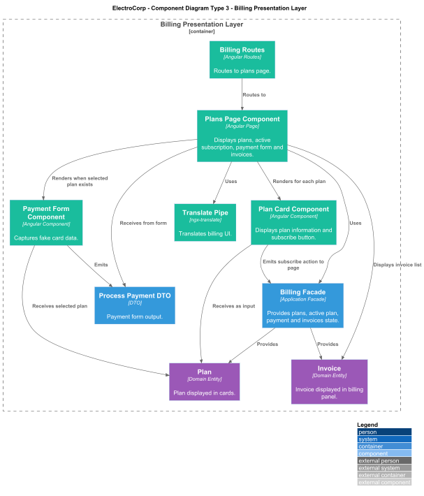

La capa de presentación de `Billing` contiene la página de planes, tarjetas de plan y formulario de pago. Desde esta vista, el usuario puede ver su plan activo, seleccionar un nuevo plan, confirmar un pago simulado y revisar sus facturas. La página se comunica con el `Billing Facade`, que proporciona los datos y acciones necesarias.

##### Device Control Presentation Components Diagram

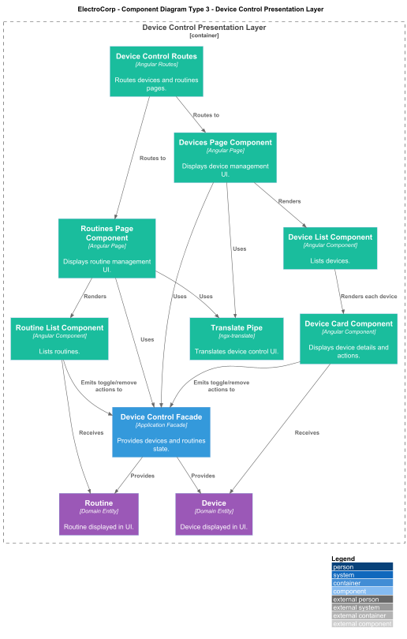

La capa de presentación de `Device Control` contiene las páginas de dispositivos y rutinas, además de componentes como listas y tarjetas de dispositivos. Su objetivo es mostrar el estado de los dispositivos, permitir acciones como encender o apagar, y gestionar rutinas automáticas.

##### Energy Monitoring Presentation Components Diagram

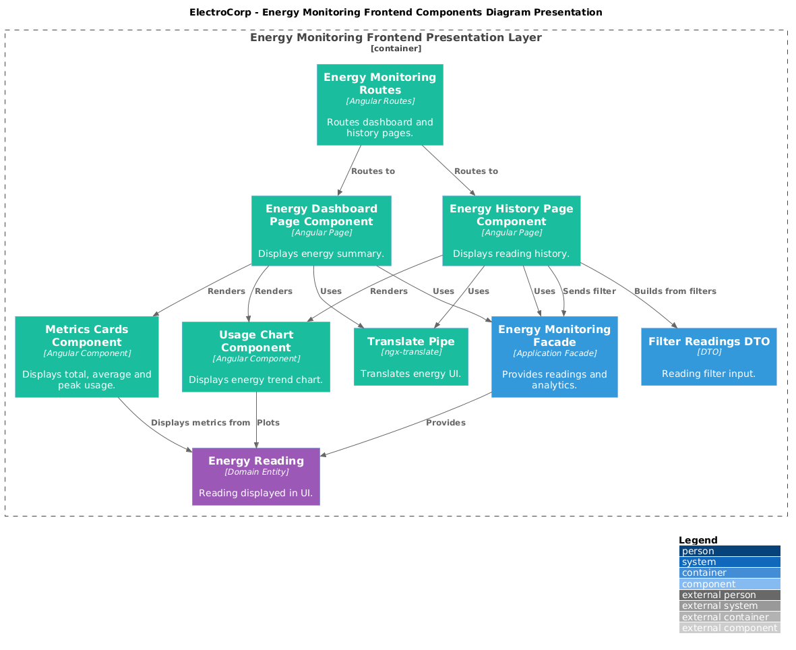

La capa de presentación de `Energy Monitoring` contiene las páginas de dashboard energético e historial. También incluye componentes de métricas y gráficos, los cuales permiten visualizar el consumo total, consumo promedio, picos máximos y evolución histórica.

##### Notifications Presentation Components Diagram

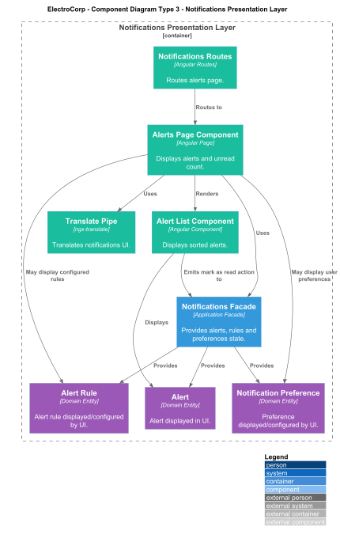

La capa de presentación de `Notifications` incluye la página de alertas y el listado de alertas. Esta vista permite observar alertas ordenadas por prioridad, revisar notificaciones pendientes y ejecutar acciones como marcar alertas como leídas.

##### Workplace Presentation Components Diagram

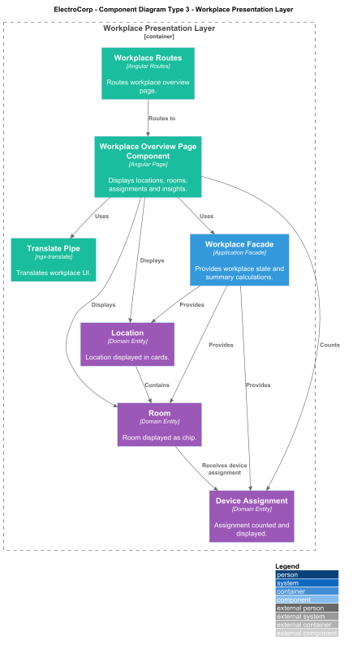

La capa de presentación de `Workplace` contiene la página de gestión de sedes y ambientes. Esta vista muestra KPIs, insights operativos, distribución de sedes, ambientes registrados y estado de asignaciones de dispositivos. Utiliza el `Workplace Facade` para obtener y calcular la información mostrada.

##### Reporting Presentation Components Diagram

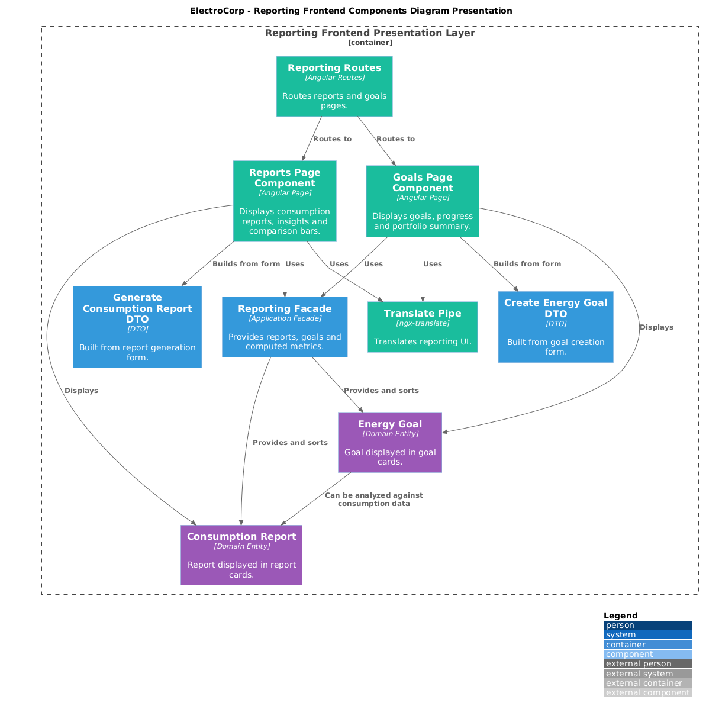

La capa de presentación de `Reporting` contiene las páginas de reportes y metas. La página de reportes muestra análisis de consumo, tendencias y reportes críticos, mientras que la página de metas muestra progreso, estado de metas y métricas de seguimiento energético.

##### Service Management Presentation Components Diagram

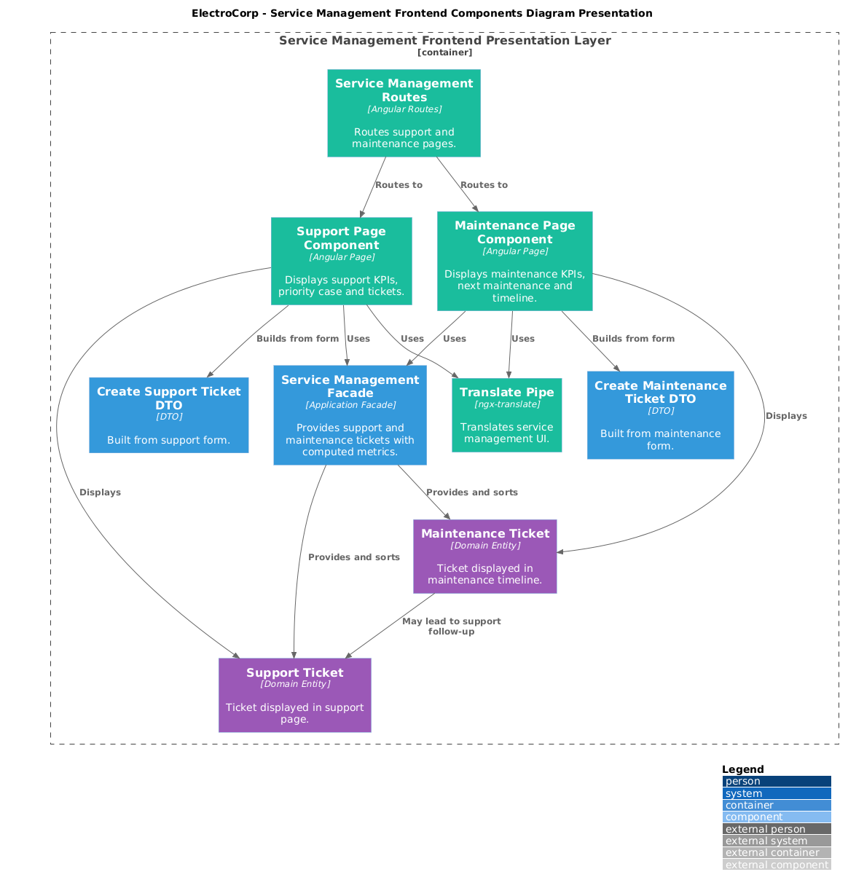

La capa de presentación de `Service Management` contiene las páginas de soporte y mantenimiento. La página de soporte muestra tickets, casos críticos y tasa de resolución. La página de mantenimiento muestra atenciones pendientes, mantenimientos completados y una línea de tiempo de mantenimientos técnicos.


## 4.7. Software Object-Oriented Design

### 4.7.1. Class Diagrams

Los siguientes diagramas de clases presentan el diseño orientado a objetos del sistema ElectroCorp, separados en una vista de frontend y una vista de backend. Ambos diagramas se renderizan de forma online a partir de los archivos fuente PlantUML almacenados en el repositorio, utilizando la versión raw de GitHub.

#### Frontend Class Diagram


El diagrama de clases del frontend representa la estructura interna de la webapp de ElectroCorp, organizada por bounded contexts. Cada módulo conecta sus vistas y componentes con stores de Pinia, servicios de aplicación, endpoints de infraestructura, ensambladores y modelos de dominio.

La conexión principal sigue el flujo: las vistas invocan acciones del store, el store utiliza facades para coordinar la lógica de aplicación, las facades consumen endpoints de infraestructura, y los responses recibidos desde la API son transformados en entidades de dominio mediante assemblers. Esta estructura permite mantener una separación clara entre presentación, aplicación, infraestructura y dominio, facilitando la futura conexión con el backend real de ElectroCorp Platform.

#### Backend Class Diagram


El diagrama de clases del backend representa la arquitectura propuesta para ElectroCorp Platform, planteada como una aplicación Spring Boot organizada por bounded contexts y capas. El diseño contempla módulos como IAM, Device Control, Energy Monitoring, Notifications y Billing.

Cada bounded context se estructura mediante controladores REST, servicios de aplicación, entidades de dominio, repositorios, adaptadores de persistencia, entidades JPA y mappers. Esta organización permite separar responsabilidades entre la capa de presentación de API, la lógica de aplicación, el modelo de dominio y la infraestructura de persistencia.

El flujo principal parte desde los controladores REST, los cuales reciben requests y delegan la ejecución a servicios de aplicación. Estos servicios coordinan la lógica del caso de uso, interactúan con entidades de dominio y consumen interfaces de repositorio. Finalmente, los adaptadores de persistencia implementan dichas interfaces utilizando Spring Data JPA y transforman la información entre entidades de dominio, entidades JPA y DTOs de respuesta.

## 4.8. Database Design

### 4.8.1. Database Diagrams

El diagrama de base de datos de ElectroCorp representa las principales entidades necesarias para el funcionamiento de la plataforma. Se incluyen entidades relacionadas con la gestión de usuarios, perfiles de acceso, permisos, dispositivos inteligentes, rutinas automáticas, lecturas de consumo energético, alertas, planes de servicio y suscripciones.

La estructura permite modelar la relación entre usuarios y dispositivos, así como el registro de lecturas energéticas generadas por cada dispositivo. Además, contempla la gestión de rutinas programadas, alertas asociadas al consumo o estado de los equipos, y la administración de planes de suscripción. Este diseño está alineado con una futura implementación backend en Spring Boot, donde las entidades podrán persistirse en una base de datos relacional.


# Capitulo V: Product Implementation, Validation & Deployment
## 5.1. Software Configuration Management

A continuación, se presentará un repositorio central y organizado que servirá como guía para el desarrollo enfocado y consistente de nuestra solución.

### 5.1.1 Software Development Environment Configuration

En esta sección se incluye los links de las aplicaciónes, productos de software realizadas durante el ciclo del proyecto en los programas que se utilizaron. <br>

+ **Project Management**<br>
Esta área se centra en la planificación, organización, coordinación y control de los recursos y actividades necesarias para completar un proyecto de software con éxito. Incluye la gestión del alcance, el tiempo, el costo, la calidad, los riesgos, los recursos humanos y la comunicación para garantizar que el proyecto se entregue dentro del tiempo y el presupuesto establecidos, cumpliendo con los requisitos y objetivos definidos.

  +	<b>Jira Software:</b> Herramienta líder en la industria para la gestión ágil de proyectos. Permite a los equipos planificar, priorizar y realizar un seguimiento del trabajo de manera colaborativa mediante tableros Scrum o Kanban. <br>https://www.atlassian.com/es/software/jira<br><br>

+ **Requirements Management**<br>
Se refiere al proceso de identificar, documentar, verificar y gestionar los requisitos del sistema y del software. Implica entender las necesidades de los usuarios y las partes interesadas, traduciéndolas en requisitos funcionales y no funcionales claros y específicos. El objetivo es garantizar que el software desarrollado satisfaga las necesidades y expectativas de los usuarios finales.

  + **Jira Software:**
Plataforma de gestión centrada en Historias de Usuario (User Stories), que se organizan en Épicas (Epics) y se clasifican por puntaje de esfuerzo (Story Points). Es utilizada para mantener a todos los miembros del equipo al tanto del progreso del Backlog del producto, ofreciendo una vista en tiempo real compartida que facilita la colaboración eficiente.
<br> https://www.atlassian.com/es/software/jira<br><br>

+ **Product UX/UI Design**<br>
Este aspecto se enfoca en el diseño de la experiencia del usuario (UX) y la interfaz de usuario (UI) del producto de software. UX se centra en comprender y mejorar la experiencia general del usuario al interactuar con el software, mientras que UI se refiere al diseño visual y la usabilidad de la interfaz de usuario. En este caso realizar un modelo de sitio web para computadoras y celulares.

  + **Figma:**<br>Herramienta de prototipado web y editor de gráficos vectoriales que se aloja en la web, permitiendo establecer los modelos interactivos para versión en Web Browser y Mobile Browser de manera colaborativa.
https://www.figma.com/design/ 

  + **UXPressia:**<br> Herramienta en línea para el mapeo de la trayectoria del cliente. Sus herramientas nos permitieron establecer las bases del modelado de User Persona, Empathy Map y Journey Map.<br>https://uxpressia.com/ 

  + **MIRO:**<br>Pizarra digital colaborativa en línea, usada para la investigación, la ideación, mapas mentales, flujos as-is / to-be y una variedad de otras actividades colaborativas.<br>https://miro.com/app/dashboard/ 

  + **Lucid Chart:**<br> Es una herramienta de diagramación basada en la web, que permite a los usuarios colaborar y trabajar juntos en tiempo real, creando diseños UML, mapas mentales, prototipos de software y muchos otros tipos de diagrama.
https://lucid.app/documents#/dashboard 

  + **dbdiagram.io:**<br> Herramienta gratuita y basada en la web diseñada para dibujar esquemas de bases de datos de forma rápida e intuitiva mediante código (DBML). Se utilizará para diseñar visualmente el modelo Entidad-Relación (ERD), definir las estructuras de las tablas y exportar ágilmente los scripts SQL necesarios para implementar nuestra base de datos en MySQL.
https://dbdiagram.io/

  + **Structurizr:**<br> Es una herramienta de diseño que soporta el modelo C4, para visualizar la arquitectura de software de nuestra solución. 
https://structurizr.com/ 

+ **Software Development**<br>
Es el proceso de crear, diseñar, programar, probar y mantener el software. Incluye la implementación de los requisitos definidos utilizando diferentes lenguajes de programación, herramientas y tecnologías.

  + **GitHub:**<br>Repositorio comunitario basado en la nube cuya función es almacenar, versionar y gestionar los avances del código fuente elaborado por el equipo. <br>
https://github.com/upc-pre-202610-1asi0729-11896-ECorp


  + **Visual Studio Code:**<br> Editor de código fuente potente y ligero que brinda extensiones personalizables, permitiendo que la función del desarrollador sea más eficiente.<br>
https://code.visualstudio.com/ 

  + **HTML:**<br>  Lenguaje estándar para crear y diseñar sitios web. Utiliza etiquetas para estructurar el contenido. Este lenguaje será utilizado en el presente proyecto para implementar la estructura de la página web.<br>
https://www.jetbrains.com/help/webstorm/editing-html-files.html 

  + **CSS:**<br> : Lenguaje de hojas de estilo utilizado para controlar el diseño y la presentación de páginas web. Permite establecer colores, fuentes y animaciones. Se utilizará para la implementación del diseño visual de nuestra plataforma.<br>
https://www.jetbrains.com/help/webstorm/style-sheets.html#ws_css_completion 

  + **JavaScript:**<br> Lenguaje de programación de alto nivel que se utiliza para agregar interactividad y dinamismo a los sitios web (validar formularios, animar elementos, etc.). Se utilizará para la elaboración de la lógica frontend de la plataforma.<br>
https://www.jetbrains.com/help/webstorm/javascript-specific-guidelines.html 


  +  **Java:**<br> Es un lenguaje de programación de alto nivel, robusto y orientado a objetos, diseñado para tener la menor cantidad posible de dependencias de implementación. Es ideal para aplicaciones empresariales, desarrollo de apps móviles (Android) y sistemas de escritorio. Se utilizará para gestionar la lógica de servidor y el procesamiento de datos del proyecto.<br>
https://www.oracle.com/java/technologies/downloads/

+ **Software Testing**<br>
Se refiere a la actividad de verificar y validar el software para garantizar su calidad y funcionamiento correcto. Involucra la ejecución de pruebas funcionales y no funcionales para identificar errores, defectos o problemas en el software antes de su lanzamiento. El objetivo es asegurar que el software sea confiable, robusto y cumpla con los requisitos y expectativas del usuario final.

  + **Lenguaje Gherkin:**<br>Es un lenguaje de dominio específico (DSL) utilizado en el desarrollo de software para escribir pruebas de aceptación en un formato legible por humanos. Utiliza palabras clave como Given, When y Then para describir el estado inicial, la acción y el resultado esperado de un escenario de prueba, lo que facilita la colaboración entre equipos al definir requisitos y pruebas.<br>https://cucumber.io/

+ **Software Deployment**<br>
Es el proceso de implementar y poner en funcionamiento el software en un entorno de producción o en los dispositivos de los usuarios finales. Incluye actividades como la instalación, configuración, migración de datos y puesta en marcha del software. El objetivo es garantizar una implementación exitosa y sin problemas del software en el entorno de producción.

  + **Github Pages:**<br> Servicio de Github que nos permitió alojar nuestra Landing page y nos permitirá alojar nuestro web applications.<br>
https://pages.github.com/ <br>


+	**Software Documentation**<br>Se refiere a la creación y mantenimiento de documentos que describen el software, incluyendo su arquitectura, diseño, funcionamiento, instalación, configuración, uso y mantenimiento. La documentación proporciona información útil y detallada sobre el software para desarrolladores, usuarios finales, administradores de sistemas y otras partes interesadas. 

    + **Markdown:**<br>Es un lenguaje de marcado ligero que permite escribir texto con un formato fácil de leer y escribir, que luego puede ser convertido a HTML u otros formatos de presentación. Es ampliamente utilizado para documentar proyectos de software debido a su simplicidad y versatilidad. Markdown permite agregar formato básico como encabezados, listas, enlaces e imágenes utilizando una sintaxis sencilla y fácil de recordar.<br>https://www.markdownguide.org/getting-started/<br><br>


### 5.1.2. Source Code Management

Para administrar el progreso del código de manera efectiva, hemos decidido adoptar la metodología Git Flow. Esta estrategia se enfoca en el uso de ramas para facilitar la gestión de archivos durante el proceso de programación. En resumen, Git Flow nos permite mantener una rama principal ('main') que contiene una versión estable del proyecto en un punto determinado. Al mismo tiempo, utilizamos otra rama de desarrollo para incorporar nuevas características al código base sin afectar la versión estable actual. Esto nos permite avanzar en el desarrollo de nuestra página de destino mientras realizamos pruebas relacionadas con las nuevas modificaciones introducidas en la rama de desarrollo.

Además, hemos optado por utilizar GitHub debido a su función específica llamada GitHub Pages. Esta función permite la visualización eficiente del proyecto mediante la ejecución de archivos '.html' y la generación de un enlace web.

En cuanto a nuestros archivos feature, creamos una nueva rama “feature/sprint-1” para cada nueva funcionalidad que deseamos agregar. Este enfoque modular y organizado asegura un desarrollo progresivo, ya que cada rama “feature/sprint-1” actúa como un espacio aislado para desarrollar y probar una característica específica antes de fusionarla con la rama de desarrollo.<br><br>

Enlace de la Landing Page en GitHub Pages: https://upc-pre-202610-1asi0729-11896-ecorp.github.io/electrocorp-website/<br><br> 

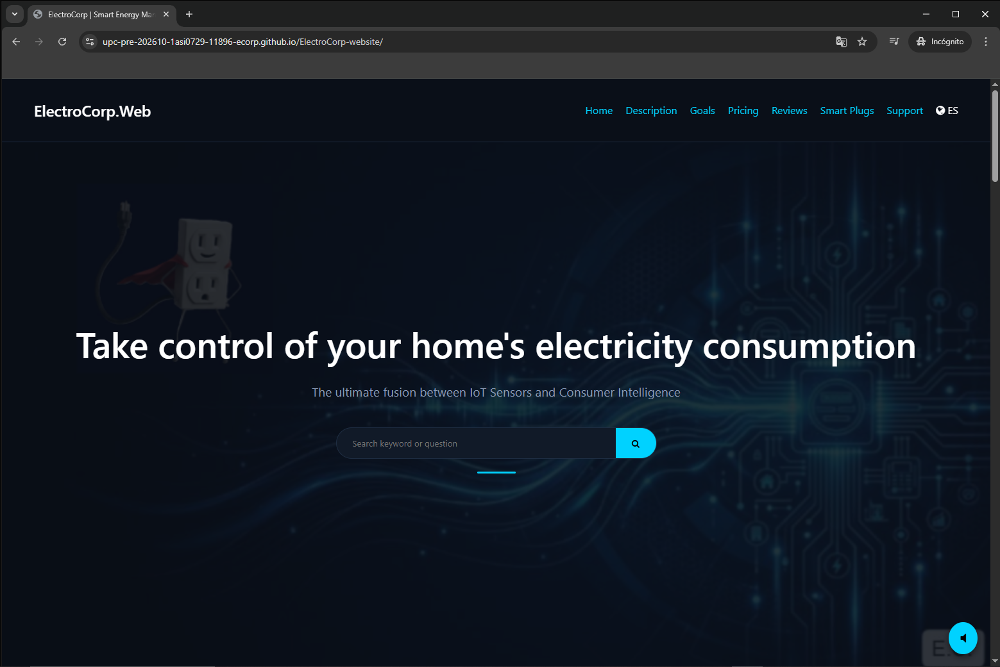</img><br>

Repositorio GitHub de la Landing Page: https://github.com/upc-pre-202610-1asi0729-11896-ecorp/electrocorp-website <br><br> 

</img><br>

Repositorio GitHub de los archivos feature: https://github.com/upc-pre-202610-1asi0729-11896-ecorp/Acceptance-Test/tree/feature/sprint-1 <br><br> 

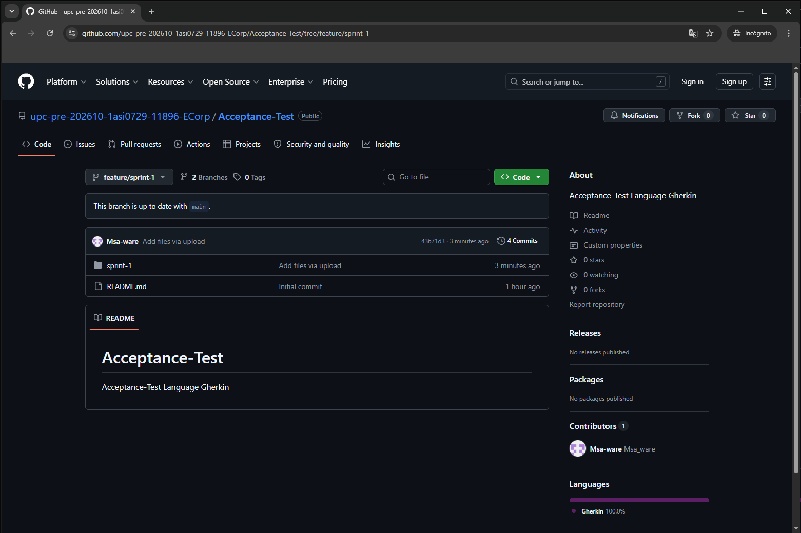</img><br>


### 5.1.3 Source Code Style Guide & Conventions

En esta sección del proyecto, nos enfocaremos en establecer un conjunto coherente de referencias y convenciones para el estilo de código y las convenciones de programación que usaremos para la creación de nuestra aplicación web ElectroCorp. Estas prácticas son cruciales para el desarrollo de la aplicación puesto a que garantizan la coherencia, la legibilidad y la calidad estructural del código. En consecuencia, nos facilitarán su mantenimiento y escalabilidad a lo largo del ciclo de vida del proyecto. 

En este proyecto, se emplearán HTML, CSS, JavaScript y Java para desarrollar la plataforma web, mientras que Gherkin se utilizará en el proceso de prueba del programa. A continuación, se presentarán y explicarán las reglas y recomendaciones generales que se considerarán al utilizar estos lenguajes.

**Nomenclatura en Inglés y uso de Minúsculas**

Los términos utilizados para nombrar variables, objetos, elementos y funciones estarán en inglés y relacionados con la función o descripción de lo que representan. En el desarrollo web se evitará el uso de mayúsculas, ya que la combinación de mayúsculas y minúsculas puede afectar la legibilidad del código, según lo señalado por Google. Se dará preferencia al uso exclusivo de minúsculas para mejorar la legibilidad del código.

Ejemplo: 
```css
.btn-s {}  /* Mala práctica, el nombre de esta clase no nos dice nada */

.btn-start {} /* Buena práctica, el nombre de esta clase nos dice que representa al botón de inicio */
```

**Identación o Sangría**

La indentación o sangría en el código es esencial para mejorar la legibilidad y comprensión del mismo. Proporciona una estructura visual clara que refleja la lógica del código, facilitando su mantenimiento y reduciendo la probabilidad de errores.

Según Google para facilitar la lectura, se debe agregar dos espacios de sangría y no utilizar la tecla de tabulación, por lo que seguiremos esta práctica para nuestro proyecto.

Ejemplos:

**En HTML:**
```html
<ul class="device-list">
  <li>Smart Plug</li>
  <li>Smart Switch</li>
  <li>Light Sensor</li>
</ul>
```

**En CSS:**
```css
body {
  background: #0a0f18;
  color: #ffffff;
}
```

**En JavaScript:**
```javascript
function calculateWatts(amps) {
  return amps * 220;
}
```

A continuación se mostrarán las reglas específicas para cada lenguaje que utilizaremos:

<br><br>

**HTML**

Para nuestro proyecto utilizaremos HTML5, el estándar más reciente de HTML que ofrece una amplia gama de nuevas características y mejoras. A continuación se mostrarán las características y pautas que seguiremos para el desarrollo:

+ **Document Type**

En nuestro proyecto, nos adherimos a las mejores prácticas recomendadas por Google al utilizar HTML. Por lo tanto, emplearemos la declaración de tipo de documento (DOCTYPE) específica de HTML5, que se define como `<!DOCTYPE html>`. 

+ **Semantics**

Utilizaremos los elementos HTML para lo que han sido diseñados. Por ejemplo, emplearemos elementos de encabezado para encabezados, elementos de párrafo (`<p>`) para párrafos, elementos de anchor (`<a>`) para enlaces, y así sucesivamente, tal y como nos indica Google.

Ejemplo:
```html
<div onclick="goToDashboard();">Go to Dashboard</div>

<a href="dashboard/">Go to Dashboard</a>
```

+ **Blank Lines**

Para mejorar la legibilidad del código, W3Schools recomienda agregar líneas en blanco para separar bloques de código grandes o lógicos. Esta práctica ayuda a dividir visualmente el código en secciones más manejables y facilita la identificación de la estructura y la lógica del programa.

```html
<body>

<h1>Control de Dispositivos</h1>

<h2>Lámpara de Sala</h2>
<p>Estado actual: Encendido. Consumo: 15W.</p>

<h2>Aire Acondicionado</h2>
<p>Estado actual: Apagado. Programado para las 18:00 hrs.</p>

</body>
```

+ **Multimedia Fallback**

Es fundamental proporcionar contenido alternativo para elementos multimedia, como imágenes, videos y objetos animados a través de canvas. Esto implica utilizar texto alternativo (`alt`) significativo para las imágenes, videos y audios. Según Google, la inclusión de contenido alternativo es crucial por razones de accesibilidad y además es importante en caso de que estos objetos multimedia fallen al cargar. 

Ejemplo:
```html


```

+ **HTML Quotation Marks**

Según las recomendaciones de Google, al citar los valores de los atributos en HTML, se deben utilizar comillas dobles ("") en lugar de comillas simples (''). Esta práctica es preferible ya que las comillas dobles son el estándar recomendado en la especificación de HTML.

Ejemplo: 
```html
<a class='btn-login'>Sign in</a>

<a class="btn-login">Sign in</a> 
```

<br><br>

**CSS**

Para nuestro proyecto, optaremos por CSS3, la versión más reciente de CSS que ofrece una amplia variedad de nuevas características y mejoras en comparación con las versiones anteriores. A continuación, se presentarán las características y directrices que seguiremos para el desarrollo:

+ **Property Name Stops**

Para mantener la consistencia en el código CSS, se recomienda utilizar un espacio después de los dos puntos que siguen al nombre de la propiedad. Además, es importante utilizar un solo espacio entre la propiedad y el valor asignado a esa propiedad, tal y como nos indica Google.

Ejemplo:
```css
/* Not recommended */
h2 {
  font-weight:bold;
}

/* Recommended */
h2 {
  font-weight: bold;
}
```

+ **Declaration Stops**

Según las recomendaciones de Google, se debe utilizar un punto y coma (;) al final de cada declaración en CSS. Esto ayuda a mantener la consistencia y la extensibilidad del código.

```css
/* Not recommended */
.box {
  display: block;
  width: 100px
}

/* Recommended */
.box {
  display: block;
  width: 100px;
}
```

+ **Shorthand Properties**

Se debe utilizar propiedades abreviadas (shorthand properties) siempre que sea posible en CSS. Google afirma que estas propiedades abreviadas, como font o margin, ofrecen una forma más concisa de definir múltiples valores en una sola declaración, incluso en casos donde solo se establece un valor de manera explícita.

Ejemplo: 
```css
/* Not recommended */
border-top-style: none;
padding-bottom: 2em;
padding-left: 1em;
padding-right: 1em;
padding-top: 0;

/* Recommended */
border-top: 0;
padding: 0 1em 2em;
```

+ **CSS Quotation Marks**

Google nos dice la recomendación de que se deben utilizar comillas simples ('') en lugar de comillas dobles ("") para selectores de atributos y valores de propiedades en CSS. No se deben utilizar comillas en valores de URI (`url()`).

Ejemplo: 
```css
/* Not recommended */
@import url("[https://fonts.googleapis.com/css?family=Roboto](https://fonts.googleapis.com/css?family=Roboto)");

html {
  font-family: "open sans", sans-serif;
}

/* Recommended */
@import url([https://fonts.googleapis.com/css?family=Roboto](https://fonts.googleapis.com/css?family=Roboto));

html {
  font-family: 'open sans', sans-serif;
}
```

+ **Declaration Block Separation**

Se debe utilizar un espacio entre el último selector y el bloque de declaración en CSS. Google indica que siempre se debe utilizar un solo espacio entre el último selector y la llave de apertura que inicia el bloque de declaración. La llave de apertura debe estar en la misma línea que el último selector en una regla dada.

Ejemplo:
```css
/* Not recommended: missing space */
.nav{
  margin-bottom: 1em;
}

/* Not recommended: unnecessary line break */
.nav
{
  margin-bottom: 1em;
}

/* Recommended */
.nav {
  margin-bottom: 1em;
}
```

<br><br>

**JAVASCRIPT**

Para nuestro proyecto, seleccionaremos JavaScript, un lenguaje de programación fundamental para el desarrollo web. Se utiliza para agregar interactividad y dinamismo a las páginas web, permitiendo a los desarrolladores crear aplicaciones web complejas y altamente funcionales. Usaremos las siguientes indicaciones de JavaScript para nuestro proyecto:

+ **Spaces Around Operators**

Según W3Schools, se recomienda siempre colocar espacios alrededor de los operadores (=, +, -, *, /) y después de las comas al escribir código JavaScript. Esto ayuda a mejorar la legibilidad y la claridad del código, facilitando su comprensión y mantenimiento.

Ejemplo: 
```javascript
let totalWatts = wattsA + wattsB;
const activeDevices = ["Lamp", "TV", "Fan"];
```

+ **End of the simple declaration**

Según W3Schools, siempre se debe terminar una declaración simple con un punto y coma (;) al escribir código JavaScript. Esto incluye la declaración de variables, asignaciones y declaraciones de objetos.

Ejemplo:
```javascript
const devices = ["Lamp", "TV", "Fan"];

const deviceProfile = {
  id: "DEV-01",
  name: "Living Room Light",
  watts: 15,
  status: "ON"
};
```

+ **General Rules for Complex Statements**

Según la recomendación de W3Schools, para declaraciones complejas (compuestas) se deben seguir las siguientes pautas:

1. Colocar la llave de apertura al final de la primera línea.
2. Utilizar un espacio antes de la llave de apertura.
3. Colocar la llave de cierre en una nueva línea, sin espacios previos.
4. No terminar una declaración compleja con un punto y coma.

Ejemplo:
```javascript
function calculateConsumption(watts) {
  return watts * 24;
}

for (let i = 0; i < 5; i++) {
  total += i;
}

if (time < 20) {
  status = "Encendido";
} else {
  status = "Apagado";
}
```

+ **Object Rules**

Según la recomendación de W3Schools, las reglas generales para definir objetos son las siguientes:

1. Colocar la llave de apertura en la misma línea que el nombre del objeto.
2. Utilizar dos puntos seguidos de un espacio entre cada propiedad y su valor.
3. Utilizar comillas alrededor de los valores de cadena, pero no alrededor de los valores numéricos.
4. No agregar una coma después del último par propiedad-valor.
5. Colocar la llave de cierre en una nueva línea, sin espacios previos.
6. Siempre terminar la definición del objeto con un punto y coma.

Ejemplo:
```javascript
const deviceProfile = {
  id: "DEV-01",
  name: "Living Room Light",
  watts: 15,
  status: "ON"
};
```

<br><br>

**GHERKIN**

Gherkin es un Lenguaje Específico de Dominio (DSL) diseñado para abordar problemas específicos al generar casos de validación de características en diversos escenarios. Este lenguaje se utiliza para describir el comportamiento deseado de un software de manera comprensible para personas no técnicas. Gherkin presenta varios elementos, entre los que se destacan Feature, Scenario, Example, Given, When y Then, los cuales son ampliamente utilizados para definir las características y los pasos de las pruebas de comportamiento.

Las pautas a tener en cuenta al utilizar Gherkin en nuestro código incluyen:

* **Discernible Given-When-Then Blocks**

Según la sugerencia de Keiblinger, para facilitar la comprensión y la organización de los escenarios en Gherkin, se recomienda indentar los pasos que comienzan con "And" después de cada Given, When o Then. Esto permite distinguir claramente dónde termina un bloque y comienza otro, incluso en escenarios con múltiples pasos.

Ejemplo de Sophie Keiblinger:
```gherkin
Scenario: Discernible Given-When-Then Blocks

In order to quickly spot where one block ends and another one begins, you can indent the steps starting with “And”

Given I need to prepare some data for my scenario
  And this is more complex so I need a second step
  And this is more complex so I need a third step
When I trigger some action
Then I can see the expected outcome
  And this outcome also has a second step
  And this outcome also has a third step
```

* **Steps with Tables**

Keiblinger nos sugiere utilizar un colon (:) al final de los pasos que requieren más entrada de una tabla. Esto ayuda a hacer inmediatamente reconocible que se espera una tabla como parte de la entrada del paso.

Ejemplo de Sophie Keiblinger:
```gherkin
Given I need to prepare the following data for my scenario:

|  column 1  | column 2 |
| necessary  |   data   |
```

* **Reducing Noise**

Keiblinger sugiere utilizar valores por defecto para campos que el sistema requiere pero que no son pertinentes para el escenario en cuestión. Por ejemplo, al probar la validación del encendido de un equipo, no es necesario especificar la marca del router de internet del usuario. Esta inclusión no afecta al resultado del escenario. Esta práctica ayuda a simplificar los escenarios y a enfocarse en las características específicas que se están probando.

Ejemplo:
```gherkin
When el visitante se acerque a la sección 'Comunícate con nosotros'
```

* **Newlines between scenarios and separator comments**

Keiblinger nos dice que para mantener la claridad en los archivos de escenarios de Gherkin, especialmente cuando estos son extensos o contienen múltiples escenarios, se recomienda agregar dos líneas en blanco entre cada escenario. Esto ayuda a distinguir claramente dónde termina un escenario y comienza otro. Además, es común añadir un comentario separador para brindar una guía visual adicional y facilitar la navegación en el archivo.

Ejemplo:
```gherkin
#-----------------------------------------------------------------------------------
Scenario: Acceso a la historia de ElectroCorp
        Given que soy un visitante de la landing page
        When navegue por la página de inicio
        And encuentre la sección titulada "¿Quiénes Somos?"
        Then podré obtener información detallada sobre la historia de la startup.

#-----------------------------------------------------------------------------------

    Scenario: Acceso a las redes sociales de ElectroCorp
        Given que el visitante se encuentra en la landing page
        When el visitante de click en la etiqueta "Contáctanos"
        And encuentre los botones con los logos de las redes sociales
        And de click encima del botón con el logo de la red social que desee ver
        Then el usuario será redireccionado a la red social que seleccionó previamente.
```

<br><br>

**JAVA**

Java es un lenguaje de programación versátil y potente, ampliamente utilizado en una variedad de aplicaciones. Ofrece una amplia gama de características y funcionalidades, como la portabilidad, la orientación a objetos y la robustez, lo que lo convierte en una opción popular para el desarrollo backend. Con Java, construiremos la API principal de ElectroCorp. A continuación, se presentarán las características y directrices que seguiremos para el desarrollo utilizando este lenguaje.

* **Name Conventions**

Para identificar una variable, método, función o clase, es importante utilizar nombres significativos que mejoren la legibilidad del código. A continuación, se detallan las convenciones para diferentes tipos de identificadores:

Nombre de una clase: Debe comenzar con una letra mayúscula (PascalCase).
Ejemplo:
```java
public class Device
{
}
```

Nombre de función o método: Debe comenzar con una letra minúscula (camelCase).
Ejemplo:
```java
private int calculateWatts(int current, int voltage)
{
}
```

Nombre de variable: Debe comenzar con una letra minúscula (camelCase).
Ejemplo:
```java
int totalConsumption = 100;
```

Nombre de final o constante: Debe estar en letras mayúsculas separadas por guiones bajos (UPPER_CASE).
Ejemplo:
```java
public final int MAX_WATT_LIMIT = 2000;
```

* **Uso de paréntesis y llaves en las expresiones**

Codecademy sugiere utilizar paréntesis y llaves para hacer las cláusulas en una expresión más evidentes. Esta práctica mejora la claridad y la legibilidad del código, especialmente en expresiones complejas como la que se mostrará a continuación:

Ejemplo:
```java
if ((watts > limit) && (deviceStatus == true))
{
   // Ejecutar alerta
}
```

* **Identación y espaciado**

Codecademy recomienda seguir ciertos estándares para mejorar la legibilidad del código en Java. Esto incluye utilizar sangrías y asegurarse de que haya una sangría cada vez que se abre un nuevo bloque. Además, sugiere agregar espacios antes y después de las palabras clave y operadores para mejorar la claridad del código.

Ejemplo:
```java
currentWatts = 15;
voltage = 220;
```

* **Comment Style**

Google nos recomienda utilizar comentarios con `//` y `/* */`. Es preferible evitar comentarios en varias líneas para explicaciones más largas dentro de la lógica, ya que los comentarios no están localizados y pueden dificultar la lectura del código. En su lugar, se sugiere incluir explicaciones más extensas en documentación externa y usar comentarios simples para métodos puntuales.

Ejemplo:
```java
// Funcion que calcula el consumo total del dispositivo
private int calculateWatts(int current, int voltage)
{
}
```

### 5.1.4. Software Deployment Configuration
## 5.2. Landing Page, Services & Applications Implementation
### 5.2.1. Sprint 1 
#### 5.2.1.1. Sprint Planning 1
<table align="center" border="1" width="90%" style="text-align:left;">
    <tr>
        <td><b>Sprint #</b></td>
        <td>Sprint 1</td>
    </tr>
    <tr>
        <td colspan="2" align="center"><b>Sprint Planning Background</b></td>
    </tr>
    <tr>
        <td><b>Date</b></td>
        <td>2026-04-19</td>
    </tr>
    <tr>
        <td><b>Time</b></td>
        <td>11:00 AM</td>
    </tr>
    <tr>
        <td><b>Location</b></td>
        <td>Modalidad Remota por Whatsapp</td>
    </tr>
    <tr>
        <td><b>Prepared By</b></td>
        <td>Cabrejos Chocce, Diego Alexander</td>
    </tr>
    <tr>
        <td><b>Attendees (to planning meeting)</b></td>
        <td>Tavara Correa, Sebastian Oswaldo / Santiago Atanacio, Jairo Mathias / Cabrejos Chocce, Diego Alexander / Loa Rojas, Jean Franck / Documet Romero, Timothy</td>
    </tr>
    <tr>
        <td><b>Sprint n - 1 Review Summary</b></td>
        <td>No existe Spring anterior para realizar una retrospectiva. Sin embargo se debe de desarrollar en la brevedad posible las User Stories y la planificación del Product Backlog.</td>
    </tr>
    <tr>
        <td><b>Sprint n - 1 Retrospective Summary</b></td>
        <td>No existe un sprint anterior para realizar una retrospectiva. Sin embargo, basándonos en lo avanzado, debemos priorizar la correcta definición y desarrollo de las User Stories y una planificación eficiente del Product Backlog.</td>
    </tr>
    <tr>
        <td colspan="2" align="center"><b>Sprint Goal & User Stories</b></td>
    </tr>
    <tr>
        <td><b>Sprint 1 Goal</b></td>
        <td>
            <b>Our focus is on</b> desarrollar y desplegar la primera versión funcional de la Landing Page de ElectroCorp en Github Pages.<br><br>
            <b>We believe it delivers</b> una comunicación clara de nuestra propuesta de valor (ecosistema IoT plug-and-play) a los visitantes, generando interés y prospectos.<br><br>
            <b>This will be confirmed when</b> los usuarios puedan navegar fluidamente por las secciones informativas, visualizar testimonios, interactuar con el cambio de idiomas y suscribirse al boletín.
        </td>
    </tr>
    <tr>
        <td><b>Sprint 1 Velocity</b></td>
        <td>36</td>
    </tr>
    <tr>
        <td><b>Sum of Story Points</b></td>
        <td>36</td>
    </tr>
</table>

#### 5.2.1.2. Aspect Leaders and Collaborators
Al momento de realizar el sprint 1, el equipo ElectroCorp decidió asignar Líderes (B Boss) y Colaboradores (C Collaborator) para los aspectos esenciales como diseño de la interfaz, desarrollo de la landing page, planificacion de los sprints, documentación y las pruebas iniciales. Gracias a esta distribución se permitió un trabajo más colaborador y organizado para el avance del proyecto

<p style="text-align: justify; width: 90%; margin: 20px auto;">
    Al momento de realizar el sprint 1, el equipo ElectroCorp decidió asignar Líderes (B Boss) y Colaboradores (C Collaborator) para los aspectos esenciales como diseño de la interfaz, desarrollo de la landing page, planificación de los sprints, documentación y las pruebas iniciales. Gracias a esta distribución se permitió un trabajo más colaborativo y organizado para el avance del proyecto.
</p>

<table align="center" border="1" width="90%" style="text-align:center; border-collapse: collapse;">
   <tr align="center">
        <td><b>Team Member (Last Name, First Name)</b></td>
        <td><b>GitHub Username</b></td>
        <td><b>UI/UX Design <br> Leader (L) / Collaborator (C)</b></td>
        <td><b>Landing Page Dev <br> Leader (L) / Collaborator (C)</b></td>
        <td><b>Sprint Planning <br> Leader (L) / Collaborator (C)</b></td>
        <td><b>Documentation <br> Leader (L) / Collaborator (C)</b></td>
        <td><b>Testing <br> Leader (L) / Collaborator (C)</b></td>
    </tr>
    <tr align="left">
        <td>- Tavara Correa, Sebastian Oswaldo</td>
        <td align="center">SebastianTavara</td>
        <td align="center">C</td>
        <td align="center">-</td>
        <td align="center">L</td>
        <td align="center">-</td>
        <td align="center">C</td>
    </tr>
    <tr align="left">
        <td>- Santiago Atanacio, Jairo Mathias</td>
        <td align="center">Msa-ware</td>
        <td align="center">C</td>
        <td align="center">-</td>
        <td align="center">-</td>
        <td align="center">-</td>
        <td align="center">C</td>
    </tr>
    <tr align="left">
        <td>- Cabrejos Chocce, Diego Alexander</td>
        <td align="center">MOTOX-357</td>
        <td align="center">L</td>
        <td align="center">L</td>
        <td align="center">C</td>
        <td align="center">C</td>
        <td align="center">L</td>
    </tr>
    <tr align="left">
        <td>- Loa Rojas, Jean Franck</td>
        <td align="center">JeanLoa</td>
        <td align="center">C</td>
        <td align="center">-</td>
        <td align="center">-</td>
        <td align="center">L</td>
        <td align="center">C</td>
    </tr>
    <tr align="left">
        <td>- Documet Romero, Timothy</td>
        <td align="center">HiApple1</td>
        <td align="center">C</td>
        <td align="center">-</td>
        <td align="center">-</td>
        <td align="center">-</td>
        <td align="center">C</td>
    </tr>
</table>

#### 5.2.1.3. Sprint Backlog 1.
<p style="text-align: justify; width: 90%; margin: 20px auto;">
    El primer objetivo del Sprint Backlog fue el establecer los cimientos del proyecto ElectroCorp centrando los esfuerzos en el diseño de la interfaz (UI/UX), la construcción total de la landing page, la definición de los Sprints en la herramienta de gestión y el desarrollo de documentación base. También se incluyeron tareas generales como configuración de repositorios, organización del equipo y avances del trabajo.
</p>

<p style="text-align: left; width: 90%; margin: 20px auto;">
    <b>Enlace de Seguimiento:</b> <a href="https://trello.com/invite/b/69ea69db3f7579b973a8f0d9/ATTIc10bfb6ee54361e0d44f1e36131317e252842AF0/sprint1-electrocorp" target="_blank">Tablero del Sprint 1 en Trello</a>
    <br><br>
    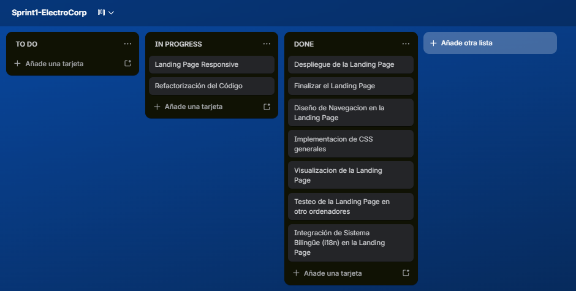</img>
</p>

<table align="center" border="1" width="95%" style="text-align:center; border-collapse: collapse;">
  <tr>
    <td colspan="1"><b>Sprint #</b></td>
    <td colspan="8"><b>Sprint 1</b></td>
  </tr>
  <tr>
    <td colspan="2"><b>User Story</b></td>
    <td colspan="7"><b>Work-Item / Task</b></td>
  </tr>
  <tr>
    <td><b>Id</b></td>
    <td><b>Title</b></td>
    <td><b>Id</b></td>
    <td><b>Title</b></td>
    <td><b>Description</b></td>
    <td><b>Estimation (Hours)</b></td>
    <td><b>Assigned To</b></td>
    <td><b>Student Code</b></td>
    <td><b>Status</b></td>
  </tr>

  <tr>
    <td rowspan="2">US-01</td>
    <td rowspan="2">Visualizar información y testimonios</td>
    <td>T01</td>
    <td>Maquetación HTML de contenido</td>
    <td>Estructurar en HTML5 las secciones de descripción, objetivos y testimonios de la startup.</td>
    <td>2</td>
    <td>Sebastian Tavara</td>
    <td>U20241e179</td>
    <td>Done</td>
  </tr>
  <tr>
    <td>T02</td>
    <td>Aplicar estilos CSS base</td>
    <td>Configurar paleta de colores Dark Mode y tipografías para la sección informativa.</td>
    <td>2</td>
    <td>Jairo Santiago</td>
    <td>U202418755</td>
    <td>Done</td>
  </tr>

  <tr>
    <td rowspan="2">US-02</td>
    <td rowspan="2">Motor de búsqueda inteligente</td>
    <td>T03</td>
    <td>Diseño de barra de búsqueda</td>
    <td>Crear el layout del input y botón de búsqueda en el header de la web.</td>
    <td>2</td>
    <td>Diego Cabrejos</td>
    <td>U20241e014</td>
    <td>Done</td>
  </tr>
  <tr>
    <td>T04</td>
    <td>Lógica JS de búsqueda</td>
    <td>Implementar diccionario de palabras clave y smooth scroll hacia las secciones.</td>
    <td>3</td>
    <td>Diego Cabrejos</td>
    <td>U20241e014</td>
    <td>Done</td>
  </tr>

  <tr>
    <td rowspan="2">US-03</td>
    <td rowspan="2">Cambio de idioma (ES/EN)</td>
    <td>T05</td>
    <td>Configuración de diccionario JSON/JS</td>
    <td>Crear los arreglos de texto en inglés y español para la landing page.</td>
    <td>3</td>
    <td>Jean Loa</td>
    <td>U20241e406</td>
    <td>Done</td>
  </tr>
  <tr>
    <td>T06</td>
    <td>Integración en el DOM</td>
    <td>Crear la función JS que reemplace dinámicamente los textos al clickear el botón.</td>
    <td>2</td>
    <td>Diego Cabrejos</td>
    <td>U20241e014</td>
    <td>Done</td>
  </tr>

  <tr>
    <td rowspan="2">US-04</td>
    <td rowspan="2">Suscripción al boletín</td>
    <td>T07</td>
    <td>Diseño del formulario</td>
    <td>Maquetar el input de email y el botón de submit en la sección final.</td>
    <td>2</td>
    <td>Jairo Santiago</td>
    <td>U202418755</td>
    <td>Done</td>
  </tr>
  <tr>
    <td>T08</td>
    <td>Validación de formulario JS</td>
    <td>Interceptar el evento submit con preventDefault y mostrar alerta de éxito temporal.</td>
    <td>2</td>
    <td>Timothy Documet</td>
    <td>U202318828</td>
    <td>Done</td>
  </tr>

  <tr>
    <td rowspan="2">US-05</td>
    <td rowspan="2">Interfaz interactiva (Menú y Audio)</td>
    <td>T09</td>
    <td>Creación de Navbar y Responsive</td>
    <td>Configurar el menú pegadizo (sticky) y su adaptación a dispositivos móviles.</td>
    <td>3</td>
    <td>Sebastian Tavara</td>
    <td>U20241e179</td>
    <td>Done</td>
  </tr>
  <tr>
    <td>T10</td>
    <td>Botón flotante de audio</td>
    <td>Configurar etiqueta de audio HTML y lógica JS para pausar/reproducir la música de fondo.</td>
    <td>2</td>
    <td>Diego Cabrejos</td>
    <td>U20241e014</td>
    <td>Done</td>
  </tr>

  <tr>
    <td rowspan="2">US-06</td>
    <td rowspan="2">Comparar planes de servicio</td>
    <td>T11</td>
    <td>Maquetación de tarjetas (Grid)</td>
    <td>Construir la vista de los planes Free y Enterprise usando CSS Flexbox/Grid.</td>
    <td>2</td>
    <td>Jean Loa</td>
    <td>U20241e406</td>
    <td>Done</td>
  </tr>
  <tr>
    <td>T12</td>
    <td>Estilización del plan Premium</td>
    <td>Agregar efectos hover, bordes brillantes y escala para destacar la tarjeta Enterprise.</td>
    <td>2</td>
    <td>Diego Cabrejos</td>
    <td>U20241e014</td>
    <td>Done</td>
  </tr>
</table>


#### 5.2.1.4. Development Evidence for Sprint Review
En el presente sprint se logró desarrollar la primera versión del Landing Page de ElectroCorp, la cual presenta de manera clara el propósito de la plataforma y las problemáticas que busca resolver en el ámbito de la domótica y eficiencia energética. La información mostrada fue organizada de forma comprensible y acompañada de elementos visuales (Dark Mode) que refuerzan el mensaje. Asimismo, se consideró un diseño atractivo, responsivo e intuitivo que busca captar la atención de los usuarios y transmitir confianza en la solución propuesta.

<p align="left" style="width: 95%; margin: 20px auto; font-family: Arial, sans-serif;">
    <b>Link de commits del repositorio del landing page:</b> <br>
    <a href="https://github.com/upc-pre-202610-1asi0729-11896-ECorp/ElectroCorp-website/commits/main" target="_blank" style="color: #00d2ff;">
        https://github.com/upc-pre-202610-1asi0729-11896-ECorp/ElectroCorp-website/commits/main
    </a>
</p>

| Repository | Branch | Commit Id | Commit Message | Commit Message Body | Commited on (Date) |
| :--- | :---: | :---: | :--- | :--- | :---: |
| Landing Page | main | `c324853` | feat(plataform): add plataform section | added platform section content | 19/04/2026 |
| | main | `e88e22d` | feat(plataform): add plataform section and section head | added platform section and section head | 19/04/2026 |
| | main | `0e78fe2` | feat(about): add contenido-web section | added contenido-web section | 19/04/2026 |
| | main | `e0680a8` | feat(about): add desciption section | added description section | 19/04/2026 |
| | main | `96414fb` | feat(about): add goals section | added goals section | 19/04/2026 |
| | main | `5900f01` | feat(about): add service section | added service section | 19/04/2026 |
| | main | `b7b6ca1` | feat(about): add reviews section | added reviews section | 19/04/2026 |
| | main | `fe9c165` | feat(about): add contact and musical-background section | added contact and musical-background section | 19/04/2026 |
| | main | `41e520b` | fix(head): fix html styles.css and scripts.js | fixed html styles.css and scripts.js | 19/04/2026 |


#### 5.2.1.5. Execution Evidence for Sprint Review
Durante el primer sprint, se lograron varios hitos importantes en el desarrollo del landing page de la StartUp ElectroCorp. Por lo consiguiente, presentamos un resumen de los logros alcanzados hasta la fecha: <br>

- Establecimiento de repositorios: Se crearon y configuraron repositorios en GitHub para gestionar el código y las pruebas, asegurando una correcta organización y control de versiones, ademas de separar en main y developer para evitar posibles errores. <br>

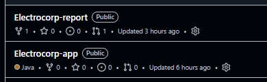</img><br>

- Implementación del Landing Page: Se diseño y se estructuro la landing page de ElectroCorp implementando funcionalidades claves y asegurando que cumpla con lo dictado en la rubrica, como el agregarle un boton de traduccion de idioma y que este en ingles por defecto

- Video Representativo de la Landing Page https://youtu.be/7O6qqLJjxF4

- Imágenes del Landing Page:
  
  * Home
    
    </img><br>
  
  * Pricing:

    </img><br>
    
  * FAQ:

    </img><br>
    
  * Smart Plugs:
    
    </img><br>
 
  * Reviews:

    </img><br>
    
  * Description:
    
    </img><br>

  * Goals
    
    </img><br>

  * About Us
    
    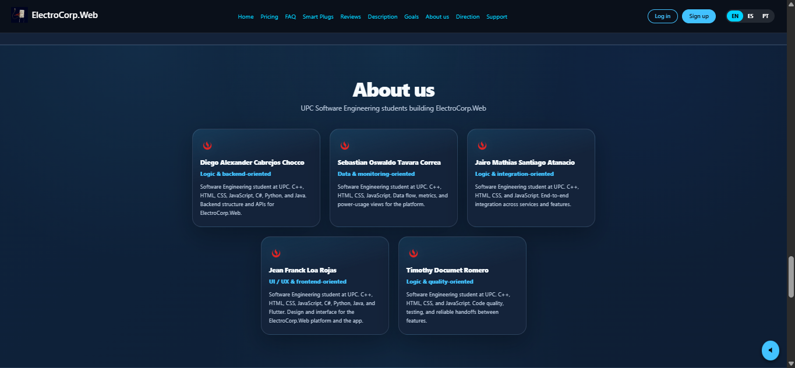</img><br>

  * Direction
    
    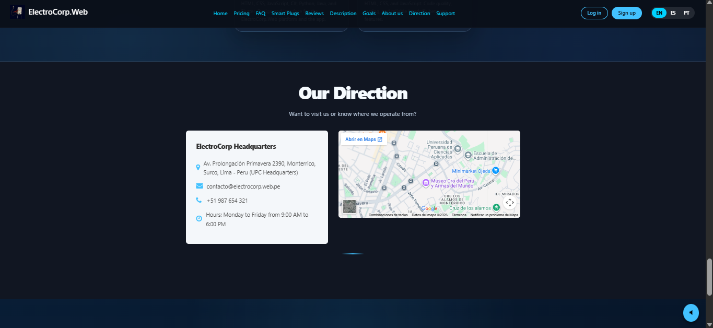</img><br>

  * Support
    
    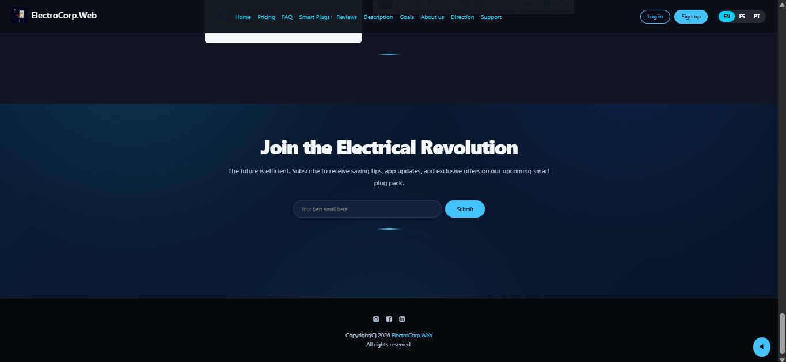</img><br>
    

#### 5.2.1.6. Services Documentation Evidence for Sprint Review
Durante el primer sprint, se desarrolló el Landing Page del proyecto de ElectroCorp como una primera entrega visual y detallando algunos aspectos. Esta implementación se centró únicamente en la estructura, diseño, la traduccion de ingles a español y viceversa, y uno que otro toque personal como la implementacion de una musica de fondo. Aunque no se han implementado accesos de inicio de sesion por el momento.

#### 5.2.1.7. Software Deployment Evidence for Sprint Review
Durante este Sprint1 se llevaron a cabo las siguientes actividades relacionadas con el despliegue de la Landing Page.

Creación de Repositorios y Configuración en GitHub
* Gestión de Versiones: Se implementaron repositorios en GitHub para centralizar el control del código fuente, asegurando un historial detallado de los cambios realizados en la Landing Page y demás componentes.
* Preparación del Entorno: Se realizó la configuración técnica de los repositorios para automatizar los flujos de despliegue mediante el uso de GitHub Pages.
* GitHub Pages:: Se utilizó GitHub Pages como infraestructura de hosting estático, permitiendo que la Landing Page sea accesible de forma pública y segura directamente desde la rama principal del repositorio.

  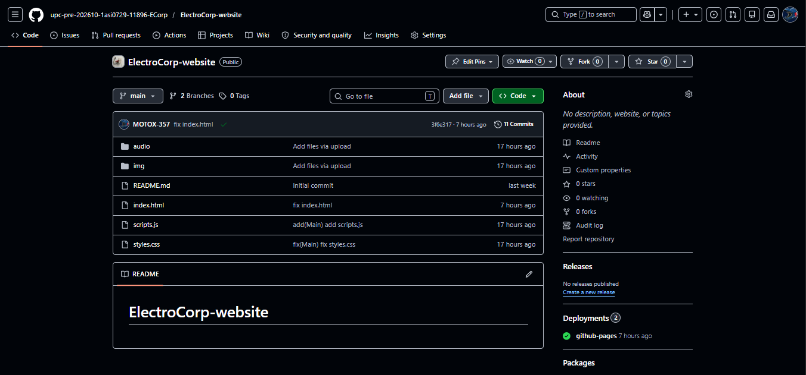</img><br>

Proceso de Despliegue
Despliegue de la Landing Page:
* Se subió el código de la Landing Page al repositorio correspondiente en GitHub.
* Se configuró GitHub Pages para publicar el sitio en línea.

  </img><br>

Verificación del Despliegue:
Se hizo una comprobacion sitio publicado en GitHub Pages para asegurar que todos los elementos funcionaran correctamente.
Se ejecutaron pruebas de funcionalidad para verificar la correcta carga del sitio y la ausencia de errores en el contenido desplegado

  </img><br>

Durante el Sprint 1, logramos consolidar la infraestructura de publicación del proyecto mediante la implementación de GitHub Pages. Este flujo de trabajo no solo optimizó el despliegue, sino que estableció un ciclo de integración continua eficiente, dejando el camino preparado para escalar la aplicación web de manera ágil en las próximas fases

Link del Landing Page: https://upc-pre-202610-1asi0729-11896-ecorp.github.io/ElectroCorp-website/
  
#### 5.2.1.8. Team Collaboration Insights during Sprint.
Durante este Sprint 1, el equipo llevó a cabo un trabajo colaborativo enfocado en el diseño, desarrollo y despliegue de la Landing Page de ElectroCorp. Asegurando que la página cumpliera con los objetivos de conversión y comunicación de nuestra propuesta de valor (IoT plug-and-play). Asimismo, se registraron los avances en la gestión del repositorio de GitHub, evidenciados en los commits y métricas de colaboración que reflejan la participación del equipo.

| Author | Task completed |
| :--- | :--- |
| **Cabrejos Chocce, Diego** | Integration of landing page sections, UI/UX core development, and interactive features (i18n, navigation). |
| **Tavara Correa, Sebastian** | HTML5 semantic structuring and GitHub Pages deployment configuration. |
| **Cabrejos Chocce, Diego** | Implementation of global CSS, Dark Mode styling, and Responsive Design adjustments. |
| **Loa Rojas, Jean Franck** | Report documentation development and code refactoring. |
| **Cabrejos Chocce, Diego** | Cross-browser testing, QA, and broken-link verification. |

* **Link de commits del repositorio del reporte:** [https://github.com/upc-pre-202610-1asi0729-11896-ECorp/Electrocorp-report/commits/develop/README.md]
* **Link de commits del repositorio del landing page:** [https://github.com/upc-pre-202610-1asi0729-11896-ECorp/ElectroCorp-website/commits/main/]

   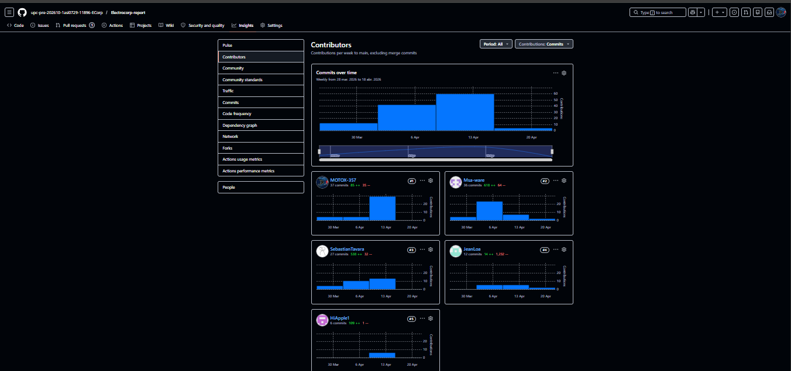</img><br>
   </img><br>
   </img><br>
   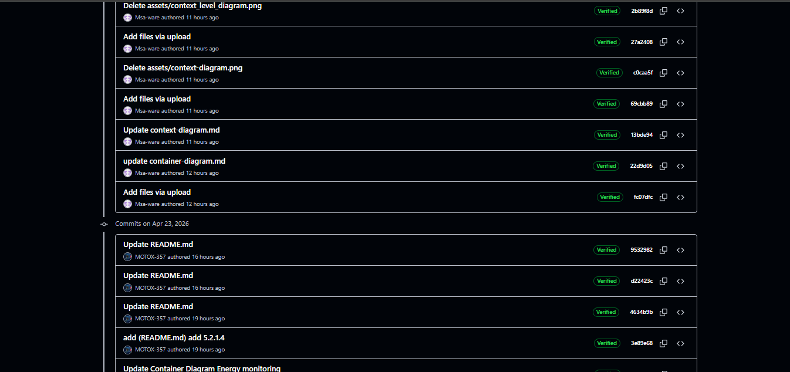</img><br>
   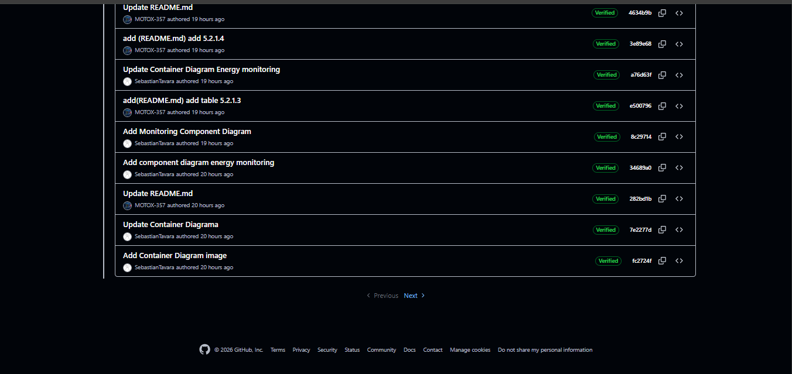</img><br>
   <br>
   </img><br>
   </img><br>
   </img><br>


### 5.2.2. Sprint 2 
#### 5.2.X.1. Sprint Planning n
#### 5.2.X.2. Aspect Leaders and Collaborators
#### 5.2.X.3. Sprint Backlog n. 
#### 5.2.X.4. Development Evidence for Sprint Review
#### 5.2.X.5. Execution Evidence for Sprint Review
#### 5.2.X.6. Services Documentation Evidence for Sprint Review
#### 5.2.X.7. Software Deployment Evidence for Sprint Review
#### 5.2.X.8. Team Collaboration Insights during Sprint.
### 5.2.1. Sprint 1 
#### 5.2.X.1. Sprint Planning n
#### 5.2.X.2. Aspect Leaders and Collaborators
#### 5.2.X.3. Sprint Backlog n. 
#### 5.2.X.4. Development Evidence for Sprint Review
#### 5.2.X.5. Execution Evidence for Sprint Review
#### 5.2.X.6. Services Documentation Evidence for Sprint Review
#### 5.2.X.7. Software Deployment Evidence for Sprint Review
#### 5.2.X.8. Team Collaboration Insights during Sprint.
## 5.3. Validation Interviews
### 5.3.1. Diseño de Entrevistas
### 5.3.2. Registro de Entrevistas
### 5.3.3. Evaluaciones según heurísticas
## 5.4. Video About-the-Product.
# Conclusiones
## Conclusiones y recomendaciones
## Video About-the-Team.
# Bibliografía 
# Anexos
