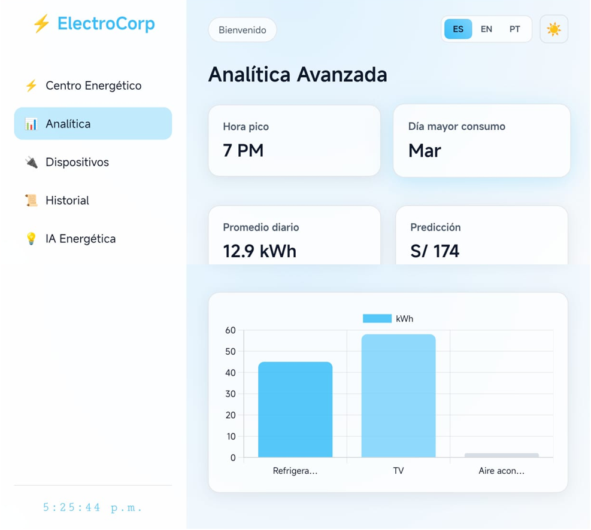
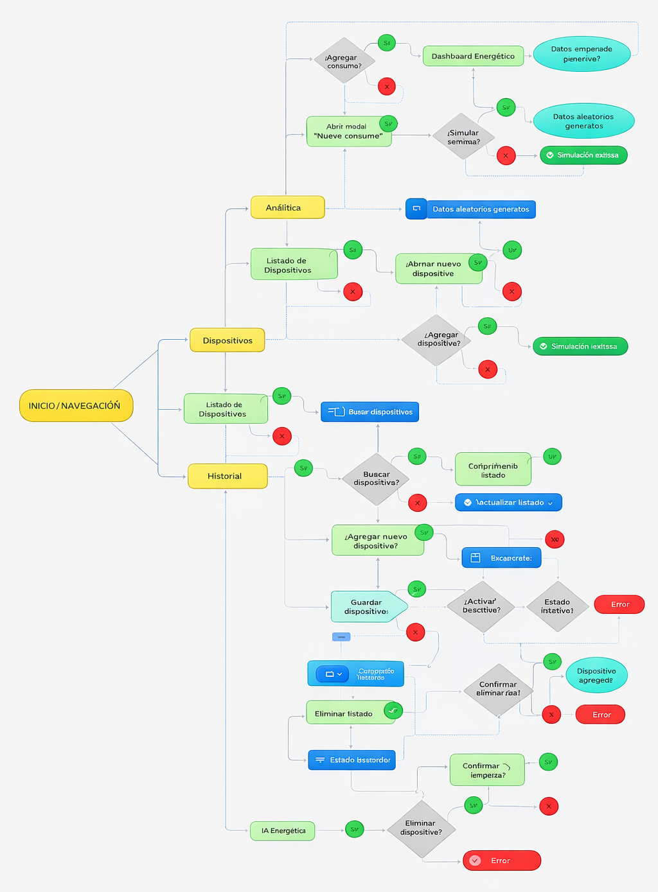
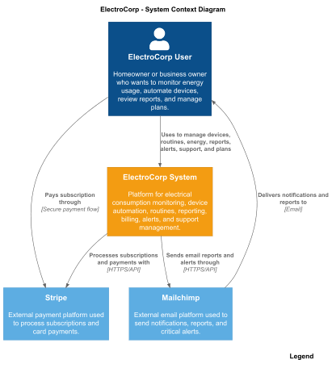
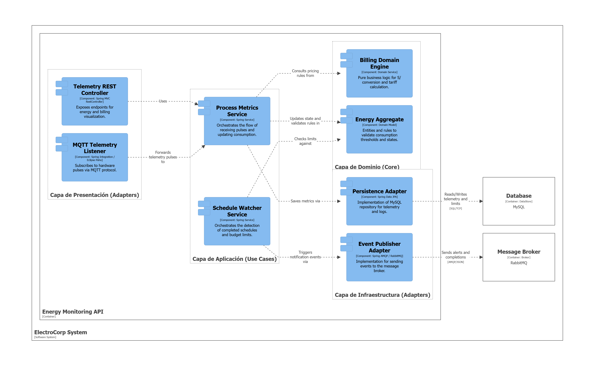

<div align="center">

</img><br>

<h3>Universidad Peruana de Ciencias Aplicadas</h3>
<h4>Facultad de Ingeniería</h4>
<h4>Carrera de Ingeniería de Software</h4>
<h4>Periodo 202610</h4>
<h4>1ASI0729 Desarrollo de Aplicaciones Open Source</h4>
<h4>NRC 11896</h4>
<h4>Docente: Efraín Ricardo Bautista Ubillús</h4>
<h4>Informe del Trabajo Final</h4>
<h4>Startup: ElectroCorp</h4>
<h4>Producto: Smart</h4>

| **Código** | **Apellidos y Nombres**               |
| :--------: | :------------------------------------ |
| U20241e179 | Tavara Correa, Sebastian Oswaldo      |
| U202418755 | Santiago Atanacio, Jairo Mathias      |
| U20241e014 | Cabrejos Chocco, Diego Alexander      |
| U20241e406 | Loa Rojas, Jean Franck                |
| U202318828 | Documet Romero, Timothy               |

### Diciembre 2025
</div>
<div style="page-break-after: always;"></div>


## Registro de Versiones del Informe

| Versión |  Fecha   |                                       Autor                                        |                                                  Descripción de modificación                                                   |
| :-----: | :------: | :--------------------------------------------------------------------------------: | :----------------------------------------------------------------------------------------------------------------------------: |
|   TB1   | 03/04/2026 | Todos | Avance del trabajo: Completando el contenido del Documento |
|   TP1   |            |       |                                                            |
|   TB2   |            |       |                                                            |
|   TF1   |            |       |                                                            |

<div style="page-break-after: always;"></div>

## Project Report Collaboration Insights
A continuación, se detallan los repositorios utilizados a lo largo del proyecto:

#### Link del repositorio del Reporte:

- 

#### Link del repositorio de la Landing Page:

- 

#### Link del repositorio del Frontend:

- 

#### Link del repositorio del Backend:

- 

### **Entrega TB1:**
[text]

##### Participación por integrante:

- 

# Contenido

## Índice

- [Registro de versiones del informe](#registro-de-versiones-del-informe)

- [Project Report Collaboration Insights](#project-report-collaboration-insights)

- [Contenido](#contenido)

- [Student Outcome](#student-outcome-1)

- [Capítulo I: Introducción](#capitulo-i-introduccion)
  - [1.1. StartUp Profile](#11-startup-profile)
    - [1.1.1. Descripción de la StartUp](#111-descripción-de-la-startup)
    - [1.1.2. Perfiles de Integrantes del equipo](#112-perfiles-de-integrantes-del-equipo)
  - [1.2. Solution Profile](#12-solution-profile)
    - [1.2.1. Antecedentes y Problemática](#121-antecedentes-y-problemática)
    - [1.2.2. Lean UX Process](#122-lean-ux-process)
      - [1.2.2.1. Lean UX Problem Statements](#1221-lean-ux-problem-statements)
      - [1.2.2.2. Lean UX Assumptions](#1222-lean-ux-assumptions)
      - [1.2.2.3. Lean UX Hypothesis Statements](#1223-lean-ux-hyphotesis-statements)
      - [1.2.2.4. Lean UX Canvas](#1224-lean-ux-canvas)
  - [1.3. Segmentos objetivo](#13-segmentos-objetivo)
- [Capítulo II: Requirements Elicitation & Analysis]()
  - [2.1. Competidores](#21-competidores)
    - [2.1.1. Análisis competitivo](#211-análisis-competitivo)
    - [2.1.2. Estrategias y tácticas frente a competidores](#212-estrategias-y-tácticas-frente-a-competidores)
  - [2.2. Entrevistas](#22-entrevistas)
    - [2.2.1. Diseño de entrevistas](#221-diseño-de-entrevistas)
    - [2.2.2. Registro de entrevistas](#222-registro-de-entrevistas)
    - [2.2.3. Análisis de entrevistas](#223-análisis-de-entrevistas)
  - [2.3. Needfinding](#23-needfinding)
    - [2.3.1. User Persona](#231-user-persona)
    - [2.3.2. User Task Matrix](#232-user-task-matrix)
    - [2.3.3. User Journey Mapping](#233-user-journey-mapping)
    - [2.3.4. Empathy Mapping](#234-empathy-mapping)
  - [2.4 Big Picture Event Storming](#24-big-picture-event-storming)
  - [2.5 Ubiquitous Language](#25-ubiquitous-language)
- [Capítulo III: Requirements Specification]()
  - [3.1. User Stories](#31-user-stories)
  - [3.2. Impact Mapping](#32-impact-mapping)
  - [3.3. Product Backlog](#33-product-backlog)
- [Capítulo IV: Product Design]()
  - [4.1. Style Guidelines](#41-style-guidelines)
    - [4.1.1. General Style Guidelines](#411-general-style-guidelines)
    - [4.1.2. Web Style Guidelines](#412-web-style-guidelines)
  - [4.2. Information Architecture](#42-information-architecture)
    - [4.2.1. Organization Systems](#421-organization-systems)
    - [4.2.2. Labeling Systems](#422-labeling-systems)
    - [4.2.3. SEO Tags and Meta Tags](#423-seo-tags-and-meta-tags)
    - [4.2.4. Searching Systems](#424-searching-systems)
    - [4.2.5. Navigation Systems](#425-navigation-systems)
  - [4.3. Landing Page UI Design](#43-landing-page-ui-design)
    - [4.3.1. Landing Page Wireframe](#431-landing-page-wireframe)
    - [4.3.2. Landing Page Mock-up](#432-landing-page-mock-up)
  - [4.4. Web Applications UX/UI Design](#44-web-applications-uxui-design)
    - [4.4.1. Web Applications Wireframes](#441-web-applications-wireframes)
    - [4.4.2. Web Applications Wireflow Diagrams](#442-web-applications-wireflow-diagrams)
    - [4.4.3. Web Applications Mock-ups](#443-web-applications-mock-ups)
    - [4.4.4. Web Applications User Flow Diagrams](#444-web-applications-user-flow-diagrams)
  - [4.5. Web Applications Prototyping](#45-web-applications-prototyping)
  - [4.6. Domain-Driven Software Architecture](#46-domain-driven-software-architecture)
    - [4.6.1. Design-Level Event Storming](#461-design-level-event-storming)
    - [4.6.2. Software Architecture Context Diagram](#462-software-architecture-context-diagram)
    - [4.6.3. Software Architecture Container Diagrams](#463-software-architecture-container-diagrams)
    - [4.6.4. Software Architecture Components Diagrams](#464-software-architecture-components-diagrams)
  - [4.7. Software Object-Oriented Design](#47-software-object-oriented-design)
    - [4.7.1. Class Diagrams](#471-class-diagrams)
  - [4.8. Database Design](#48-database-design)
    - [4.8.1. Database Diagram](#481-database-diagram)
- [Capítulo V: Product Implementation, Validation & Deployment]()
  - [5.1. Software Configuration Management](#51-software-configuration-management)
    - [5.1.1. Software Development Environment Configuration](#511-software-development-environment-configuration)
    - [5.1.2. Source Code Management](#512-source-code-management)
    - [5.1.3. Source Code Style Guide & Conventions](#513-source-code-style-guide--conventions)
    - [5.1.4. Software Deployment Configuration](#514-software-deployment-configuration)
  - [5.2. Landing Page, Services & Applications Implementation](#52-landing-page-services--applications-implementation)
    - [5.2.1. Sprint 1](#521-sprint-1)
      - [5.2.1.1. Sprint Planning 1](#5211-sprint-planning-1)
      - [5.2.1.2. Aspect Leaders and Collaborators](#5212-aspect-leaders-and-collaborators)
      - [5.2.1.3. Sprint Backlog 1](#5213-sprint-backlog-1)
      - [5.2.1.4. Development Evidence for Sprint Review](#5214-development-evidence-for-sprint-review)
      - [5.2.1.5. Execution Evidence for Sprint Review](#5215-execution-evidence-for-sprint-review)
      - [5.2.1.6. Services Documentation Evidence for Sprint Review](#5216-services-documentation-evidence-for-sprint-review)
      - [5.2.1.7. Software Deployment Evidence for Sprint Review](#5217-software-deployment-evidence-for-sprint-review)
      - [5.2.1.8. Team Collaboration Insights during Sprint](#5218-team-collaboration-insights-during-sprint)
    - [5.2.2. Sprint 2](#522-sprint-2)
      - [5.2.2.1. Sprint Planning 2](#5221-sprint-planning-2)
      - [5.2.2.2. Aspect Leaders and Collaborators](#5222-aspect-leaders-and-collaborators)
      - [5.2.2.3. Sprint Backlog 2](#5223-sprint-backlog-2)
      - [5.2.2.4. Development Evidence for Sprint Review](#5224-development-evidence-for-sprint-review)
      - [5.2.2.5. Execution Evidence for Sprint Review](#5225-execution-evidence-for-sprint-review)
      - [5.2.2.6. Services Documentation Evidence for Sprint Review](#5226-services-documentation-evidence-for-sprint-review)
      - [5.2.2.7. Software Deployment Evidence for Sprint Review](#5227-software-deployment-evidence-for-sprint-review)
      - [5.2.2.8. Team Collaboration Insights during Sprint](#5228-team-collaboration-insights-during-sprint)
    - [5.2.3. Sprint 3](#523-sprint-3)
      - [5.2.3.1. Sprint Planning 3](#5231-sprint-planning-3)
      - [5.2.3.2. Aspect Leaders and Collaborators](#5232-aspect-leaders-and-collaborators)
      - [5.2.3.3. Sprint Backlog 3](#5233-sprint-backlog-3)
      - [5.2.3.4. Development Evidence for Sprint Review](#5234-development-evidence-for-sprint-review)
      - [5.2.3.5. Execution Evidence for Sprint Review](#5235-execution-evidence-for-sprint-review)
      - [5.2.3.6. Services Documentation Evidence for Sprint Review](#5236-services-documentation-evidence-for-sprint-review)
      - [5.2.3.7. Software Deployment Evidence for Sprint Review](#5237-software-deployment-evidence-for-sprint-review)
      - [5.2.3.8. Team Collaboration Insights during Sprint](#5238-team-collaboration-insights-during-sprint)
    - [5.2.4. Sprint 4](#524-sprint-4)
      - [5.2.4.1. Sprint Planning 4](#5241-sprint-planning-4)
      - [5.2.4.2. Aspect Leaders and Collaborators](#5242-aspect-leaders-and-collaborators)
      - [5.2.4.3. Sprint Backlog 4](#5243-sprint-backlog-4)
      - [5.2.4.4. Development Evidence for Sprint Review](#5244-development-evidence-for-sprint-review)
      - [5.2.4.5. Execution Evidence for Sprint Review](#5245-execution-evidence-for-sprint-review)
      - [5.2.4.6. Services Documentation Evidence for Sprint Review](#5246-services-documentation-evidence-for-sprint-review)
      - [5.2.4.7. Software Deployment Evidence for Sprint Review](#5247-software-deployment-evidence-for-sprint-review)
      - [5.2.4.8. Team Collaboration Insights during Sprint](#5248-team-collaboration-insights-during-sprint)
  - [5.3. Validation Interviews]()
    - [5.3.1. Diseño de Entrevistas](#531-diseño-de-entrevistas)
    - [5.3.2. Registro de Entrevistas](#532-registro-de-entrevistas)
    - [5.3.3. Evaluaciones según heuristicas](#533-evaluaciones-segun-heuristicas)
  - [5.4. Video About-the-Product](#54-video-about-the-product)
- [Conclusiones](#conclusiones)
  - [Conclusiones y recomendaciones](#conclusiones-y-recomendaciones)
- [Bibliografía](#bibliografía)
- [Anexos](#anexos)

<div style="page-break-after: always;"></div>

## Student Outcome

Objetivo general, ABET – EAC - Student Outcome 3: Capacidad de comunicarse efectivamente con un rango de audiencias.
| Criterio Especifico | Acciones realizadas | Conclusiones |
|--|--|--|
| Comunica oralmente con efectividad a diferentes rangos de audiencia. | Sebastian Tavara <br>TB1:<br> TP1: <br> TB2: <br> TF1: <br> <br> Diego Cabrejos <br>TB1:<br> TP1: <br> TB2: <br> TF1: <br> <br> Jean Loa <br> TB1: <br> TP1: <br> TB2: <br> TF1: |	 |
| Comunica por escrito con efectividad a diferentes rangos de audiencia | Sebastian Tavara <br>TB1:<br> TP1: <br> TB2: <br> TF1: <br> <br> Diego Cabrejos <br>TB1:<br> TP1: <br> TB2: <br> TF1: <br> <br> Jean Loa <br> TB1: <br> TP1: <br> TB2: <br> TF1: |	 |


# Capitulo I: Introducción

## 1.1. StartUp Profile

### 1.1.1. Descripción de la StartUp
Es una startup de tecnologia enfocada en democratizar la domótica y la eficiencia energética para los hogares peruanos. 
<br><br>
Actualmente, el convertir una casa tradicional en un "hogar inteligente" es percibido como un lujo costoso, que requiere modificar el cableado eléctrico, contratar técnicos especializados y lidiar con aplicaciones genéricas que no reflejan la realidad del consumo local o que simplemente son complicados de comprender. Además, los altos costos de energía eléctrica son una preocupación constante para las familias y negocios nuevos.
<br><br>
Hemos desarrollado un ecosistema IoT (Internet de las Cosas) plug-and-play que se instala en minutos sobre los interruptores y enchufes existentes, sin necesidad de romper paredes, quebrar techos, ni alterar la red eléctrica. A través de nuestra plataforma web y móvil, los usuarios pueden controlar sus electrodomésticos de forma remota, podran programar horarios de encendido y monitorear el consumo de energia de su hogar en tiempo real.

---

## Misión

Nuestra misión es brindar a las familias peruanas soluciones de domótica accesibles y de fácil instalación que les permitan tomar el control de su consumo eléctrico, optimizando su presupuesto mediante tecnología inteligente.

---

## Visión

Queremos que ElectroCorp sea el referente en el Perú en gestión energética residencial, transformando los hogares tradicionales en espacios eficientes y sostenibles que alivien la economía familiar y contribuyan al cuidado del medio ambiente.

### 1.1.2. Perfiles de integrantes del equipo
| **Nombre Completo del integrante**    |	**Descripcion de la carrera** | **Fotografia** | **Conocimientos y habilidades**
| :------------------------------------ |:------------------------------------ |:------------------------------------ |:------------------------------------ |
| Tavara Correa, Sebastian Oswaldo      |Ingeniería de Software Universidad Peruana de Ciencias Aplicadas |  | Soy Sebastian Oswaldo Tavara Correa estudiante de la carrera de ingeniería de software, actualmente cursando el 5to ciclo, me considero una persona estudiosa y muy colaborativa al trabajar en grupo. Me adapto rápidamente a cualquier entorno. Me interesa desarrollar soluciones tecnológicas que tengan un impacto positivo. Creo que el desarrollo de software no debe limitarse en buscar la mayor funcionalidad, sino que también en generar bienestar en la sociedad.
| Santiago Atanacio, Jairo Mathias      |Ingeniería de Software Universidad Peruana de Ciencias Aplicadas|  | Soy Jairo Mathias Santiago Atanacio, estudiante de 5to ciclo de Ingeniería de Software. Cuento con una base sólida en el desarrollo de algoritmos en C++, la creación de interfaces web interactivas mediante HTML, CSS y JavaScript, y el dominio de bases de datos relacionales (MySQL) y no relacionales (MongoDB). Me apasiona transformar problemas complejos en soluciones de software eficientes, escalables y con una gestión de datos versátil. Mi enfoque combina la rigurosidad técnica con habilidades blandas como la proactividad y la empatía, lo que me permite integrarme fácilmente en equipos colaborativos bajo metodologías ágiles.
| Cabrejos Chocco, Diego Alexander      |Ingeniería de Software Universidad Peruana de Ciencias Aplicadas |  | Soy Diego Alexander Cabrejos Chocco estudiante de la carrera de ingeniería de software, actualmente cursando el 5to ciclo, soy una persona sociable, creativa, que trabaja bien en equipo y busco que todo el equipo participe en las actividades activamente. Me adapto rapidamente a la modalidad de trabajo. Mi meta es poder crear y desarrollar proyectos tecnologicos que tenga un impacto positivo y que sea entretenido. Lo mas interesante de la Software es que cada vez se va expandiendo, y las opciones para poder desarrollar algun proyecto por mas interesante o loco que paresca el tema, no es impedimento para desarrollar lo que desees. (claro que siempre siguiendo el tema legal)
| Loa Rojas, Jean Franck      |Ingeniería de Software Universidad Peruana de Ciencias Aplicadas|  | Soy Jean Franck Loa Rojas, estudiante de 5to ciclo de la carrera de Ingeniería de Software. Actualmente estoy abierto a oportunidades laborales para emplear mis conocimientos en programación y obtener experiencia trabajando de la mano con conocedores y profesionales de mi rubro académico. Estoy emocionado por todo lo que puede venir en el futuro, y las colaboraciones tecnológicas entre países para compartir conocimiento y prosperar una nación unida y pacífica.
| Documet Romero, Timothy     |Ingeniera de software Universidad Peruana de Ciencias Aplicadas|  | Soy Timothy Documet Romero, estudiante de Ingeniería de Software, cuento con una base sólida en el desarrollo de algoritmos en C++, la creación de interfaces web interactivas mediante HTML, CSS y JavaScript, así como en el manejo de bases de datos relacionales (MySQL) y no relacionales (MongoDB). Me apasiona convertir problemas complejos en soluciones de software eficientes, escalables y con una gestión de datos versátil. Mi enfoque combina la rigurosidad técnica con habilidades blandas como la proactividad y la empatía, lo que le permite integrarse con facilidad en equipos colaborativos bajo metodologías ágiles.

## 1.2 *Solution Profile*
### 1.2.1 Antecedentes y problemática
La energía eléctrica, es uno de los recursos más importantes de nuestra sociedad actual, ayudándonos a desarrollar multiplicidad de tareas, ya sea en hogares, instituciones educativas, espacios publicos, sector empresarial, etc.
En la última década, el ecosistema IoT ha experimentado un crecimiento exponencial, impulsado por la miniaturización de componentes, el abaratamiento de los sensores y la mejora en las infraestructuras de conectividad (como el Wi-Fi de alta velocidad y el 5G). Por ejemplo los enchufes inteligentes, que ayudan al gestionamiento de la energía eléctrica empleando sensores. 
Sin embargo, estas soluciones tecnológicas están diseñadas y comercializadas casi exclusivamente para sectores de alto poder adquisitivo. Los enchufes inteligentes y sistemas de gestión energética suelen encontrarse en residencias exclusivas, hoteles de lujo o infraestructuras corporativas. Pero qué sucede con aquellas personas o familias que quieren gestionar su electricidad o controlar su energía en casa, pero que no cuentan con los recursos necesarios para poder costearse estos lujos.

## "5W" & "2H"

| Elemento | Pregunta | Definición para ElectroCorp |
| :--- | :--- | :--- |
| ("Who") Quién | ¿A quién afecta el problema / Quién es el usuario? | Familias peruanas y dueños de negocios nuevos que buscan reducir sus gastos de luz y modernizar sus espacios, pero no cuentan con el presupuesto o el conocimiento técnico para domótica tradicional. |
| ("What") Qué | ¿Cuál es el problema / Qué se ofrece? | La barrera económica y técnica para tener un hogar inteligente. La solución es un ecosistema IoT *plug-and-play* controlado mediante una plataforma web y móvil para gestionar el consumo eléctrico. |
| ("Where") Dónde | ¿Dónde ocurre el problema / Dónde se usará? | En los hogares tradicionales y negocios (enfocado inicialmente en zonas urbanas del Perú), específicamente sobre los interruptores y enchufes eléctricos ya existentes. |
| ("When") Cuándo | ¿Cuándo ocurre / Cuándo se usará? | De forma continua (24/7). Los usuarios interactuarán con el sistema cada vez que necesiten encender/apagar dispositivos, programar horarios o revisar su facturación proyectada. |
| ("Why") Por qué | ¿Por qué es importante resolverlo? | Porque el alto costo de la energía eléctrica es una preocupación constante que afecta la economía familiar, y la domótica actual es inaccesible, invasiva y compleja. |
| ("How") Cómo | ¿Cómo se va a resolver? | Desarrollando dispositivos que se sobreponen a las instalaciones actuales sin romper paredes ni cables, conectados vía Wi-Fi a una aplicación intuitiva que centraliza el control y monitoreo de la energía. |
| ("How much") Cuánto | ¿Cuánto costará / Cuál es el impacto? | Se requiere mantener un costo de producción y venta significativamente menor al de la domótica invasiva tradicional, garantizando que el ahorro en la factura de luz justifique la inversión del usuario a corto plazo. |

## Objetivos
Objetivo General:
Nuestro objetivo general es el diseñar, desarrollar e implementar un ecosistema de Internet de las Cosas (IoT) de arquitectura plug-and-play de facil entendimiento que permita a las familias y nuevo negocios en el Perú gestionar su consumo eléctrico de manera eficiente, optimizando su gasto económico y fomentando la sostenibilidad a través de una plataforma de software: una app y/o sitio web.

Objetivos Específicos
Desarrollo Tecnológico: Implementar una arquitectura de software escalable que integre una plataforma web y móvil, permitiendo el control remoto y el monitoreo en tiempo real de los dispositivos conectados con una latencia menor a 5 segundos.
Impacto Económico: Desarrollar un algoritmo de análisis de datos que proporcione proyecciones de facturación mensual en soles, facilitando la identificación de hábitos de consumo ineficientes para reducir el gasto eléctrico del hogar.

## Restricciones
Restricciones de Alcance (Scope)
Integración de terceros: En su primera versión, el ecosistema IoT operará exclusivamente a través de la plataforma web y móvil propietaria de ElectroCorp. No se contemplará la integración con asistentes de voz de terceros (como Amazon Alexa, Google Assistant o Apple HomeKit) para mantener el enfoque en la robustez de la interfaz nativa.

Restricciones de Tiempo y Costo
Cronograma de Desarrollo: El ciclo de vida del proyecto está estrictamente sujeto al calendario académico regular. Todas las fases de diseño, desarrollo, pruebas y despliegue deben completarse y documentarse para coincidir con los hitos de entrega programados (TB1, TP1, TB2 y TF1).

### 1.2.2 Lean UX Process
#### 1.2.2.1 Lean UX Problem Statements
Los hogares urbanos y pequeños negocios en el Perú enfrentan grandes dificultades para modernizar su infraestructura eléctrica y adoptar tecnologías de domótica. Actualmente, convertir una vivienda tradicional en un "hogar inteligente" es percibido como un lujo costoso que requiere modificaciones invasivas en el cableado, la ruptura de paredes y la contratación de técnicos especializados. Esta situación limita el acceso a la tecnología y mantiene una preocupación constante por los altos costos de energía eléctrica, los cuales afectan directamente la economía de las familias de clase media y la rentabilidad de los nuevos emprendimientos.

El problema central es que los propietarios y administradores carecen de una herramienta digital accesible y adaptada a la realidad de las viviendas con más de 10 años de antigüedad, que les permita monitorear y controlar el consumo de energía de manera sencilla. Las soluciones actuales en el mercado son complejas de configurar o utilizan aplicaciones genéricas que no reflejan el gasto real en moneda local (Soles). La ausencia de un control eficiente contribuye a desperdicios energéticos y sobrecostos significativos en los recibos de luz, representando una carga económica que impacta el presupuesto mensual de los usuarios.

ElectroCorp responde a esta necesidad con un ecosistema IoT plug-and-play diseñado para instalarse en minutos sobre interruptores y enchufes existentes, sin necesidad de alterar la red eléctrica ni realizar obras civiles. A través de nuestra plataforma web y móvil intuitiva, facilitamos el control remoto de dispositivos, la programación de horarios y el monitoreo del consumo en tiempo real. Esto no solo democratiza el acceso a la domótica en el Perú, sino que empodera al usuario para optimizar su gasto energético y transformar su entorno en un espacio eficiente y sostenible.

#### 1.2.2.1 Lean UX Assumptions

 + **User Assumptions:** 

###### ¿Quién es el usuario?

Los usuarios de ElectroCorp se dividen en dos grupos principales. Primero, los usuarios residenciales, conformados por familias de clase media que viven en zonas urbanas con viviendas de infraestructura antigua y buscan reducir su gasto mensual de luz sin realizar obras civiles. Segundo, los usuarios comerciales, que incluyen dueños y administradores de pequeños negocios (talleres, oficinas y restaurantes) que necesitan optimizar sus costos operativos y asegurar que sus equipos eléctricos funcionen de manera eficiente y segura.

###### ¿Dónde encaja nuestro producto, en su trabajo o en su vida?

En el ámbito residencial, ElectroCorp se integra en la vida diaria y en la planificación financiera del hogar, permitiendo a los usuarios gestionar su entorno de manera remota y consciente. En el ámbito comercial, se convierte en una herramienta estratégica de gestión operativa que ayuda a los dueños de negocios a controlar el gasto energético de sus locales y mejorar la seguridad al finalizar la jornada laboral.

###### ¿Qué problema resuelve nuestro producto?

ElectroCorp soluciona la alta barrera de entrada a la domótica en el Perú, eliminando la necesidad de modificar el cableado eléctrico o realizar costosas remodelaciones. Resuelve la falta de visibilidad sobre el consumo energético real, permitiendo a los usuarios identificar qué dispositivos generan un gasto excesivo y tomar medidas preventivas para reducir el monto de sus recibos de luz en moneda local.

###### ¿Cuándo y cómo se utiliza nuestro producto?

La plataforma se utiliza de forma continua mediante el monitoreo en tiempo real desde dispositivos móviles o web. Los usuarios interactúan con ella principalmente al salir de casa o del negocio para verificar que todo esté apagado, al programar horarios automáticos para electrodomésticos de alto consumo (como termas o maquinaria) y al recibir notificaciones de alerta cuando se detectan picos de consumo inusuales.

###### ¿Qué características son importantes?

- Instalación física no invasiva (Plug & Play) sobre interruptores y enchufes existentes.

- Monitoreo del consumo eléctrico traducido directamente a Soles (S/).

- Control remoto y programación de horarios desde una interfaz web y móvil sencilla.

- Sistema de alertas preventivas ante consumos elevados o dispositivos encendidos innecesariamente.

- Interfaz en español diseñada para ser comprendida por usuarios sin conocimientos técnicos avanzados.

###### ¿Cómo debe verse y comportarse nuestro producto?

ElectroCorp debe proyectar una imagen de modernidad, eficiencia y simplicidad. La interfaz debe ser intuitiva y fluida, con indicadores visuales claros (gráficos de consumo) que faciliten la interpretación de los datos financieros. El comportamiento del sistema debe ser altamente confiable y seguro, transmitiendo al usuario la tranquilidad de tener el control total de su infraestructura eléctrica en la palma de su mano.

 + **Business Outcomes:**

1. **Creo que mis clientes necesitan:** Una forma económica y sencilla de automatizar su hogar y controlar su gasto eléctrico sin hacer obras.

2. **Estas necesidades se pueden resolver con:** Un ecosistema IoT plug-and-play que se instala sobre la infraestructura eléctrica existente.

3. **Mis clientes iniciales son (o serán):** Familias de clase media en zonas urbanas con viviendas de más de 10 años e inquilinos de departamentos.

4. **El valor #1 que un cliente quiere de mi servicio es:** Ahorro de dinero en el recibo de luz y comodidad en el control de sus dispositivos.

5. **El cliente también puede obtener estos beneficios adicionales:** Mayor seguridad al evitar cortocircuitos por equipos encendidos y reportes de consumo detallados.

6. **Voy a adquirir la mayoría de mis clientes a través de:** Publicidad segmentada en redes sociales (Facebook/Instagram) y alianzas con ferreterías locales.

7. **Haré dinero a través de:** La venta directa del hardware (kits) y un modelo de suscripción opcional para funciones avanzadas de análisis de energía.

8. **Mi competencia principal en el mercado será:** Marcas globales como Xiaomi y Sonoff, además de enchufes genéricos en retail.

9. **Los venceremos debido a:** Nuestra instalación no invasiva (sin cables) y la visualización de costos directamente en Soles (S/).

10. **Mi mayor riesgo de producto es:** Que el hardware no encaje físicamente en algunos modelos de interruptores antiguos muy específicos.

11. **Resolveremos esto a través de:** Pruebas piloto con usuarios reales y el diseño de adaptadores universales ajustables.

12. **¿Qué otras suposiciones tenemos?:** Suponemos que la conexión Wi-Fi en los hogares peruanos es lo suficientemente estable para el control remoto.


#### 1.2.2.1 Lean UX Hypothesis Statements

###### Hipótesis 1:

Creemos que al ofrecer dispositivos IoT que no requieren modificar el cableado eléctrico ni realizar obras civiles, lograremos una adopción masiva en hogares urbanos con infraestructura antigua. Esto será posible gracias a un sistema de instalación externa que se coloca sobre los interruptores existentes, eliminando la necesidad de técnicos especializados.

**Business Outcome:** Alta penetración en el mercado de viviendas antiguas y reducción de barreras de entrada para nuevos clientes.  
**Users:** Familias de clase media en viviendas urbanas antiguas e inquilinos que no pueden modificar su infraestructura.  
**User Outcome:** Automatización inmediata del hogar sin costos de instalación profesional ni daños a la propiedad.  
**Feature:** Hardware IoT plug-and-play adaptable a interruptores y enchufes tradicionales.

###### Hipótesis 2:

Consideramos que si proporcionamos una plataforma digital (web y móvil) intuitiva, en español y adaptada al contexto local, los usuarios tendrán mayor confianza y utilizarán el sistema de manera regular para gestionar sus hogares y negocios.

**Business Outcome:** Incremento en la retención de usuarios activos y fidelización de marca mediante una experiencia de uso simplificada.  
**Users:** Usuarios residenciales y dueños de pequeños negocios con diversos niveles de habilidades tecnológicas.  
**User Outcome:** Acceso sencillo y seguro al control de dispositivos eléctricos sin barreras de idioma o complejidad técnica.  
**Feature:** Interfaz de usuario (UI) intuitiva con guías de configuración integradas en español.

###### Hipótesis 3:

Suponemos que al demostrar un ahorro tangible en el recibo de luz mediante el monitoreo del consumo en Soles (S/) en tiempo real, los clientes estarán dispuestos a pagar por el producto y recomendarlo activamente en su entorno.

**Business Outcome:** Crecimiento sostenido de ventas basado en el retorno de inversión (ROI) positivo para el cliente y recomendaciones boca a boca.  
**Users:** Jefes de hogar y administradores de pequeños negocios preocupados por los altos costos fijos de energía.  
**User Outcome:** Reducción del gasto mensual de energía y optimización del presupuesto familiar o comercial. 
**Feature:** Panel de monitoreo de consumo en tiempo real con conversión automática de Watts a Soles (S/).

#### 1.2.2.1 Lean UX Canvas


<table>  
<tr>  
<td>  
<h2>Business Problem</h2>  
- La mayoría de las soluciones de domótica requieren modificar la infraestructura eléctrica, lo que encarece su implementación.  <br>
- Los hogares en el Perú no están diseñados para la automatización, generando barreras técnicas.  <br>
- Existe poca accesibilidad a soluciones IoT económicas para familias de ingresos medios y bajos.
</td>  
<td>  
<h2>Solutions</h2>  
-   Módulo IoT "No-Neutro" ultracompacto: Un dispositivo basado en ESP32 y relé que sea lo suficientemente pequeño para caber en las cajas eléctricas estándar de las paredes peruanas sin requerir el cable neutro. <br>
-   Interruptores _Plug & Play_: Placas de interruptores táctiles o físicos que ya traigan el módulo inteligente integrado y se instalen exactamente igual que un interruptor tradicional. <br>
-  Kits de inicio pre-configurados:** Paquetes como "Kit Habitación" o "Kit Sala" donde los dispositivos ya vienen emparejados entre sí, listos para instalar sin configuraciones complejas.
</td>  
<td>  
<h2>Business Outcomes</h2>  
- Incrementar la adopción de hogares inteligentes en sectores urbanos y semiurbanos.  <br>
- Reducir los costos energéticos en hogares y pequeños negocios mediante control eficiente. <br>  
- Posicionar a SmartHome Control como solución peruana innovadora y accesible.
</td>  
</tr>  
<tr>  
<td>  
<h2>Users</h2>  
- Familias de clase media en zonas urbanas que buscan comodidad y ahorro energético. <br>
- Propietarios de pequeños negocios y oficinas que desean optimizar consumo eléctrico.
</td>  
<td></td>  
<td>  
<h2>User Outcomes & Benefits</h2>  
- Automatizar el control de luces y dispositivos sin hacer modificaciones costosas.  <br>
- Gestionar sus electrodomésticos desde el celular o la computadora, en tiempo real.  <br>
- Obtener reportes o alertas sobre el estado de los dispositivos para mayor seguridad y eficiencia.
</td>  
</tr>  
<tr>  
<td>  
<h2>Hypotheses</h2>  
- Dispositivos sin obras facilitarán la adopción masiva en viviendas antiguas. <br>
- Una app intuitiva en español generará mayor confianza y uso regular. <br>
- Visualizar el ahorro económico en soles (S/) mediante el monitoreo en tiempo real motivará la compra.
</td>  
<td>  
<h2>What’s the most important thing we need to learn first?</h2>  
- Validar la confianza del usuario en la seguridad del hardware no invasivo. <br>
- Confirmar si el monitoreo en Soles (S/) es un factor decisivo de compra. <br>
- Verificar la estabilidad de la conexión Wi-Fi en viviendas de infraestructura antigua.
</td>  
<td>  
<h2>What’s the least amount of work we need to do to learn the next most important thing?</h2>  
- Lanzar una Landing Page con video demostrativo y lista de espera.  <br>
- Realizar entrevistas a profundidad con dueños de hogares y pequeñas empresas.  <br>
- Crear un Mock-up interactivo del panel de control de ahorro en Soles.
</td>  
</tr>  
</table>

## 1.3 Segmentos objetivo
El proyecto busca atender a usuarios que requieren soluciones de automatización accesibles y no invasivas, con un enfoque en dos segmentos principales:

- Hogares urbanos con viviendas antiguas (más de 10 años de construcción).  
Este segmento comprende familias de clase media que residen en departamentos y casas en zonas urbanas, donde la infraestructura eléctrica fue instalada hace más de una década y no está diseñada para la domótica. Según el Censo Nacional 2017 del INEI, aproximadamente 79,3 % de la población peruana vive en áreas urbanas (INEI, 2017). Dada la antigüedad de gran parte de estas viviendas, existe una alta necesidad de modernización mediante soluciones que no requieran remodelaciones eléctricas costosas. Nuestro producto responde directamente a esta problemática al ofrecer automatización sin modificaciones en el cableado.
- Pequeños negocios y talleres en zonas urbanas.  
Este segmento incluye comercios, oficinas, talleres y restaurantes que buscan optimizar el uso de sus dispositivos eléctricos, reducir costos operativos y mejorar la seguridad. En el Perú, las micro y pequeñas empresas representan el 99,2 % del tejido empresarial nacional (Ministerio de la Producción, 2023) y más del 91 % de ellas operan en zonas urbanas (ComexPerú, 2022). Estos negocios generalmente se establecen en locales con instalaciones tradicionales, lo que dificulta la implementación de domótica. SmartHome Control ofrece una solución práctica y económica, adaptada a su infraestructura y a sus necesidades de ahorro energético.
# Capitulo II: Requirements Elicitation & Analysis
## 2.1 Competidores
En este apartado, examinamos el ecosistema de soluciones existentes en el mercado peruano que ofrecen servicios de automatización residencial y gestión de dispositivos eléctricos. 
### 2.1.1 Análisis Competitivo
A través de esta comparativa, buscamos determinar el valor diferencial de ElectroCorp frente a las alternativas globales. El análisis se enfoca en detectar necesidades no resueltas por las grandes marcas, especialmente en lo que respecta a la adaptabilidad a la infraestructura eléctrica peruana (instalación sin obra civil) y la interpretación financiera del consumo energético en moneda local.

<table border="1" cellpadding="5" cellspacing="0">
  <tr>
    <th colspan="6"><b>Competitive Analysis Landscape</b></th>
  </tr>
  <tr>
    <td>¿Por qué llevar a cabo este análisis?</td>
    <td colspan="5"> Queremos saber cómo está posicionado cada posible competidor con nuestro producto, así podemos detectar ventajas competitivas y diferenciar nuestra propuesta de valor.</td>
  </tr>
  <tr>
    <td colspan="2">Nombre y logo de competidor</td>
    <td><b>ElectroCorp  </b></td>
    <td><b> Sonoff Peru</b>  </td>
    <td><b>Xiaomi Mi Smart Plug</b>  </td>
    <td><b>Smart Plugs</b>  </td>
  </tr>
  <tr>
    <td rowspan="2"><b>Perfil</b></td>
    <td><b>Overview</b></td>
    <td> Startup peruana de tecnología enfocada en democratizar la domótica mediante un ecosistema IoT plug-and-play que se instala sobre interruptores y enchufes existentes sin modificar el cableado eléctrico. </td>
    <td> Ofrece variedad en enchufes, interruptores, relés WIFI y dispositivos para automatización del hogar. Su funcionamiento es simple, se conecta directamente a la red electrica y se controla mediante la app eWeLink.</td>
    <td>Es un enchufre inteligente que convierte cualquier dispositivo electrico en un aparato “inteligente”. Permitiendo asi: encender/apagar remotamente, programar horarios y controlar el consumo electrico desde la app llamada “Xiaomi Home”.</td>
    <td>Promart entre muchos otros productos comercializa enchufes inteligentes (Smart Plugs) Con la funcion de poder encender/apagar remotamente, temporizador, conexion WIFI y control mediante la app.</td>
  </tr>
  <tr>
    <td><b>Ventaja competitiva ¿Qué valor ofrece a los clientes?</b></td>
    <td> - Instalación no invasiva (sin técnicos ni obras civiles).<br> - Monitoreo de consumo en Soles (S/) en tiempo real<br>- Una plataforma diseñada específicamente para la realidad del consumo eléctrico en Perú. </td>
    <td> - Variedad en productos que se adaptan a distintos aparatos y situaciones (no solo enchufes, también interruptores y relés). <br> -Precio accesible <br> -Soporte local y venta directa en Perú.</td>
    <td> -Marca reconocida a nivel mundial por su calidad y confiabilidad<br>-Integración directa con el ecosistema Xiaomi (atractivo para personas que cuenten con dispositivos Xiaomi).</td>
    <td> -Disponibilidad, hay tiendas fisicas a nivel nacional<br>-Facilidad de compra y confianza al ser una cadena de empresas conocida en Peru.<br>-Precios competitivos en relacion a productos similares</td>
  </tr>
  <tr>
    <td rowspan="2"><b>Perfil de Marketing</b></td>
    <td><b>Mercado objetivo</b></td>
    <td>- Familias de clase media en zonas urbanas con viviendas de más de 10 años de antigüedad.<br>- Micro/pequeñas empresas (talleres, restaurantes) que buscan reducir costos operativos.</td>
    <td>-Personas interesadas en automatizar su vivienda a bajo precio y sin necesidad de conocimientos tecnicos.<br>- Personas jovenes y familias que buscan comodidad (encender/apagar)<br>- Emprendedores pequeños (restaurantes, oficinas, talleres).</td>
    <td>-Consumidores que ya tengan productos xiami, ya sea celulares, camaras, aspiradoras)<br>-Jovenes y familias que tengan alto uso de tecnologia y preferencia por marcas reconocidas<br>- Personas que valoran la calidad y seguridad certificada.</td>
    <td>-Familias que son clientes recurrentes de Promart ya se para compras del hogar.<br>- Personas que no tienen conocimiento en tecnologia y buscan algo facil de instalar.</td>
  </tr>
  <tr>
    <td><b>Estrategias de marketing</b></td>
    <td>- Marketing de contenidos sobre ahorro energético.<br>- Enfoque en la facilidad de autoinstalación ("Hazlo tú mismo").<br>- Presencia activa en canales digitales dirigidos a emprendedores y jefes de hogar.</td>
    <td>-Venta directa online en su tienda web.<br>- Marketing digital por medio de redes sociales (Facebook, Instagram).<br>- Estrategia de precios accesibles al consumidor.</td>
    <td>-Integracion de un dispositivo mas al ecosistema de Xiaomi<br>
- Branding Fuerte, Xiaomi al ser una marca con reconocimiento global, hace transmitir confianza al cliente.</td>
    <td>
-Presencia de tiendas Promart a nivel nacional, lo que da confianza al cliente.<br>
- Promociones y descuentos por temporadas.<br>
- Estrategia de Conveniencia: facil de conseguir, comprar y devolver en casos de problemas.</td>
  </tr>
  <tr>
    <td rowspan="3"><b>Perfil de Producto</b></td>
    <td><b>Productos y Servicios</b></td>
    <td>- Adaptadores IoT para interruptores y enchufes, aplicación móvil en español y plataforma web para programación de horarios y gestión de eficiencia energética. </td>
    <td>-Ofrece enchufes inteligentes, interruptores WIFI, relés, sensores, etc. También ofrece soporte técnico local, tutorías y asesoría de uso básico.</td>
    <td>Su producto principal es el enchufe inteligente compacto, se integra con la app “Xiaomi Home” y con el ecosistema Xiaomi</td>
    <td>-Encufhes inteligentes importados (marcas genéricas).</td>
  </tr>
  <tr>
    <td><b>Precios y Costos</b></td>
    <td> Rango de precios accesible para la clase media (aprox. S/ 70 - S/ 120), posicionándose como una inversión de rápido retorno mediante el ahorro de luz.</td>
    <td> Enchufes desde S/ 60 – S/ 100</td>
    <td>Desde S/ 90 a S/ 130.</td>
    <td>Desde S/ 60  a S/ 100</td>
  </tr>
  <tr>
    <td><b>Canales de distribución (Web y/o móvil)</b></td>
    <td>- Plataforma web oficial.<br>- Aplicación móvil propia y posibles alianzas estratégicas con ferreterías locales.</td>
    <td>-Web Principal (sonoffperu.com)<br>
- Distribución en redes sociales y Marketplace peruano</td>
    <td>
-Tiendas Online Oficiales (ShopMi.pe, Linio, MercadoLibre)<br>
-Tiendas fisicas (malls).</td>
    <td>
-Tiendas fisicas Promart. <br>
-Tienda online Promart.pe<br>
- App movil de Promart.</td>
  </tr>
  <tr>
    <td rowspan="5"><b>Análisis SWOT</b></td>
    <td colspan="5">Realice esto para su startup y sus competidores. Sus fortalezas deberían apoyar sus oportunidades y contribuir a lo que ustedes definen como su posible ventaja competitiva.</td>
  </tr>
  <tr>
    <td><b>Fortalezas</b></td>
    <td>- Instalación simple sin obra civil.<br>- Conocimiento profundo del mercado local (tarifas en Soles).<br> - Solución adaptada a infraestructura antigua.</td>
    <td>- Variedad de productos. <br>
    - Precios accesibles<br>
- Soporte tecnico y garantia local<br>
- Compatibilidad con ecosistemas como Google y Alexa</td>
    <td>
- Marca reconocida globalmente.<br>
- Ecosistema bien consolidado<br>
- Fuerte presencia en retail y e-commerce peruanos.</td>
    <td>
- Muchas tiendas fisicas en Peru.<br>
- Disponibilidad inmediata y confianza en la compra.</td>
  </tr>
  <tr>
    <td><b>Debilidades</b></td>
    <td>- Marca nueva con presupuesto limitado para publicidad masiva frente a gigantes globales.</td>
    <td>- Depende de importacion (no produce localmente)</td>
    <td>
- Precios más altos que competidores locales.<br>
- Dependencia del ecosistema Xiaomi.</td>
    <td>
- Productos genericos con poca diferenciacion.<br>
- Sin ecosistema propio.<br>
- Dependencia de proveedores externos.</td>
  </tr>
  <tr>
    <td><b>Oportunidades</b></td>
    <td>- Incremento constante de las tarifas eléctricas en el mercado peruano.<br> - Gran volumen de viviendas urbanas que necesitan modernización.</td>
    <td>
- Mercado local con poca competencia especializada.<br>
- Posibilidad de diferenciarse ofreciendo instalación y soporte.</td>
    <td>
- Posibilidad de cross-selling para maximizar ganancias.<br>
- Tendencia global hacia la domótica segura y certificada.</td>
  <td>
- Captar al consumidor no especializado que busca soluciones rápidas.<br>
- Posibilidad de aliarse con marcas reconocidas para diferenciar su oferta.</td>
  </tr>
  <tr>
    <td><b>Amenazas</b></td>
    <td>- Ingreso de nuevos dispositivos genéricos de bajo costo.<br> - Inestabilidad en los precios de componentes electrónicos y módulos Wi-Fi importados.</td>
    <td>
- Competencia de marcas globales con mayor presupuesto de marketing<br>
- Cambios en regulaciones eléctricas o certificaciones necesarias.</td>
    <td>
- Productos genéricos más baratos que cumplen funciones similares<br>
- Cambios en restricciones de importación o alzas en costos logísticos.</td>
    <td>
- Competidores Online que ofrecen más variedad.<br>
- Clientes que buscan marcas con ecosistemas establecidos.</td>
  </tr>
</table>

### **2.1.2 Estrategias y tácticas frente a competidores**
A partir del análisis competitivo realizado, se han definido las siguientes estrategias y tácticas para posicionar a ElectroCorp en el mercado peruano y afrontar las fortalezas de la competencia.

##### **1. Aprovechar la Fortaleza: Instalación No Invasiva y Enfoque en Hogares Peruanos**
**Estrategia**

Posicionarse como la única alternativa de automatización que no requiere modificaciones en el cableado eléctrico ni contratar técnicos especializados, diferenciándose de competidores como Sonoff que exigen instalaciones complejas.

**Tácticas**

- **Guías de Autoinstalación:** Producción de tutoriales en video enfocados en la instalación del sistema sobre interruptores y enchufes estándar de viviendas peruanas.
- **Kits para Departamentos Alquilados:** Desarrollo de paquetes de dispositivos diseñados específicamente para usuarios que no tienen permiso para romper paredes o techos.
- **Demostraciones en Tiendas Locales:** Realización de exhibiciones en ferreterías para mostrar que el hardware se instala en minutos sobre la red eléctrica existente.

**Valor Añadido**

- Eliminación de costos adicionales por contratación de electricistas o técnicos externos.
- Facilidad para retirar los dispositivos y llevarlos a una nueva vivienda sin dejar daños en la infraestructura.

##### **2.  Aprovechar la Oportunidad: Incremento de Tarifas Eléctricas y Necesidad de Ahorro**
**Estrategia**

Centrar la propuesta de valor en el control del presupuesto familiar mediante el monitoreo del consumo de energía en tiempo real y en moneda local (Soles).

**Tácticas**

- **Panel de Control en Soles:** Implementación de una interfaz en la aplicación que traduzca el consumo de Watts a Soles basándose en el pliego tarifario local.
- **Sistema de Alertas de Presupuesto:** Configuración de notificaciones móviles que avisen al usuario cuando el consumo se acerque a un límite de gasto mensual establecido.
- **Reportes de Consumo Real:** Generación de resúmenes semanales que identifiquen qué electrodomésticos generan el mayor gasto energético en el hogar.

**Valor Añadido**

- Gestión eficiente de la economía del hogar mediante información financiera clara y directa.
- Capacidad de tomar acciones preventivas para reducir el monto del recibo de luz antes de que termine el mes.

##### **3.  Afrontar la Amenaza: Presencia de Marcas Globales y Soluciones Genéricas**
**Estrategia**

Mitigar la desconfianza hacia los productos importados mediante la oferta de soporte técnico local y una plataforma adaptada a la realidad del consumo peruano.

**Tácticas**

- **Soporte Técnico por WhatsApp:** Establecimiento de un canal de atención directa en español para resolver dudas sobre la configuración inicial de la plataforma.
- **Garantía de Reemplazo Inmediato:** Implementación de un servicio de cambio de hardware rápido en Lima ante cualquier falla de fábrica, evitando esperas de importación.
- **Actualizaciones Basadas en el Usuario:** Desarrollo de nuevas funcionalidades en la plataforma web y móvil a partir de las sugerencias de los clientes locales.

**Valor Añadido**

- Respaldo y seguridad de una marca con presencia física y técnica en el país.
- Reducción de la incertidumbre al configurar dispositivos inteligentes gracias al acompañamiento personalizado.
## 2.2 Entrevistas
### 2.2.1. Diseño de entrevistas

##### Preguntas Generales

- ¿Cuál es su nombre?
- ¿Cuántos años tiene usted?
- ¿En qué ciudad y distrito reside?
- ¿A qué se dedica y cuál es su formación académica?

##### Preguntas Específicas

###### Segmento 1: Hogares urbanos con viviendas antiguas (mayor a 10 años de construcción)

1. ¿Cómo es el estado de las instalaciones eléctricas en su hogar actualmente?
2. ¿Qué tan seguido revisa su recibo de luz y qué siente al ver el monto final?
3. ¿Ha intentado implementar soluciones de "hogar inteligente"?
4. ¿Cuál es su mayor temor al pensar en contratar a un técnico para remodelar su casa?
5. ¿Qué electrodoméstico le gustaría poder apagar desde su celular si olvida hacerlo al salir?
6. ¿Cuánto tiempo estaría dispuesto a invertir en instalar una solución por su cuenta si no requiere herramientas?
7. ¿Le interesaría ver su consumo de energía traducido a Soles en tiempo real?
8. ¿Qué características buscaría en una aplicación para que sea fácil de usar para toda su familia?

###### Segmento 2: Pequeños negocios y talleres en zonas urbanas

1. ¿Qué equipos eléctricos son críticos para la operación diaria de su negocio o taller?
2. ¿Cómo asegura que todos los equipos queden apagados al cerrar el local?
3. ¿Qué impacto económico tiene el recibo de luz en la rentabilidad de su negocio o taller (bajo, moderado, crítico)?
4. ¿Ha tenido problemas por dejar equipos encendidos accidentalmente después del horario de cierre?
5. ¿Qué canales digitales utiliza para gestionar o promover su negocio actualmente?
6. ¿Qué funciones le darían más tranquilidad: programar horarios de encendido o recibir alertas de sobrecosto?
7. ¿Estaría dispuesto a invertir en una solución tecnológica que no requiera detener sus actividades para su instalación?
8. ¿Cuánto valoraría contar con un reporte que identifique los puntos críticos de desperdicio de energía en su local?


### 2.2.2. Registro de entrevistas 
URL del video: https://upcedupe-my.sharepoint.com/:v:/g/personal/u202318828_upc_edu_pe/IQDU3UeTO_ZpS4S1jz04v8u-Ac14TANhydUiktFWcX_VEck?nav=eyJyZWZlcnJhbEluZm8iOnsicmVmZXJyYWxBcHAiOiJPbmVEcml2ZUZvckJ1c2luZXNzIiwicmVmZXJyYWxBcHBQbGF0Zm9ybSI6IldlYiIsInJlZmVycmFsTW9kZSI6InZpZXciLCJyZWZlcnJhbFZpZXciOiJNeUZpbGVzTGlua0NvcHkifX0&e=BmEX0t

Segmento 1: Hogares urbanos con viviendas antiguas

| N | Datos |Descripción |Imagen referencial
|--|--|--|--|
|1  | Nombre: Sonia<br>Apellido: Rojas <br>Edad: 48<br>Distrito: Ate | Sonia Rojas, es una mujer de 48 años que reside en Lima, distrito de Vitarte. Cuenta con educación secundaria completa y se desempeña en un negocio dependiente, lo que sugiere ingresos relativamente estables pero limitados.<br><br>Se percibe como una persona:<br>- Práctica y conservadora, prioriza lo funcional sobre la innovación<br>- Confiada en el estado actual de su hogar, ya que considera que sus instalaciones eléctricas cumplen con los estándares.<br>- Poco exploradora en tecnología, no ha implementado soluciones de hogar inteligente.<br><br>Contexto del hogar y uso de la energía<br>- Considera que sus instalaciones eléctricas están en buen estado y cumplen con lo requerido por la empresa proveedora <br>- Tiene un hábito de revisión mensual del recibo de luz<br>Es de denotar que no existe una preocupación activa por el consumo energético, sin embargo, si hay una oportunidad de mejora.<br><br>Necesidades y Motivaciones<br>- Interés en control remoto de dispositivos (TV, lavadora)<br>- Interés en visualizar consumo en soles en tiempo real.<br>- Necesidad de facilidad de uso para toda la familia. |
|2  | Nombre: Victor<br>Apellido: Loa <br>Edad: 59<br>Distrito: Ate | Víctor Loa, es un hombre de 59 años que reside en Lima, distrito de Ate Vitarte. Cuenta con educación secundaria completa y se desempeña como trabajador independiente.<br><br>Se percibe como una persona<br>- Tranquila y conservadora, no muestra preocupación por su consumo actual.<br>- Confiada en su entorno, considera que sus instalaciones funcionan correctamente.<br>- Precavida, especialmente frente a desconocidos (técnicos).<br>Se denota que no busca implementar tecnología, sin embargo puede adoptarla si percibe utilidad clara.<br><br>Contexto del hogar y uso de energía<br>- Considera que sus instalaciones eléctricas están en buen estado.<br>- Revisa su recibo de luz mensualmente <br>- Percibe que el consumo es estable y no varía mucho<br><br>Necesidades y Motivaciones<br>- Control remoto de dispositivos(principalmente TV).<br>- Visualización del consumo en dinero.<br>Se puede ver que su motivación principal es la comodidad, orientación y simplicidad.|
|3  | Nombre: Margarita<br>Apellido: Espinoza <br>Edad: 49<br>Distrito: Cieneguilla |Margarita representa a una ama de casa:<br>- Tener conectados los artefactos y servicios de cableado "normales"<br>- Controlar la energía empleada en ciertos artefactos<br>- Conocer técnicos especializados en mejorar experiencias de usuario|
|4  | Nombre: Victor<br>Apellido: Documet <br>Edad: 52<br>Distrito: surco |Víctor Documet, es un hombre adulto (edad no especificada, pero inferida como adulto medio) que reside en un edificio con varios años de antigüedad.<br><br>Se percibe como una persona:<br>- Preocupado por los costos, espacialmente el consumo eléctrico.<br>- Realista y crítica, reconoce limitaciones en su vivienda (requiere mantenimiento).<br>- Interesada en la tecnología, pero con dificultades prácticas. <br><br>Contexto del hogar y uso de la energía<br>- Considera que sus instalaciones eléctricas son buenas en general, aunque requieren mantenimiento. <br>- Revisa su recibo de luz mensualmente.<br>- Percibe que el consumo aumenta constantemente.<br>Se percibe una preocupación activa y creciente por el gasto energético.<br><br>Necesidades y Motivaciones<br>- Control remoto de dispositivos (Microondas, Olla arrocera).<br>- Visualización del consumo.<br>- Conocer como mejorar la interfaz de usuario|


Segmento 2: Pequeños negocios y talleres en zonas urbanas.


| N | Datos |Descripción |Imagen referencial
|--|--|--|--|
|1  | Nombre: Orlando<br>Apellido: Trinidad <br>Edad: 48<br>Distrito: La Victoria |El entrevistado Orlando Trinidad Parra, es un hombre de 48 años que reside en La Victoria. Se desempeña como microempresario del rubro textil, específicamente en la confección, operando un taller con varias máquinas industriales. Su negocio se encuentra dentro del segmento de pequeñas y medianas empresas (PYME), lo que implica recursos limitados y alta sensibilidad a los costos operativos.<br><br>Se percibe como una persona:<br>- Responsable y organizada ya que tiene trabajadores que limpian y apagan la maquina que trabajan.<br>- Abierta al cambio tecnológico, pero con criterio económico.<br><br>El taller usa diferentes equipos eléctricos tales como:<br>- Maquinas remalladoras.<br>- Maquinas rectas.<br>- Cortadora.<br>Se puede denotar que el consumo energético es alto y critico, impactando directamente la rentabilidad del negocio<br><br>Problemas detectados:<br>- Errores humanos frecuentes, especialmente en personal nuevo.<br>- Equipos que quedan encendidos o conectados innecesariamente.<br>- Desconocimiento del costo exacto por máquina, solo percibe el gasto total.<br><br>El entrevistado muestra interes en soluciones tecnologicas que le permitan:<br>- Medir el costo real por máquina (no solo consumo)<br>- Automatizar encendido/apagado<br>- Obtener reportes de desperdicio energético|
|2  | Nombre: Catherine<br>Apellido: Tejada <br>Edad: 39<br>Distrito: Villa el Salvador |La entrevistada, Katherine, es una mujer de 39 años que reside en Villa El Salvador. Es dueña de dos tiendas de vestidos de quinceañera, donde no solo comercializa, sino que también diseña y confecciona los productos.<br><br>Se percibe como una persona: <br>- Proactiva y emprendedora, al manejar dos tiendas y participar directamente en el diseño y confección.<br>- Organizada y preventiva, utiliza un sistema central (palanca general) para apagar todos los equipos.<br>- Digitalmente activa, aprovecha redes sociales para promoción.<br><br>Equipos electrónicos identificados:<br>- Remalladoras<br>- Maquina recta<br>- Maquina urbanera.<br>Equipos complementarios:<br>- Cámaras de seguridad.<br>- Ventiladores<br>- Reflectores y focos<br>Es de denotar que el negocio combina producción y exhibición de productos por lo que incrementa la variedad de consumo energético.<br><br>Problemas detectados:<br>- Ha tenido incidentes leves relacionados con el apagado (aunque sin consecuencias graves).<br>- Existe dependencia de un sistema manual (palanca general).<br>- No cuenta con monitoreo detallado del consumo energético.<br><br>Necesidades y motivaciones:<br>- Programación de encendido/apagado<br>- Alertas de actividad (saber cuándo se encienden equipos).<br>- Monitoreo de costos y consumo energético.|
|3  | Nombre: Lourdes<br>Apellido: Saldarriaga <br>Edad: 46<br>Distrito: La Victoria |Lourdes Saldarriaga, es una mujer de 46 años que reside en La Victoria. Es propietaria de una pequeña tintorería, lo que la ubica dentro del segmento de microempresas o negocios pequeños con operaciones intensivas en uso de equipos eléctricos.<br><br>Se percibe como una persona:<br>- Practica y operativa, enfocada en el funcionamiento diario del negocio más que en análisis detallados<br>- Consciente de riesgos, especialmente después de haber experimentado incidentes (recalentamiento de equipos).<br>- Precavida en inversión, muestra interés condicionado al costo.<br><br>El taller usa diferentes equipos eléctricos tales como:<br>- Lavadoras industriales<br>- Posibles secadoras<br>El negocio tiene dependencia directa de maquinaria eléctrica continua, lo que hace critico el control energético<br><br>Problemas detectados:<br>-Errores humanos: un trabajador olvidó apagar un equipo.<br>- Consecuencia directa: recalentamiento de maquinaria, lo que implica riesgo operativo y económico.<br>- Dependencia del personal para tareas críticas.<br><br>Necesidades detectadas:<br>- Programación automática de encendido y apagado (su prioridad principal)<br>- Monitoreo del consumo energético por máquina y horario<br>- Identificación de picos de consumo| 


### 2.2.3. Análisis de entrevistas 

#### Segmento 1: Hogares urbanos con viviendas antiguas

Características objetivas del segmento

- Rango de edad: 48 - 59 años.
- Ubicacion: 100% Lima
- Nivel educativo: 100% secundaria completa
- Ocupación: 
-- 75% independientes
-- 25% dependiente
- El segmento esta compuesto por adultos de mediana a mayor edad, con nivel educativo y estabilidad laboral modera.
<br>

Infraestructura del hogar
- 100% viviendas con mas de 10 años 
- 100% consideran que sus instalaciones eléctricas están en buen estado.
-- 25% menciona necesidad de mantenimiento
- Existe una percepción de seguridad y conformidad con la infraestructura actual.

Percepción del consumo
- 25% percepción negativa (preocupados)
- 75% percepción neutral/positiva

Características subjetivas del segmento
- 100% prácticos y orientados a lo funcional.
- 100% conservadores en adopción tecnológica.
- 75% confiados en su situación actual.
- 25 % preocupados activamente por el consumo.

Necesidades y motivaciones
- Control remoto de dispositivos (100%)
- Visualización del consumo en dinero (25%)

Insights clave
- Conformidad
-- 75% esta conforme
-- 25% esta preocupado.
- Interés sin accion.
-- 100% no usa la tecnología pero muestra interés en funciones.
- Simplicidad ante todo
-- el 100% pide facilidad de uso
-- el 75% desconfía de técnicos	
- Valor percibido en dinero
-- El 100% quiere ver el consumo eléctrico en soles.
#### Segmento 2: Pequeños negocios y talleres en zonas urbanas.
Características objetivas del segmento
- Rango edad: 39 -48 anios
- Ubicacion: zonas urbanas (La Vcitoria y Villa el Salvador)
- Tipo de negocio:
-- 33% confecction textil.
-- 33% lavanderia/tintereria
-- 33% moda (vestidos de Quinceaniera)

Infraestructura y equipos electricos

- 100% dependen de maquinaria electrica critica
- Tipos de equipos mas comunes:
-- 66% Maquinas de confeccion.
-- 33% Lavadoras.
-- 100% Equipos complementarios (planchas, secadoras, iluminacion, ventilacion).
- El consumo energetico es estructural, el negocio no puede operar sin electricidad.

Impacto economico del uso de la energia

- 100 % considera el costo electrico como "alto" o "critico"
-- Orlando: "bastante critico"
-- Katherine: "critico"
-- Lourdes: aunque no lo dice explicito, su preocupación por incidentes y control lo respalda.

Características subjetivas del segmento

- 100% utiliza metodos manuales de control energetico
-- Apagador por personal (66%)
-- Uso de llave/palanca general (33%)
- Consecuencia:
-- 67% ha tenido problemas por descuidos
-- Olvidos por personal (66%)
-- Incidentes menores o riesgos (recalentamiento, consumo innecesario)

Necesidades y motivaciones comunes:

- Programacion automatica (67%)
- Alertas (uso/consumo) (67%)
- Reportes de consumo (100%)
- Visualización del gasto energético en dinero (33%)

Insights clave

- Control vs Desorden
el 100% necesita control energetico, pero actualmente depende de procesos manuales vulnerables.
- Costo como driver principal
el 100% toma decisiones basado en impacto económico, no en métricas técnicas.
- Tecnologia pero simple
el 100% acepta tecnología siempre que sea fácil de implementar, económica y no invasiva.
- Segmento en transición
-- El 67% es tradicional (operativo)
-- El 33% es moderno
  
## 2.3. Needfinding
### 2.3.1. User Personas 

Segmento 1: Hogares urbanos con viviendas antiguas


Segmento 2: Pequeños negocios y talleres en zonas urbanas.


### 2.3.2. User Task Matrix 

Segmento 1: Hogares urbanos con viviendas antiguas

| Tareas del usuario | Frecuencia | Importancia |
|--|--|--|
| Encender manualmente los dispositivos del hogar | Diario | Alta |
| Apagar manualmente los dispositivos antes de salir o dormir | Diario | Alta |
| Revisar el recibo de luz | Mensual | Alta |
| Supervisar el uso de electrodomésticos en casa | Semanal | Media |
| Ajustar el uso de aparatos según necesidad (uso básico) | Diario | Media |
| Consultar sobre el consumo eléctrico | Mensual/semanal | Media |
| Entender el monto de recibo de luz | Semanal | Alta |

Segmento 2:  Pequeños negocios y talleres en zonas urbanas.

| Tareas (Tasks) | Frecuencia | Importancia |
|--|--|--|
| Encender equipos al iniciar la jornada | Diario | Alta |
| Operar maquinaria durante la producción | Diario | Alta |
| Supervisar el uso correcto de equipos por el personal | Diario | Alta |
| Apagar equipos al finalizar la jornada | Diario | Alta |
| Verificar que todos los equipos estén apagados | Interdiario | Alta |
| Coordinar con el personal sobre el uso de máquinas | Diario | Media |
| Pagar el recibo de electricidad | Mensual | Alta |
| Revisar el gasto eléctrico del negocio | Mensual | Alta |
| Intentar identificar causas de alto consumo eléctrico | Mensual (baja) | Alta |
| Detectar errores o descuidos (equipos encendidos, fallas) | Mensual (baja) | Alta |

### 2.3.3. User Journey Mapping 

Segmento 1: Hogares urbanos con viviendas antiguas


Segmento 2: Pequeños negocios y talleres en zonas urbanas.


### 2.3.4. Empathy Mapping

Segmento 1: Hogares urbanos con viviendas antiguas


Segmento 2: Pequeños negocios y talleres en zonas urbanas.


## 2.4. Big Picture Event Storming


## 2.5. Ubiquitous Language

El "Ubiquitous Language" será una herramienta esencial en nuestro trabajo, ya que nos permitirá establecer un lenguaje
común y compartido entre todos los miembros del equipo, facilitando la comunicación y la comprensión de los conceptos
clave en nuestro proyecto.

**Home User** :  A person who uses the platform to control and monitor the electricity consumption of their home through the mobile app or website.

**Business Owner**: A user who manages electrical devices in a commercial establishment and uses the platform to optimize energy usage, schedules, and access permissions.

**IoT Device**: A smart device connected to the system, such as a smart plug, switch, or meter, that can be monitored and controlled remotely.

**Pairing**: The process through which an IoT device is successfully linked to the user’s account within the platform.

**Guided Installation**: A step-by-step setup process that helps users configure the system easily without requiring technical assistance.

**Custom Device Name**: A personalized label assigned by the user to easily identify each device within the platform.

**Device Status**: The current condition of a device, such as turned on or turned off, displayed in real time.

**Remote Control**: A feature that allows users to turn devices on, turn them off, or manage them through the mobile app or website.

**Automation Routine**: A sequence of scheduled actions executed automatically at specific times, such as turning off devices at night.

**Scheduled Time**: A configured time that determines when a device or routine should start or stop.

**Energy Consumption**: The amount of electricity used by one or more devices during a specific period.

**Consumption History**: A record of energy usage data accumulated daily, weekly, or monthly.

**Consumption Alert**: A notification sent to the user when electricity usage exceeds a defined threshold.

**Saving Recommendation**: A suggestion generated by the system to reduce electricity usage and optimize costs.

**Access Profile**: A secondary or limited account created by the administrator to allow partial control of selected devices.

**Permissions**: Rules that define what actions each user is allowed to perform within the platform.

**Traceability**: A record of actions performed in the system, including who made the change, when it happened, and which device was affected.

**Billing Forecast**: An estimated monthly electricity cost in Peruvian soles, calculated using historical consumption and the current tariff.

# Capitulo III: Requirements Specification
## 3.1. User Stories
EP-01: Instalación y configuración inicial

Como usuario de un hogar o pequeño negocio, quiero instalar y configurar fácilmente mis dispositivos inteligentes sin alterar la infraestructura eléctrica existente, para comenzar a usar la solución de forma rápida, práctica y sin necesidad de asistencia técnica especializada.

Incluye (alto nivel):

Registro e inicio de sesión de usuarios.
Asistente de instalación guiada paso a paso.
Vinculación de enchufes e interruptores inteligentes.
Detección y verificación del dispositivo conectado.
Personalización inicial de nombres y ubicación de equipos.

Por qué es un Epic:

Es el primer punto de contacto entre el usuario y la solución.
Involucra flujo de adopción, experiencia de usuario e integración con hardware IoT.
Requiere coordinación entre app web/móvil, backend y dispositivos físicos.

Estimación: 3–5 sprints de 2 semanas.

EP-02: Control y automatización de dispositivos

Como usuario de un hogar o negocio, quiero controlar y automatizar mis dispositivos eléctricos desde la plataforma, para mejorar la comodidad, optimizar el uso de energía y reducir acciones manuales repetitivas.

Incluye (alto nivel):

Encendido y apagado remoto de dispositivos.
Programación de horarios por día y hora.
Creación de rutinas o automatizaciones simples.
Visualización del estado actual de cada dispositivo.
Control centralizado desde un solo panel.

Por qué es un Epic:

Representa la funcionalidad principal de la domótica ofrecida.
Requiere sincronización entre interfaz, lógica de negocio y dispositivos conectados.
Tiene impacto directo en la utilidad diaria del sistema.
Permite atender tanto necesidades domésticas como operativas en negocios pequeños.

Estimación: 4–6 sprints de 2 semanas.

EP-03: Monitoreo y ahorro de energía

Como usuario que busca reducir su consumo eléctrico, quiero visualizar, analizar y comparar el consumo de mis dispositivos en tiempo real e histórico, para identificar oportunidades de ahorro y tomar decisiones informadas.

Incluye (alto nivel):

Monitoreo del consumo energético en tiempo real.
Historial de consumo por periodos.
Reportes gráficos por dispositivo o grupo.
Alertas ante consumo inusual o excesivo.
Recomendaciones básicas para mejorar la eficiencia energética.

Por qué es un Epic:

Requiere captura y procesamiento continuo de datos energéticos.
Aporta el valor diferencial de la propuesta: ahorro y eficiencia.
Implica visualización clara de información para usuarios no técnicos.
Puede crecer hacia analítica avanzada y predicción de consumo.

Estimación: 4–7 sprints de 2 semanas.

EP-04: Seguridad, accesos y gestión de usuarios

Como usuario administrador de un hogar o negocio, quiero controlar los accesos y permisos de quienes usan la plataforma, para mantener la seguridad, la trazabilidad y el uso adecuado de los dispositivos.

Incluye (alto nivel):

Creación de cuentas y autenticación de usuarios.
Asignación de roles y permisos.
Gestión de acceso para familiares o personal autorizado.
Registro de actividad y cambios realizados.
Protección contra accesos no autorizados.

Por qué es un Epic:

Es fundamental para garantizar confianza y control del sistema.
Requiere manejo de autenticación, autorización y trazabilidad.
Tiene relevancia especial en entornos compartidos como hogares y negocios.
Refuerza la seguridad operativa de la plataforma IoT.

Estimación: 3–5 sprints de 2 semanas.
| Epic/Story ID | Título | Descripción | Criterios de Aceptación | Relacionado con (Epic ID)
|--|--|--|--|--|
|US-01|Registro inicial del usuario| Como usuario del hogar, quiero crear una cuenta en la plataforma para vincular mis dispositivos y acceder a sus funciones.| El usuario puede registrarse con correo y contraseña, el sistema valida campos obligatorios, se confirma el registro por mensaje o pantalla de éxito. | EP-01|
|US-02| Emparejar dispositivo plug-and-play| Como usuario, quiero vincular un enchufe o interruptor inteligente desde la app para empezar a controlarlo sin ayuda técnica.| El sistema detecta el dispositivo, la app muestra confirmación de emparejamiento, el dispositivo queda visible en la lista principal.| EP-01|
|US-03| Asistente de instalación guiada | Como usuario nuevo, quiero seguir una guía paso a paso para instalar el sistema sin modificar el cableado.| La guía muestra instrucciones ordenadas; incluye imágenes o mensajes simples, finaliza cuando el dispositivo queda operativo.| EP-01|
|US-04| Nombrar dispositivos| Como usuario, quiero asignar nombres personalizados a mis dispositivos para identificarlos fácilmente. | El usuario puede editar el nombre, el cambio se guarda correctamente, el nombre se actualiza en toda la plataforma.  | EP-01 |
|US-05| Ver estado en tiempo real | Como usuario, quiero ver si un dispositivo está encendido o apagado para saber su estado actual. | La app muestra el estado actual, la información se actualiza al cambiar el dispositivo, el estado coincide con el dispositivo físico. | EP-02|
|US-06| Encender y apagar remotamente| Como usuario, quiero controlar mis dispositivos desde el celular o la web para usarlos aunque no esté en casa o en el local.| El usuario puede activar y desactivar desde la interfaz, la acción se refleja en el dispositivo, el sistema confirma la ejecución.| EP-02 |
|US-07| Programar horarios de encendido| Como usuario, quiero programar horarios automáticos para reducir consumo y tener mayor comodidad.| El usuario puede crear una programación, puede indicar hora de inicio y fin, el sistema ejecuta la acción en el horario definido.| EP-02 |
|US-08| Crear rutinas automáticas| Como usuario, quiero definir rutinas como “siempre apagar a cierta hora” para automatizar tareas repetitivas.| La rutina puede activarse y desactivarse, el sistema ejecuta la acción configurada, el usuario puede editar o eliminar la rutina. | EP-02 |
|US-09| Ver consumo en tiempo real| Como usuario, quiero monitorear el consumo energético de mis dispositivos en tiempo real para entender cuánto gasto estoy generando. | El panel muestra el consumo actual, los datos se actualizan periódicamente, la información es visible de forma clara.| EP-03|
|US-10| Consultar historial de consumo| Como usuario, quiero revisar el historial de consumo por día, semana o mes para identificar patrones de uso. | El usuario puede elegir un rango de fechas, el sistema muestra datos históricos, la información se presenta de forma gráfica o resumida.| EP-03 |
|US-11| Recibir alertas por alto consumo | Como usuario, quiero recibir alertas cuando un dispositivo consuma más de lo normal para evitar gastos innecesarios. | El sistema compara con un umbral definido, se envía una alerta al usuario; la alerta indica qué dispositivo generó el aviso. | EP-03|
|US-12| Ver recomendaciones de ahorro | Como usuario, quiero recibir sugerencias para ahorrar energía según mi consumo habitual.| El sistema genera recomendaciones, las sugerencias se basan en el uso registrado, el usuario puede verlas en su panel. | EP-03 |
|US-13| Administrar múltiples dispositivos| Como usuario, quiero visualizar todos mis dispositivos en una sola pantalla para gestionarlos fácilmente. | Se muestra una lista organizada, cada dispositivo tiene su estado, el usuario puede acceder al detalle de cada uno.| EP-04 |
|US-14| Crear perfiles de acceso| Como usuario administrador, quiero dar acceso a otros miembros de la familia o empleados con permisos limitados.| El administrador puede crear usuarios, se pueden asignar permisos, cada perfil accede solo a funciones autorizadas.| EP-04 |
|US-15| Bloquear acceso no autorizado| Como usuario, quiero proteger mi cuenta para que nadie controle mis dispositivos sin permiso.| La app solicita autenticación, el sistema cierra sesión tras inactividad, se impide el acceso sin credenciales válidas. | EP-04|
|US-16| Registrar actividad de control| Como usuario administrador, quiero ver quién encendió, apagó o modificó una automatización para tener trazabilidad.| El sistema guarda fecha y hora, se registra el usuario que hizo el cambio, el historial puede consultarse en la plataforma.| EP-04|
|US-17| Controlar equipos del negocio| Como dueño de negocio, quiero encender o apagar equipos del local desde mi móvil para ahorrar tiempo y energía.| El control puede realizarse remotamente, la acción se ejecuta correctamente, el sistema confirma el cambio.| EP-02  |
|US-18| Programar equipos por horario comercial  | Como dueño de negocio, quiero automatizar el encendido y apagado de equipos según el horario de atención.| Se puede configurar por días y horas, el sistema cumple el horario indicado, la programación puede editarse. | EP-02  |
|US-19| Revisar consumo por área o equipo| Como dueño de negocio, quiero identificar qué equipos consumen más energía para tomar decisiones de ahorro. | El sistema muestra el consumo por dispositivo, se puede comparar entre equipos, los datos están disponibles en reportes.| EP-03 |
|US-20| Compartir acceso con personal autorizado | Como dueño de negocio, quiero permitir que ciertos empleados controlen solo algunos dispositivos del local.| El administrador define permisos, el empleado solo ve dispositivos asignados, los cambios quedan registrados. | EP-04  |

## 3.2. Impact Mapping


## 3.3. Product Backlog
| # Orden | User Story ID | Título | Descripcion | Story Points(1 / 2 / 3 / 5 / 8)
|--|--|--|--|--|
|1|US-03|Asistente de instalación guiada|Como usuario nuevo, quiero seguir una guía paso a paso para instalar el sistema sin modificar el cableado.|8|
|2|US-02|Emparejar dispositivo plug-and-play|Como usuario, quiero vincular un enchufe o interruptor inteligente desde la app para empezar a controlarlo sin ayuda técnica.|8|
|3|US-06|Encender y apagar remotamente|Como usuario, quiero controlar mis dispositivos desde el celular o la web para usarlos aunque no esté en casa o en el local.|5|
|4|US-05|Ver estado en tiempo real|Como usuario, quiero ver si un dispositivo está encendido o apagado para saber su estado actual.|3|
|5|US-08|Crear rutinas automáticas|Como usuario, quiero definir rutinas como “apagar a cierta hora” para automatizar tareas repetitivas.|5|
|6|US-07|Programar horarios de encendido|Como usuario, quiero programar horarios automáticos para reducir consumo y tener mayor comodidad.|5|
|7|US-13|Administrar múltiples dispositivos|Como usuario, quiero visualizar todos mis dispositivos en una sola pantalla para gestionarlos fácilmente.|5|
|8|US-09|Ver consumo en tiempo real|Como usuario, quiero monitorear el consumo energético de mis dispositivos en tiempo real para entender cuánto gasto estoy generando.|5|
|9|US-10|Consultar historial de consumo|Como usuario, quiero revisar el historial de consumo por día, semana o mes para identificar patrones de uso.|5|
|10|US-11|Recibir alertas por alto consumo|Como usuario, quiero recibir alertas cuando un dispositivo consuma más de lo normal para evitar gastos innecesarios.|3|
|11|US-12|Ver recomendaciones de ahorro|Como usuario, quiero recibir sugerencias para ahorrar energía según mi consumo habitual.|3|
|12|US-17|Controlar equipos del negocio|Como dueño de negocio, quiero encender o apagar equipos del local desde mi móvil para ahorrar tiempo y energía.|5|
|13|US-18|Programar equipos por horario comercial|Como dueño de negocio, quiero automatizar el encendido y apagado de equipos según el horario de atención.|5|
|14|US-19|Revisar consumo por área o equipo|Como dueño de negocio, quiero identificar qué equipos consumen más energía para tomar decisiones de ahorro.|5|
|15|US-14|Crear perfiles de acceso|Como usuario administrador, quiero dar acceso a otros miembros de la familia o empleados con permisos limitados.|5|
|16|US-20|Compartir acceso con personal autorizado|Como dueño de negocio, quiero permitir que ciertos empleados controlen solo algunos dispositivos del local.|5|
|17|US-16|Registrar actividad de control|Como usuario administrador, quiero ver quién encendió, apagó o modificó una automatización para tener trazabilidad.|3|
|18|US-01|Registro inicial del usuario|Como usuario del hogar, quiero crear una cuenta en la plataforma para vincular mis dispositivos y acceder a sus funciones.|3|
|19|US-04|Nombrar dispositivos|Como usuario, quiero asignar nombres personalizados a mis dispositivos para identificarlos fácilmente.|2|
|20|US-15|Bloquear acceso no autorizado|Como usuario, quiero proteger mi cuenta para que nadie controle mis dispositivos sin permiso.|5|

# Capitulo IV: Product Design

## 4.1. Style Guidelines

En esta sección se detallan las bases visuales y comunicativas de ElectroCorp, orientadas a mantener una presentación consistente y profesional en todas las interfaces del ecosistema IoT.

### 4.1.1. General Style Guidelines

**Branding:** 
La identidad de ElectroCorp busca democratizar la domótica en el Perú. El uso de la mascota (el enchufe con capa de superhéroe) transmite que el usuario tiene el "poder" y el control sobre su consumo eléctrico de forma amigable y heroica.
<br><br>
FOTO DEL LOGO


<br><br>
**Typography:**
La tipografía es el pilar de la comunicación digital en ElectroCorp. Hemos seleccionado una jerarquía basada en fuentes _sans-serif_ para asegurar que los datos de consumo (watts y costos) sean legibles en cualquier condición de iluminación de la interfaz.

-   **Fuente Principal:** Se utiliza Roboto, tipografías de sistema diseñadas para interfaces de alta densidad de información.
    
-   **Jerarquía de Títulos:** Se aplica un peso de 600 (SemiBold) para transmitir solidez y autoridad en la gestión energética. El tamaño del título principal en el _Hero_ es de 3.5rem, asegurando un impacto visual inmediato.
    
-   **Cuerpo de Texto:** Se define en 1.1rem con un interlineado de 1.6, optimizando la lectura de párrafos largos en la descripción de la startup y testimonios.
    


#### **Colors**

La paleta de colores de **ElectroCorp** ha sido diseñada bajo una estética de "Modo Oscuro" (Dark Mode), que evoca tecnología avanzada y eficiencia operativa.


#### **Spacing**

El sistema de espaciado sigue una progresión lógica para mantener el orden y la limpieza visual, facilitando que el usuario no se sienta abrumado por los datos.

-   **Secciones Principales:** Poseen un relleno (_padding_) de 80px en la parte superior e inferior con un margen lateral del 10*, creando un "respiro" visual necesario para separar los objetivos de los planes de servicio.
    
-   **Grillas (Grid Gap):** Se establece un espacio de 30px entre elementos del inventario y dispositivos, permitiendo una diferenciación clara entre cada unidad IoT.
    
-   **Separadores (hr):** Se utilizan líneas de 3px de alto y 60px de ancho en color azul eléctrico para indicar el fin de un concepto y el inicio de otro de forma minimalista.


#### **Dimensions (Tone of Voice)**

El lenguaje de **ElectroCorp** ha sido calibrado para generar confianza en una audiencia que suele temer a los costos elevados de energía.

-   **Enfoque:** **Formal pero Entusiasta**. Somos serios con la precisión de la medición (watts), pero entusiastas al invitar al usuario a la "Revolución Eléctrica".
    
-   **Lenguaje:** **Respetuoso y Profesional**. Evitamos términos excesivamente técnicos para que la microempresaria Elena o el gamer Ricardo comprendan el beneficio directo (ahorro de dinero) sin esfuerzo.
    
-   **Estilo de Comunicación:**
    
    -   **Sereno:** Transmitimos tranquilidad mediante la seguridad de que el usuario tiene el control total desde su app.
        
    -   **Heroico:** Usamos la narrativa de nuestra mascota (el enchufe con capa) para posicionar la tecnología como una aliada contra el desperdicio.


### **4.1.2. Web Style Guidelines**

En esta sección se establecen los estándares visuales, técnicos y de interacción aplicados a las interfaces web de ElectroCorp. El objetivo es garantizar una experiencia de usuario (UX) fluida, coherente y accesible que permita a familias y negocios peruanos gestionar su consumo energético con total confianza desde cualquier dispositivo.

#### **1. Diseño Responsivo y Adaptabilidad**

Priorizamos un enfoque Mobile-First para asegurar que el control de los dispositivos IoT sea efectivo en movimiento.

-   **Adaptación Fluida:** El sitio utiliza un sistema de retícula flexible basado en _CSS Flexbox_ y _Media Queries_ que adapta el contenido automáticamente. En dispositivos de escritorio (desktop), se mantiene una estructura de 12 columnas con contenedores máximos de 1200px; mientras que en dispositivos móviles (smartphones), el contenido se reorganiza en una sola columna con márgenes laterales de 20px para facilitar la interacción táctil.
    
-   **Puntos de Ruptura (Breakpoints):** Se define un punto crítico en los 768px, donde la navegación cambia de una barra horizontal a un menú vertical optimizado, y las tarjetas de servicios (planes) pasan de una disposición en grilla (_grid_) a una lista vertical.
    

#### **2. Sistema de Layout y Patrones de Lectura**

-   **Patrón en F:** En la landing page, aplicamos un patrón de escaneo visual en "F". Ubicamos el logotipo de ElectroCorp en la esquina superior izquierda (punto de entrada visual) y los llamados a la acción (CTA) en la parte superior derecha y centro del Hero para maximizar la conversión de usuarios interesados en los planes.
    
-   **Jerarquía Visual:** Utilizamos el contraste entre el fondo Deep Navy (`#0a0f18`) y el Electric Blue (`#00d2ff`) para dirigir la atención hacia los indicadores de ahorro y botones de compra.
    

#### **3. Elementos Visuales (Imágenes e Iconografía)**

-   **Tratamiento de Imágenes:** Las imágenes ilustrativas (como el enchufe superhéroe) y fotografías de hardware deben estar optimizadas en formato WebP para garantizar una carga rápida (peso < 200kb). Se aplica una opacidad del 15% en las imágenes de fondo del Hero para no competir con la legibilidad del texto.
    
-   **Iconografía Funcional:** Implementamos la librería Font Awesome. Los íconos deben ser lineales y minimalistas, manteniendo un tamaño uniforme de 1.8rem en el footer y 20px en los botones de búsqueda y audio para asegurar consistencia visual.
    

#### **4. Componentes de Interacción (Botones y Estados)**

Los botones son los elementos críticos para la toma de decisiones. Se definen tres categorías:

-   **Botón Primario (Action):** Fondo Azul Eléctrico con texto negro. Utilizado para acciones principales como "Suscribirme" o "Empezar Gratis".
    
-   **Botón Secundario (Nav):** Enlaces con efecto _hover_ que activan un resplandor azul (`text-shadow`) y cambian a color blanco para confirmar la selección del usuario.
    
-   **Estados Visuales:** Cada elemento interactivo cuenta con estados claramente definidos (`default`, `hover`, `active`). Se aplica una transición suave de 0.3s para evitar cambios bruscos y mejorar la percepción de fluidez.
    

#### **5. Formularios y Entradas de Datos**

-   **Claridad y Validación:** El formulario de suscripción y la barra de búsqueda central cuentan con bordes redondeados (30px) y _placeholders_ descriptivos.
    
-   **Feedback Inmediato:** Mediante JavaScript, se informa al usuario en tiempo real sobre el éxito de su suscripción o la falta de resultados en la búsqueda mediante alertas visuales y mensajes dinámicos, evitando la frustración ante errores de escritura.
    

#### **6. Accesibilidad y Estándares de Calidad**

-   **Contraste y Legibilidad:** Nos aseguramos de que el texto claro (`#e0e6ed`) sobre el fondo oscuro cumpla con las pautas de accesibilidad WCAG, garantizando que usuarios con fatiga visual o en entornos de baja luz puedan leer los datos de consumo sin dificultad.
    
-   **Navegación Asistida:** El sitio incluye un sistema de búsqueda inteligente que interpreta palabras clave del usuario (ej. "precios", "soporte") y lo desplaza automáticamente (`smooth scroll`) hacia la sección relevante, facilitando el uso a personas que prefieren no usar el menú tradicional.


## 4.2. Information Architecture

En ElectroCorp, la arquitectura de la información se ha diseñado para facilitar la transición hacia un hogar inteligente de forma intuitiva y sin fricciones. El objetivo es que usuarios como Elena o Ricardo puedan gestionar su consumo eléctrico y controlar sus dispositivos IoT sin necesidad de conocimientos técnicos avanzados. Organizamos el contenido mediante una jerarquía visual clara en el Landing Page y sistemas de navegación que priorizan la eficiencia energética y el ahorro económico inmediato.

### 4.2.1. Organization Systems

En ElectroCorp, aplicaremos diversos sistemas de organización para garantizar que la gestión del stock y el monitoreo de energía sean accesibles:

-   **Organización Visual del Contenido (Jerárquica):** Utilizaremos este sistema para guiar al usuario desde el impacto inicial en el Hero hacia la toma de decisiones en la sección de Planes. La información fluye desde la propuesta de valor ("Domina el consumo de tu hogar") hacia los detalles técnicos (Sistemas I.O.T.) y la prueba social (Testimonios).
    
-   **Organización Secuencial (Step-by-step):** Este sistema se emplea rigurosamente en el proceso de instalación _plug-and-play_ de los enchufes y en el flujo de suscripción al boletín informativo. Cada paso está diseñado para evitar la sobrecarga cognitiva del usuario.
    
-   **Esquemas de Categorización de Contenido:**
    
    -   **Por Tópicos:** La información se agrupa en módulos lógicos como "Nuestros Planes", "Nuestros Objetivos" y "Sistemas I.O.T.".
        
    -   **Según Audiencia (Grupos de usuarios):** Segmentamos el contenido para dos perfiles principales: el usuario residencial (Plan Free para departamentos) y el corporativo/microempresario (Plan Enterprise para oficinas o negocios grandes).
        
    -   **Cronológico:** Se utiliza en la visualización de datos de consumo en tiempo real, permitiendo comparar el gasto energético actual frente a periodos pasados para identificar patrones de ahorro.

### 4.2.2. Labeling Systems

El sistema de etiquetado de ElectroCorp utiliza términos directos y familiares para reducir la confusión en usuarios no técnicos.

-   **Inicio:** Sección principal que presenta la misión de democratizar la domótica.
    
-   **Descripción:** Detalle del ecosistema IoT y la facilidad de instalación sin obras eléctricas.
    
-   **Objetivos:** Resumen de las metas de sostenibilidad y eficiencia económica.
    
-   **Planes:** Sección de tarifas donde se diferencian las opciones "Free" y "Enterprise".
    
-   **Enchufes Smart:** Galería técnica de los dispositivos de hardware disponibles.
    
-   **Soporte:** Canal de contacto y suscripción para asistencia técnica.
    
-   **Suscribirme al Boletín:** Llamado a la acción (CTA) claro para la captura de nuevos _leads_.

### 4.2.3. SEO Tags and Meta Tags 

Para optimizar la visibilidad en buscadores y asegurar una correcta indexación de la plataforma de gestión energética, se aplican los siguientes metadatos:
**Landing Page:**


- **Título:**
```html
<title>ElectroCorp | Gestión Energética Inteligente</title>
```
    
- **Descripción:**
```html
<meta name="description" content="Domótica accesible para hogares peruanos. Controla tus electrodomésticos y ahorra en tu recibo de luz con nuestros enchufes inteligentes plug-and-play."/>"/>
```
    
- **Palabras clave (Keywords):**
```html
<meta name="keywords" content="ahorro energía, domótica Perú, enchufes inteligentes, IoT hogar, eficiencia eléctrica, ElectroCorp"/>"/>
```
- **Autor (author):**
```
<meta name="author" content="ElectroCorp Team" />
```
- **Copyright:**
```
<meta name="copyright" content="© ElectroCorp.app, 2026" />
```

**Web Application (Portal de Usuario):**

- **Título:**
```html
<title>ElectroCorp Dashboard - Monitoreo en Tiempo Real</title>
```
- **Descripción:**
```html
<meta name="description" content="Panel de control para la gestión de dispositivos inteligentes y visualización de consumo eléctrico en tiempo real."/>"/>
```
- **Palabras clave (Keywords):**
```html
<meta name="keywords" content="consumo watts, control remoto enchufes, dashboard energético, smart home dashboard"/>"/>
```
- **Autor (author):**
```
<meta name="author" content="ElectroCorp Team" />
```
- **Copyright:**
```
<meta name="copyright" content="© ElectroCorp.app, 2026" />
```

### 4.2.4. Searching Systems

El sistema de búsqueda de ElectroCorp está optimizado para la navegación rápida dentro del sitio de una sola página (SPA):

-   **Búsqueda por Palabras Clave:** Un campo de búsqueda en el Hero permite al usuario ingresar términos como "planes", "hardware" o "misión".
    
-   **Buscador Inteligente :** El sistema utiliza un diccionario de términos ('gratis', 'precios', 'dispositivos') que activa un desplazamiento suave (_smooth scroll_) hacia la sección exacta donde se encuentra la información buscada.
    
-   **Feedback de Búsqueda:** En caso de no encontrar una coincidencia, el sistema proporciona alertas con sugerencias para guiar al usuario hacia términos válidos.

### 4.2.5. Navigation Systems

Diseñamos la navegación para que sea persistente y minimice los clics del usuario:

-   **Barra de Navegación Persistente (Sticky Header):** El menú superior permanece visible durante todo el recorrido, permitiendo saltar entre secciones como "Testimonios" o "Planes" en cualquier momento.
    
-   **Enlaces de Ancla (Anchor Links):** Facilitan el movimiento fluido a través del landing page mediante desplazamientos programados por ID.
    
-   **Botones de Acción Rápida (CTA):** Botones prominentes como "Empezar Gratis" dirigen directamente a los puntos de conversión.
    
-   **Control de Audio Global:** Un botón flotante permite gestionar la experiencia sonora de la plataforma, brindando un control total sobre el entorno multimedia sin interrumpir la navegación.
    
-   **Navegación Móvil:** Para pantallas pequeñas, implementamos un diseño responsivo que reorganiza los elementos del menú en una lista vertical accesible para una interacción táctil eficiente.

## 4.3. Landing Page UI Design
### 4.3.1. Landing Page Wireframe
El wireframe define la estructura básica de la landing page en bloques principales:


### 4.3.2. Landing Page Mock-up


## 4.4. Web Applications UX/UI Design
### 4.4.1. Web Applications Wireframes


### 4.4.2. Web Applications Wireflow Diagrams


### 4.4.3. Web Applications Mock-ups


**Centro Energético:**  
Este mockup representa la vista principal de la aplicación, donde el usuario puede visualizar un resumen general de su consumo energético. Se muestran indicadores clave como el consumo mensual, el gasto estimado, el porcentaje de ahorro y la cantidad de dispositivos registrados. Además, incluye un gráfico de línea que permite analizar el comportamiento del consumo durante la semana. Desde esta sección, el usuario puede agregar nuevos registros de consumo o simular datos para análisis.

---



**Analítica Avanzada:**  
En esta vista se presentan métricas más detalladas del consumo energético. El usuario puede identificar la hora pico de consumo, el día con mayor uso, el promedio diario y una predicción del gasto mensual. También se incluye un gráfico de barras que distribuye el consumo por dispositivo, facilitando la toma de decisiones informadas para optimizar el uso de energía.

---


**Gestión de Dispositivos:**  
Este mockup muestra la interfaz para administrar los dispositivos eléctricos del usuario. Permite buscar dispositivos, agregarlos, activarlos o desactivarlos, así como eliminarlos. Cada dispositivo presenta su estado actual, lo que impacta directamente en el cálculo del consumo energético. Esta sección es clave para el control y personalización del sistema.

---


**Historial de Consumo:**  
Aquí se visualizan los registros recientes de consumo energético organizados por día. El usuario puede revisar fácilmente su historial, exportar los datos en formato CSV para análisis externo o limpiar los registros almacenados. Esta sección permite llevar un seguimiento detallado del comportamiento energético a lo largo del tiempo.

---


**IA Energética (Insights):**  
Este mockup presenta recomendaciones inteligentes generadas a partir del análisis de los datos de consumo. Se muestran alertas sobre consumo elevado, sugerencias para optimizar el uso de dispositivos y estimaciones de ahorro. Esta funcionalidad busca ayudar al usuario a mejorar su eficiencia energética mediante información clara y accionable.

### 4.4.4. Web Applications User Flow Diagrams

El flujo inicia con el acceso del usuario a la plataforma, seguido de procesos clave como la navegación entre secciones, la interacción con funcionalidades principales y la obtención de resultados esperados. Asimismo, se contemplan escenarios alternativos y puntos de decisión que influyen en la experiencia del usuario, permitiendo comprender cómo se gestionan diferentes situaciones dentro del sistema.



---

## 4.5. Web Applications Prototyping
## 4.6. Domain-Driven Software Architecture
### 4.6.1. Design-Level Event Storming


### 4.6.2. Software Architecture Context Diagram
En esta sección se presenta el Diagrama de Contexto (Context Level Diagram) correspondiente al Nivel 1 del Modelo C4 para la arquitectura de ElectroCorp. Este diagrama ilustra el panorama general del ecosistema, posicionando al sistema propuesto en el centro para demostrar cómo interactúa directamente con los usuarios finales y los sistemas de software de terceros que complementan su funcionalidad.



El entorno del sistema ElectroCorp se compone de los siguientes elementos clave:

**-ElectroCorp User (Actor Principal):** Representa a los propietarios de viviendas o dueños de negocios que interactúan con la plataforma. Su objetivo es monitorear su consumo de energía, configurar límites de presupuesto y establecer rutinas automáticas para sus dispositivos. Adicionalmente, el usuario interactúa con la pasarela de pagos para mantener activa su suscripción mensual y es el receptor final de las alertas del sistema.

**-ElectroCorp System (Sistema Principal):** Es la plataforma integral de software (Web y Móvil) que centraliza la lógica de negocio. Para este alcance del proyecto, el sistema absorbe la responsabilidad de simular el comportamiento y la telemetría de los dispositivos IoT, orquestando las reglas de automatización y el cálculo de tarifas energéticas sin depender de hardware físico externo.

**-Stripe (Sistema Externo de Soporte):** Plataforma comercial externa utilizada como pasarela de pagos. ElectroCorp se comunica con este sistema para delegar el procesamiento seguro de las transacciones financieras y la gestión de las suscripciones de los usuarios.

**-Mailchimp (Sistema Externo de Soporte):** Servicio comercial de envío de correos electrónicos. ElectroCorp le delega el despacho automatizado de reportes mensuales de consumo y la emisión de alertas críticas (por ejemplo, cuando el consumo simulado excede los límites configurados), asegurando que las notificaciones lleguen de manera confiable a la bandeja de entrada del usuario.

### 4.6.3. Software Architecture Container Diagrams

A continuación, se detalla el ecosistema técnico de ElectroCorp, destacando el flujo de información desde que el usuario solicita contenido estático hasta que se procesan las reglas de negocio y se persiste la información


La arquitectura se basa en una separación clara entre la lógica de presentación y la lógica de negocio, estructurada de la siguiente manera:

**1. Contenedores de Aplicación (Frontend):**

**-ElectroCorp Web App:** Actúa como el servidor de contenido estático (HTML, CSS y JS). Su única responsabilidad es entregar los archivos necesarios al navegador del usuario para inicializar la aplicación.

**-ElectroCorp Single Page Application (SPA):** Desarrollada en Angular (TypeScript), es la aplicación que corre directamente en el cliente. Maneja el renderizado dinámico del dashboard, permitiendo que el usuario interactúe con las gráficas de consumo y configure sus dispositivos sin recargar la página.

**-ElectroCorp Mobile Application:** Construida en Flutter, ofrece una interfaz nativa para dispositivos móviles, consumiendo los mismos servicios que la versión web.

**2. Contenedor de Lógica Central (Backend):**

**-Backend API:** Es el núcleo del sistema, desarrollado en Java con Spring Boot. Implementa los principios de Domain-Driven Design (DDD) y expone endpoints REST. Se encarga de la autenticación de usuarios, la lógica de simulación de consumo energético y la coordinación de alertas.

**3. Contenedores de Persistencia e Infraestructura:**

**-Database (MySQL):** Motor de base de datos relacional encargado de la persistencia de perfiles, configuraciones de horarios y el histórico de telemetría de los enchufes inteligentes.

**4. Interacciones con Sistemas Externos:**

**-Stripe (Payment Gateway):** Se integra con la Backend API mediante HTTPS/JSON para gestionar el flujo de pagos de suscripciones de manera segura.

**-Mailchimp (Notification Service):** Servicio externo utilizado para el despacho de correos electrónicos transaccionales, como alertas de picos de voltaje o resúmenes de consumo mensual.


### 4.6.4. Software Architecture Components Diagrams

#### Energy Monitoring Container
Este contenedor se encarga de monitorear el consumo energético y detectar si es que se ha superado el limite energético definido por el usuario.



Capa de presentación 
- Telemetry REST Controller:
Se encarga de exponer los endpoints bajo el estándar arquitectónico REST. Recibe y gestiona peticiones HTTP provenientes de la Web Application cuando el usuario requiere consultar su historial de consumo o visualizar métricas de gasto en la interfaz.
- MQTT Telemetry Listener: Actúa como el punto de entrada para el hardware (IoT). Se suscribe a los tópicos del servidor MQTT para recibir de forma continua los pulsos de telemetría enviados por el modulo ESP32. Traduce esta carga útil de energía bruta y la envía hacia el interior del sistema.

Capa de aplicación
- Process Metrics Service: Recibe datos del MQTT Listener, este servicio solicita a la capa de dominio que aplique las reglas de negocio correspondiente y finalmente le ordena a la infraestructura que guarde el nuevo registro en la base de datos.
- Schedule Watcher Service: Funciona como el supervisor activo del sistema. Mediante tareas programadas. Revisa el consumo actual frente a los limites definidos por el usuario. Si el Dominio dictamina que se ha violado una regla, este servicio coordina la emisión del evento de alerta hacia el exterior.

Capa de dominio
- Billing Domain Engine: Servicio de dominio responsable de las matemáticas del negocio. Contiene la lógica estricta para la conversión de medidas físicas (Vatios/Amperios) a valor monetario (Soles - S/), aplicando las reglas de las tarifas eléctricas vigentes según el perfil del hogar o local comercial.
    
- Energy Aggregate: Representa el modelo central del dominio. Agrupa las entidades y objetos de valor (Value Objects) que mantienen el estado del consumo. Posee la responsabilidad exclusiva de evaluar las reglas de negocio críticas, decidiendo cuándo un dispositivo cambia de estado o cuándo el consumo ha excedido formalmente el presupuesto permitido.

Capa de infraestructura
- Persistence Adapter:
Se encarga de traducir los objetos del dominio a sentencias SQL para almacenar y recuperar de forma persistente la telemetría, los estados de los módulos y los límites presupuestales en MySQL.
- Event Publisher Adapter:
Envía mensajes estandarizados en formato JSON hacia el _Message Broker_ (RabbitMQ) cada vez que el sistema detecta una anomalía, garantizando la entrega segura del evento hacia el servicio de notificaciones.

## 4.7. Software Object-Oriented Design
### 4.7.1. Class Diagrams
## 4.8. Database Design
### 4.8.1. Database Diagrams.
# Capitulo V: Product Implementation, Validation & Deployment
## 5.1. Software Configuration Management
### 5.1.1. Software Development Environment Configuration
### 5.1.2. Source Code Management
### 5.1.3. Source Code Style Guide & Conventions
### 5.1.4. Software Deployment Configuration
## 5.2. Landing Page, Services & Applications Implementation
### 5.2.1. Sprint 1 
#### 5.2.1.1. Sprint Planning 1
<table align="center" border="1" width="90%" style="text-align:center;">
    <tr align="left">
        <td>
            <b>Sprint #</b>
        </td>
        <td>
            <b>Sprint 1</b>           
        </td>
    </tr>
    <tr align="left">
        <td colspan="2">
            <b>Sprint Planning Background</b>
        </td>
    </tr>
    <tr align="left">
        <td>
            <b>Date</b>
        </td>
        <td>
            19/04/2026         
        </td>
    </tr>
    <tr align="left">
        <td>
            <b>Time</b>
        </td>
        <td>
            11:00         
        </td>
    </tr>
    <tr align="left">
        <td>
            <b>Location</b>
        </td>
        <td>
            Modalidad Remota por Whatsapp
        </td>
    </tr>
    <tr align="left">
        <td>
            <b>Prepared By</b>
        </td>
        <td>
            ElectroCorp Team    
        </td>
    </tr>
    <tr align="left">
        <td>
            <b>Attendees (to planning meeting)</b>
        </td>
        <td>
            - Tavara Correa, Sebastian Oswaldo <br>
            - Santiago Atanacio, Jairo Mathias <br>
            - Cabrejos Chocco, Diego Alexander  <br>
            - Loa Rojas, Jean Franck <br>
            - Documet Romero, Timothy <br>
        </td>
    </tr>
    <tr align="left">
        <td>
            <b>Sprint n - 1</b> <br>
            <b>Review Summary</b>
        </td>
        <td>
            No existe Spring anterior para realizar una retrospectiva. Sin embargo se debe de desarrollar en la brevedad posible las User Stories y la planificación del Product Backlog  
        </td>
    </tr>
    <tr align="left">
        <td>
            <b>Sprint n - 1</b> <br>
            <b>Retrospective Summary</b>
        </td>
        <td>
            No existe un sprint anterior para realizar una retrospectiva. Sin embargo, basándonos en lo avanzado, debemos priorizar la correcta definición y desarrollo de las User Stories y una planificación eficiente del Product Backlog.
        </td>
    </tr>
    <tr align="left">
        <td colspan="2">
            <b>SPRINT GOAL & USER STORIES</b>
        </td>
    </tr>
    <tr align="left">
        <td>
            <b>Sprint 1 Goal</b>
        </td>
        <td>
            El objetivo para este Sprint 1, es el desarrollar una landing page para ElectroCorp que cumpla con los requisitos dictados en la guía, garantizando una experiencia de usuario (UX) fluida y un diseño visual atractivo (Dark Mode), que comunique eficazmente nuestra propuesta de valor: democratizar la domótica en los hogares peruanos mediante un ecosistema IoT plug-and-play que permite gestionar el consumo eléctrico en tiempo real, reduciendo los altos costos de los recibos de luz y fomentando la eficiencia energética 
        </td>
    </tr>
    <tr align="left">
        <td>
            <b>Sprint 1 Velocity</b>
        </td>
        <td>
            8
        </td>
    </tr>
    <tr align="left">
        <td>
            <b>Sum of Story Points</b>
        </td>
        <td>
            8
        </td>
    </tr>
</table>

#### 5.2.1.2. Aspect Leaders and Collaborators
Al momento de realizar el sprint 1, el equipo ElectroCorp decidió asignar Líderes (B Boss) y Colaboradores (C Collaborator) para los aspectos esenciales como diseño de la interfaz, desarrollo de la landing page, planificacion de los sprints, documentación y las pruebas iniciales. Gracias a esta distribución se permitió un trabajo más colaborador y organizado para el avance del proyecto

<p style="text-align: justify; width: 90%; margin: 20px auto;">
    Al momento de realizar el sprint 1, el equipo ElectroCorp decidió asignar Líderes (B Boss) y Colaboradores (C Collaborator) para los aspectos esenciales como diseño de la interfaz, desarrollo de la landing page, planificación de los sprints, documentación y las pruebas iniciales. Gracias a esta distribución se permitió un trabajo más colaborativo y organizado para el avance del proyecto.
</p>

<table align="center" border="1" width="90%" style="text-align:center; border-collapse: collapse;">
    <tr align="center">
        <td><b>Miembro del Equipo</b></td>
        <td><b>Github Username</b></td>
        <td><b>UI/UX</b></td>
        <td><b>Landing Page</b></td>
        <td><b>Sprint Planning</b></td>
        <td><b>Documentation</b></td>
        <td><b>Testing</b></td>
    </tr>
    <tr align="left">
        <td>- Tavara Correa, Sebastian Oswaldo</td>
        <td align="center">SebastianTavara</td>
        <td align="center">C</td>
        <td align="center">-</td>
        <td align="center">B</td>
        <td align="center">-</td>
        <td align="center">C</td>
    </tr>
    <tr align="left">
        <td>- Santiago Atanacio, Jairo Mathias</td>
        <td align="center">Msa-ware</td>
        <td align="center">C</td>
        <td align="center">-</td>
        <td align="center">-</td>
        <td align="center">-</td>
        <td align="center">C</td>
    </tr>
    <tr align="left">
        <td>- Cabrejos Chocce, Diego Alexander</td>
        <td align="center">MOTOX-357</td>
        <td align="center">B</td>
        <td align="center">B</td>
        <td align="center">C</td>
        <td align="center">C</td>
        <td align="center">B</td>
    </tr>
    <tr align="left">
        <td>- Loa Rojas, Jean Franck</td>
        <td align="center">JeanLoa</td>
        <td align="center">C</td>
        <td align="center">-</td>
        <td align="center">-</td>
        <td align="center">B</td>
        <td align="center">C</td>
    </tr>
    <tr align="left">
        <td>- Documet Romero, Timothy</td>
        <td align="center">HiApple1</td>
        <td align="center">-</td>
        <td align="center">-</td>
        <td align="center">-</td>
        <td align="center">-</td>
        <td align="center">C</td>
    </tr>
</table>

#### 5.2.1.3. Sprint Backlog 1.
<p style="text-align: justify; width: 90%; margin: 20px auto;">
    El primer objetivo del Sprint Backlog fue el establecer los cimientos del proyecto ElectroCorp centrando los esfuerzos en el diseño de la interfaz (UI/UX), la construcción total de la landing page, la definición de los Sprints en la herramienta de gestión y el desarrollo de documentación base. También se incluyeron tareas generales como configuración de repositorios, organización del equipo y avances del trabajo.
</p>

<p style="text-align: left; width: 90%; margin: 20px auto;">
    <b>Enlace de Seguimiento:</b> <a href="https://trello.com/invite/b/69ea69db3f7579b973a8f0d9/ATTIc10bfb6ee54361e0d44f1e36131317e252842AF0/sprint1-electrocorp" target="_blank">Tablero del Sprint 1 en Trello</a>
    <br><br>
    </img>
</p>

<table align="center" border="1" width="95%" style="text-align:center">
  <tr>
    <td colspan="1"><b>Sprint #</b></td>
    <td colspan="8"><b>Sprint 1</b></td>
  </tr>
  <tr>
    <td colspan="2"><b>User Story</b></td>
    <td colspan="7"><b>Work-Item / Task</b></td>
  </tr>
  <tr>
    <td><b>Id</b></td>
    <td><b>Title</b></td>
    <td><b>Id</b></td>
    <td><b>Title</b></td>
    <td><b>Description</b></td>
    <td><b>Estimation (Hours)</b></td>
    <td><b>Assigned To</b></td>
    <td><b>Student Code</b></td>
    <td><b>Status</b></td>
  </tr>
  <tr>
    <td rowspan="2">US11</td>
    <td rowspan="2">Visualizar página informativa</td>
    <td>T01</td>
    <td>Maquetación HTML inicial</td>
    <td>Diseñar la estructura base en HTML para la landing page.</td>
    <td>2</td>
    <td>Sebastian Tavara</td>
    <td>U20241e179</td>
    <td>Done</td>
  </tr>
  <tr>
    <td>T02</td>
    <td>Estilización general</td>
    <td>Aplicar estilos CSS para definir la apariencia general.</td>
    <td>2</td>
     <td>Diego Cabrejos</td>
    <td>U20241e014</td>
    <td>Done</td>
  </tr>
  
  <tr>
    <td rowspan="2">US12</td>
    <td rowspan="2">Landing Page intuitiva</td>
    <td>T01</td>
    <td>Diseño de navegación</td>
    <td>Crear menú de navegación con enlaces funcionales.</td>
    <td>4</td>
     <td>Diego Cabrejos</td>
    <td>U20241e014</td>
    <td>Done</td>
  </tr>
  <tr>
    <td>T02</td>
    <td>Personalización del Navbar</td>
    <td>Aplicar diseño e identidad visual al menú de navegación.</td>
    <td>4</td>
     <td>Diego Cabrejos</td>
    <td>U20241e014</td>
    <td>Done</td>
  </tr>

  <tr>
    <td rowspan="2">US14</td>
    <td rowspan="2">Landing Page responsiva</td>
    <td>T01</td>
    <td>Adaptar contenido principal</td>
    <td>Aplicar media queries para que el contenido se adapte a distintos dispositivos.</td>
    <td>4</td>
     <td>Diego Cabrejos</td>
    <td>U20241e014</td>
    <td>Done</td>
  </tr>
  <tr>
    <td>T02</td>
    <td>Navbar adaptable</td>
    <td>Hacer que el menú de navegación funcione correctamente en pantallas móviles.</td>
    <td>2</td>
     <td>Diego Cabrejos</td>
    <td>U20241e014</td>
    <td>Done</td>
  </tr>
</table>

#### 5.2.1.4. Development Evidence for Sprint Review
En el presente sprint se logró desarrollar la primera versión del Landing Page de ElectroCorp, la cual presenta de manera clara el propósito de la plataforma y las problemáticas que busca resolver en el ámbito de la domótica y eficiencia energética. La información mostrada fue organizada de forma comprensible y acompañada de elementos visuales (Dark Mode) que refuerzan el mensaje. Asimismo, se consideró un diseño atractivo, responsivo e intuitivo que busca captar la atención de los usuarios y transmitir confianza en la solución propuesta.

<p align="left" style="width: 95%; margin: 20px auto; font-family: Arial, sans-serif;">
    <b>Link de commits del repositorio del landing page:</b> <br>
    <a href="https://github.com/upc-pre-202610-1asi0729-11896-ECorp/ElectroCorp-website/commits/main" target="_blank" style="color: #00d2ff;">
        https://github.com/upc-pre-202610-1asi0729-11896-ECorp/ElectroCorp-website/commits/main
    </a>
</p>

| Repository | Branch | Commit Id | Commit Message | Commit Message Body | Commited on (Date) |
| :--- | :---: | :---: | :--- | :--- | :---: |
| Landing Page | main | `c324853` | feat(plataform): add plataform section | added platform section content | 19/04/2026 |
| | main | `e88e22d` | feat(plataform): add plataform section and section head | added platform section and section head | 19/04/2026 |
| | main | `0e78fe2` | feat(about): add contenido-web section | added contenido-web section | 19/04/2026 |
| | main | `e0680a8` | feat(about): add desciption section | added description section | 19/04/2026 |
| | main | `96414fb` | feat(about): add goals section | added goals section | 19/04/2026 |
| | main | `5900f01` | feat(about): add service section | added service section | 19/04/2026 |
| | main | `b7b6ca1` | feat(about): add reviews section | added reviews section | 19/04/2026 |
| | main | `fe9c165` | feat(about): add contact and musical-background section | added contact and musical-background section | 19/04/2026 |
| | main | `41e520b` | fix(head): fix html styles.css and scripts.js | fixed html styles.css and scripts.js | 19/04/2026 |

#### 5.2.1.5. Execution Evidence for Sprint Review
Durante el primer sprint, se lograron varios hitos importantes en el desarrollo del landing page de la StartUp ElectroCorp. Por lo consiguiente, presentamos un resumen de los logros alcanzados hasta la fecha: <br>

- Establecimiento de repositorios: Se crearon y configuraron repositorios en GitHub para gestionar el código y las pruebas, asegurando una correcta organización y control de versiones, ademas de separar en main y developer para evitar posibles errores. <br>

</img><br>

- Implementación del Landing Page: Se diseño y se estructuro la landing page de ElectroCorp implementando funcionalidades claves y asegurando que cumpla con lo dictado en la rubrica, como el agregarle un boton de traduccion de idioma y que este en ingles por defecto

- Imágenes del Landing Page:
  
  * Home
    
    </img><br>
  
  * Description:

    </img><br>
    
  * Goals:

    </img><br>
    
  * Pricing
    
    </img><br>
 
  * Reviews

    </img><br>
    
  * Smart Plugins
    
    </img><br>

  * Contact
    
    </img><br>
  

#### 5.2.1.6. Services Documentation Evidence for Sprint Review
Durante el primer sprint, se desarrolló el Landing Page del proyecto de ElectroCorp como una primera entrega visual y detallando algunos aspectos. Esta implementación se centró únicamente en la estructura, diseño, la traduccion de ingles a español y viceversa, y uno que otro toque personal como la implementacion de una musica de fondo. Aunque no se han implementado accesos de inicio de sesion por el momento.

#### 5.2.1.7. Software Deployment Evidence for Sprint Review
Durante este Sprint1 se llevaron a cabo las siguientes actividades relacionadas con el despliegue de la Landing Page.

Creación de Repositorios y Configuración en GitHub
* Gestión de Versiones: Se implementaron repositorios en GitHub para centralizar el control del código fuente, asegurando un historial detallado de los cambios realizados en la Landing Page y demás componentes.
* Preparación del Entorno: Se realizó la configuración técnica de los repositorios para automatizar los flujos de despliegue mediante el uso de GitHub Pages.
* GitHub Pages:: Se utilizó GitHub Pages como infraestructura de hosting estático, permitiendo que la Landing Page sea accesible de forma pública y segura directamente desde la rama principal del repositorio.

  </img><br>

Proceso de Despliegue
Despliegue de la Landing Page:
* Se subió el código de la Landing Page al repositorio correspondiente en GitHub.
* Se configuró GitHub Pages para publicar el sitio en línea.

  </img><br>

Verificación del Despliegue:
Se hizo una comprobacion sitio publicado en GitHub Pages para asegurar que todos los elementos funcionaran correctamente.
Se ejecutaron pruebas de funcionalidad para verificar la correcta carga del sitio y la ausencia de errores en el contenido desplegado

  </img><br>

Durante el Sprint 1, logramos consolidar la infraestructura de publicación del proyecto mediante la implementación de GitHub Pages. Este flujo de trabajo no solo optimizó el despliegue, sino que estableció un ciclo de integración continua eficiente, dejando el camino preparado para escalar la aplicación web de manera ágil en las próximas fases

Link del Landing Page: https://upc-pre-202610-1asi0729-11896-ecorp.github.io/ElectroCorp-website/
  
#### 5.2.1.8. Team Collaboration Insights during Sprint.
Durante este Sprint 1, el equipo llevó a cabo un trabajo colaborativo enfocado en el diseño, desarrollo y despliegue de la Landing Page de ElectroCorp. Asegurando que la página cumpliera con los objetivos de conversión y comunicación de nuestra propuesta de valor (IoT plug-and-play). Asimismo, se registraron los avances en la gestión del repositorio de GitHub, evidenciados en los commits y métricas de colaboración que reflejan la participación del equipo.

| Author | Task completed |
| :--- | :--- |
| **Cabrejos Chocce, Diego** | Integration of landing page sections, UI/UX core development, and interactive features (i18n, navigation). |
| **Tavara Correa, Sebastian** | HTML5 semantic structuring and GitHub Pages deployment configuration. |
| **Cabrejos Chocce, Diego** | Implementation of global CSS, Dark Mode styling, and Responsive Design adjustments. |
| **Loa Rojas, Jean Franck** | Report documentation development and code refactoring. |
| **Cabrejos Chocce, Diego** | Cross-browser testing, QA, and broken-link verification. |


### 5.2.2. Sprint 2 
#### 5.2.X.1. Sprint Planning n
#### 5.2.X.2. Aspect Leaders and Collaborators
#### 5.2.X.3. Sprint Backlog n. 
#### 5.2.X.4. Development Evidence for Sprint Review
#### 5.2.X.5. Execution Evidence for Sprint Review
#### 5.2.X.6. Services Documentation Evidence for Sprint Review
#### 5.2.X.7. Software Deployment Evidence for Sprint Review
#### 5.2.X.8. Team Collaboration Insights during Sprint.
### 5.2.1. Sprint 1 
#### 5.2.X.1. Sprint Planning n
#### 5.2.X.2. Aspect Leaders and Collaborators
#### 5.2.X.3. Sprint Backlog n. 
#### 5.2.X.4. Development Evidence for Sprint Review
#### 5.2.X.5. Execution Evidence for Sprint Review
#### 5.2.X.6. Services Documentation Evidence for Sprint Review
#### 5.2.X.7. Software Deployment Evidence for Sprint Review
#### 5.2.X.8. Team Collaboration Insights during Sprint.
## 5.3. Validation Interviews
### 5.3.1. Diseño de Entrevistas
### 5.3.2. Registro de Entrevistas
### 5.3.3. Evaluaciones según heurísticas
## 5.4. Video About-the-Product.
# Conclusiones
## Conclusiones y recomendaciones
## Video About-the-Team.
# Bibliografía 
# Anexos
